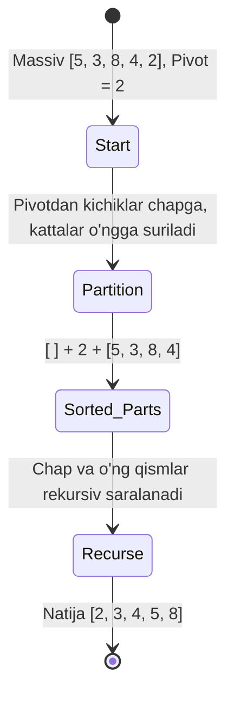

## 1. 💡 Sodda Tushuntirish va Analogiya

### Saralash va Qidiruv Algoritmlari nima?
* **Saralash (Sorting):** Tartibsiz joylashgan elementlar to'plamini (masalan, sonlar yoki ismlarni) o'sish yoki kamayish tartibida joylashtirish jarayonidir.
* **Qidiruv (Searching):** Ma'lumotlar to'plami ichidan kerakli qiymatni yoki uning manzilini (indeksini) aniqlash jarayonidir.

### Real hayotiy analogiya
* **Saralash (Kutubxonadagi kitoblar):** Tasavvur qiling, kutubxonada kitoblar tartibsiz yotibdi. Siz ularni alifbo tartibida joylashtirib chiqasiz. Agar kitoblar ko'p bo'lsa, ularni birma-bir solishtirib chiqish (Bubble Sort) juda uzoq vaqt oladi. Buning o'rniga kitoblarni teng ikkiga bo'lib, alohida saralab, keyin birlashtirish (Merge Sort) ancha tezroq bo'ladi.
* **Qidiruv (Lug'atdan so'z izlash):** Agar siz lug'atdan "Olma" so'zini qidirsangiz, birinchi sahifadan boshlab har bir so'zni o'qimaysiz (Linear Search). Siz lug'atni o'rtasidan ochib, alifboga qarab chap yoki o'ng tomonga o'tasiz (Binary Search).

---

## 2. 💻 Real Kod Misollari

### 1. Basic Example (Linear Search va Bubble Sort)
Eng oddiy qidirish va saralash usullari:
```javascript
// Chiziqli qidiruv (Linear Search)
function linearSearch(arr, target) {
  for (let i = 0; i < arr.length; i++) {
    if (arr[i] === target) return i; // Indeks qaytariladi
  }
  return -1; // Topilmadi
}

// Pufakchali saralash (Bubble Sort)
function bubbleSort(arr) {
  let swapped;
  const len = arr.length;
  for (let i = 0; i < len; i++) {
    swapped = false;
    for (let j = 0; j < len - 1 - i; j++) {
      if (arr[j] > arr[j + 1]) {
        // Qiymatlarni almashtiramiz
        [arr[j], arr[j + 1]] = [arr[j + 1], arr[j]];
        swapped = true;
      }
    }
    // Agar biror marta almashtirish bajarilmasa, demak massiv saralangan
    if (!swapped) break;
  }
  return arr;
}

console.log(linearSearch([10, 20, 30], 20)); // 1
console.log(bubbleSort([5, 1, 4, 2, 8])); // [1, 2, 4, 5, 8]
```

### 2. Intermediate Example (Binary Search va Insertion Sort)
Tezroq va samaraliroq ishlash usullari:
```javascript
// Ikkilik qidiruv (Binary Search)
function binarySearch(arr, target) {
  let left = 0;
  let right = arr.length - 1;

  while (left <= right) {
    let mid = Math.floor((left + right) / 2);
    if (arr[mid] === target) {
      return mid; // Topildi!
    } else if (arr[mid] < target) {
      left = mid + 1; // O'ng tomondan qidiramiz
    } else {
      right = mid - 1; // Chap tomondan qidiramiz
    }
  }
  return -1; // Topilmadi
}

// Joylashtirish orqali saralash (Insertion Sort)
function insertionSort(arr) {
  for (let i = 1; i < arr.length; i++) {
    let current = arr[i];
    let j = i - 1;
    while (j >= 0 && arr[j] > current) {
      arr[j + 1] = arr[j]; // O'ngga suramiz
      j--;
    }
    arr[j + 1] = current;
  }
  return arr;
}
```

### 3. Advanced Example (Merge Sort - Bo'lish va Birlashtirish)
Katta hajmdagi ma'lumotlarni saralashda qo'llaniladigan O(n log n) tezlikdagi algoritm:
```javascript
// Ikki saralangan massivni birlashtirish funksiyasi
function merge(left, right) {
  let result = [];
  let i = 0, j = 0;
  while (i < left.length && j < right.length) {
    if (left[i] < right[j]) {
      result.push(left[i]);
      i++;
    } else {
      result.push(right[j]);
      j++;
    }
  }
  return result.concat(left.slice(i)).concat(right.slice(j));
}

// Bosh Merge Sort funksiyasi
function mergeSort(arr) {
  if (arr.length <= 1) return arr;
  const mid = Math.floor(arr.length / 2);
  const left = mergeSort(arr.slice(0, mid));
  const right = mergeSort(arr.slice(mid));
  return merge(left, right);
}

console.log(mergeSort([38, 27, 43, 3, 9, 82, 10])); // [3, 9, 10, 27, 38, 43, 82]
```

---

## 3. ⚠️ Muammo va Nima uchun Muhimligi

### Qaysi muammoni hal qiladi?
* **Unumdorlik va Tejamkorlik:** Agar sizda 1 millionta ma'lumot bo'lsa va undan Linear Search (chiziqli qidiruv) orqali narsalarni izlasangiz, eng yomon holatda 1 million marta tekshiruv bajariladi. Binary Search (ikkilik qidiruv) yordamida esa atigi **20 marta** taqqoslash bilan kerakli natijani topasiz.
* **Ma'lumotlarni tartibga solish:** Ko'pgina boshqa algoritmlar (masalan, graf yoki geometrik algoritmlar, ma'lumotlar bazasi indekslari) ishlashidan oldin ma'lumotlar saralangan bo'lishini talab qiladi.

---

## 4. ❌ Ko'p Uchraydigan Xatolar (Junior Mistakes)

### 1. Saralanmagan massivda Binary Search ishlatish
#### Xato:
`binarySearch([5, 1, 9, 3, 7], 3)`
Ushbu kod xato ishlaydi va qiymat mavjud bo'lsa ham `-1` qaytarishi mumkin, chunki qidiruv sohasi noto'g'ri qisqaradi.
#### Tuzatish:
Binary Search ishlatishdan oldin massivni albatta saralash shart.

### 2. O'rnatilgan `.sort()` metodini sonlar uchun noto'g'ri ishlatish
#### Xato:
`[10, 2, 30, 5].sort()` natijasi `[10, 2, 30, 5]` yoki `[10, 2, 5, 30]` bo'lib qoladi, chunki JS sukut bo'yicha ularni string sifatida (`unicode` bo'yicha) solishtiradi.
#### Tuzatish:
Sonlarni solishtirish uchun callback yozish kerak: `arr.sort((a, b) => a - b)`.

---

## 5. 💬 12 ta Intervyu Savollari

### Junior (1–4)
1. **Savol:** Linear Search va Binary Search farqi nimada?
   * **Javob:** Linear Search elementlarni ketma-ket, Binary Search esa saralangan massivni teng ikkiga bo'lish orqali qidiradi.
2. **Savol:** JS massivlarining `.sort()` metodi sukut bo'yicha qanday saralaydi?
   * **Javob:** Elementlarni matnga aylantirib, Unicode jadvali bo'yicha alifbo tartibida saralaydi.
3. **Savol:** Pufakchali saralash (Bubble Sort) eng yaxshi holatda (best case) qanday tezlikda ishlaydi?
   * **Javob:** Agar optimallashtirilgan bo'lsa, saralangan massiv uchun O(n) vaqt oladi.
4. **Savol:** Stabil (Stable) saralash nima?
   * **Javob:** Qiymatlari teng bo'lgan elementlarning massivdagi boshlang'ich nisbiy tartibini saqlab qoladigan saralash turi.

### Middle (5–8)
5. **Savol:** Quick Sort qanday ishlaydi va pivot nima?
   * **Javob:** U massivdan bitta elementni pivot (tayanch) qilib tanlaydi va qolgan elementlarni pivotdan kichik hamda kattalarga ajratib, rekursiv davom ettiradi (Divide and Conquer).
6. **Savol:** Merge Sort va Quick Sort o'rtasidagi asosiy farq nima?
   * **Javob:** Merge Sort qo'shimcha xotira O(n) talab qiladi va stabil algoritm. Quick Sort esa odatda joyida saralaydi (in-place, O(log n) xotira) lekin stabil emas.
7. **Savol:** Quick Sortning eng yomon holatdagi murakkabligi qachon sodir bo'ladi?
   * **Javob:** Agar pivot sifatida har safar eng chetki (eng kichik yoki eng katta) element tanlansa, tezlik O(n²) bo'lib qoladi.
8. **Savol:** O(n log n) va O(n²) farqi qanchalik katta?
   * **Javob:** Masalan, n=10,000 bo'lsa, n² = 100,000,000 amal bajariladi, n log n esa taxminan 130,000 amal bajariladi. Farqi juda ulkan.

### Senior (9–12)
9. **Savol:** In-place (joyida) saralash nima va qaysi algoritmlar bunga misol bo'ladi?
   * **Javob:** Qo'shimcha massivlar yaratmasdan, faqat berilgan massiv ichidagi elementlar o'rnini almashtiruvchi saralashlar. Masalan: Bubble Sort, Selection Sort, Insertion Sort, Quick Sort.
10. **Savol:** JavaScript-dagi `Array.prototype.sort` qaysi algoritmdan foydalanadi?
    * **Javob:** V8 dvigatelida hozirda **Timsort** (Merge Sort va Insertion Sort gibridi) algoritmidan foydalaniladi.
11. **Savol:** Katta hajmdagi fayl tizimlarini (xotiraga sig'maydigan) saralash uchun qaysi turdagi algoritmlar qo'llaniladi?
    * **Javob:** External Sorting (Tashqi saralash) va bunda ko'pincha External Merge Sort qo'llaniladi.
12. **Savol:** Radix Sort yoki Counting Sort algoritmlari qachon ishlatiladi va ularning cheklovlari nimada?
    * **Javob:** Ular taqqoslashga asoslanmagan algoritmlar bo'lib, sonlarning diapazoni cheklangan bo'lsa, O(n) vaqtda saralashi mumkin. Cheklovi — faqat butun sonlar yoki ma'lum formatdagi kalitlar bilan ishlaydi hamda qo'shimcha xotira ko'p talab qilishi mumkin.

---

## 6. 🎨 Interaktiv Vizual

Dasturlarda ma'lumotlarni saralash va qidirishda xotira (Memory Allocation) boshqaruvi algoritmlarning samaradorligiga bevosita ta'sir qiladi.

### 1. In-place vs Out-of-place (Xotirada saralash)

* **In-place (Masalan: Bubble, Insertion, Quick Sort):** Qo'shimcha massiv yaratmaydi. Stack-dagi o'zgaruvchi Heap-dagi bitta massiv `@500` ga ishora qilib turadi. Qiymatlar faqat `@500` ichida almashtiriladi. Xotira murakkabligi: $O(1)$.
* **Out-of-place (Masalan: Merge Sort):** Har bir bo'linish va birlashish qadamida Heap-da yangi massivlar yaratiladi (`@600`, `@700` va h.k.). Bu esa JavaScript-ning Garbage Collector-iga juda katta bosim yuklaydi. Xotira murakkabligi: $O(n)$.

```mermaid
graph TD
    subgraph In-Place Memory (Bubble Sort)
        StackA["Stack: arr = @500"]
        HeapA["Heap @500: [5, 1, 4]"]
        HeapA2["Heap @500: [1, 5, 4] (Swapped)"]
        StackA --> HeapA
        HeapA -.-> HeapA2
    end
    
    subgraph Out-of-Place Memory (Merge Sort)
        StackB["Stack: arr = @600"]
        HeapB["Heap @600: [5, 1, 4]"]
        HeapBLeft["Heap @700: [5] (New Heap Array)"]
        HeapBRight["Heap @800: [1, 4] (New Heap Array)"]
        
        StackB --> HeapB
        HeapB --> HeapBLeft
        HeapB --> HeapBRight
    end
```

### 2. Binary Search Algoritmining Qisqarish Strukturasi

Binary Search saralangan massivda har bir iteratsiyada qidiruv maydonini ikkiga bo'lib boradi.

```mermaid
graph TD
    subgraph Binary Search: [1, 3, 5, 7, 9, 11, 13], Target: 11
        Step1["Step 1: [1, 3, 5, (7), 9, 11, 13] <br/> Mid = 7 (Index 3) <br/> Target 11 > 7 -> Search Right"]
        Step2["Step 2: [9, (11), 13] <br/> Mid = 11 (Index 5) <br/> Target 11 == 11 -> Found!"]
        
        Step1 --> Step2
    end
```

### 3. Quick Sort Pivot va Partitioning Strukturasi

Pivot sifatida chetki element tanlanib, unga nisbatan kichiklar chapga, kattalar o'ngga yig'iladi:



---

## 7. 🛠️ Amaliy Topshiriqlar

Interaktiv muharrir yordamida Bubble Sort, Insertion Sort va Binary Search kabi klassik algoritmlarni yozib, ularni testlardan o'tkazing.

---

## 8. 🎯 Real Project Case Study

### Katta ma'lumotlar omborida tezkor qidiruv indeksi yaratish
Ma'lumotlar bazasi tez-tez qidiriladigan ustunlar bo'yicha indekslar yaratadi. Bu indekslar aslida saralangan ro'yxat bo'lib, Binary Search yoki shunga o'xshash B-Tree algoritmlari yordamida qidiruvni soniyaning ulushlarida amalga oshirishga yordam beradi.

#### Mahsulotlarni narxi bo'yicha binary search yordamida topish:
```javascript
const products = [
  { id: 1, name: "Non", price: 3000 },
  { id: 2, name: "Sut", price: 9000 },
  { id: 3, name: "Shakar", price: 15000 },
  { id: 4, name: "Go'sht", price: 85000 }
]; // Narxi bo'yicha saralangan

function findProductByPrice(arr, targetPrice) {
  let left = 0;
  let right = arr.length - 1;
  while (left <= right) {
    let mid = Math.floor((left + right) / 2);
    if (arr[mid].price === targetPrice) {
      return arr[mid];
    } else if (arr[mid].price < targetPrice) {
      left = mid + 1;
    } else {
      right = mid - 1;
    }
  }
  return null;
}
```

---

## 9. 🚀 Performance va Optimization

* **Erta to'xtatish (Early Exit):** Bubble sort kabi algoritmlarda biror aylanishda element almashtirilmasa, siklni darhol to'xtatish (swapped flag orqali) ishlash vaqtini tejaydi.
* **Kichik massivlar uchun Insertion Sort:** Quick Sort yoki Merge Sort kabi algoritmlar massiv hajmi juda kichrayganda (masalan, n < 10) rekursiv chaqiruvlarni to'xtatib, Insertion Sortga o'tishi samaradorlikni oshiradi.

---

## 10. 📌 Cheat Sheet

| Algoritm | Eng yaxshi holat (Best) | O'rtacha (Average) | Eng yomon holat (Worst) | Xotira (Space) |
| :--- | :--- | :--- | :--- | :--- |
| **Bubble Sort** | O(n) | O(n²) | O(n²) | O(1) |
| **Insertion Sort**| O(n) | O(n²) | O(n²) | O(1) |
| **Merge Sort** | O(n log n) | O(n log n) | O(n log n) | O(n) |
| **Quick Sort** | O(n log n) | O(n log n) | O(n²) | O(log n) |
| **Binary Search** | O(1) | O(log n) | O(log n) | O(1) |
