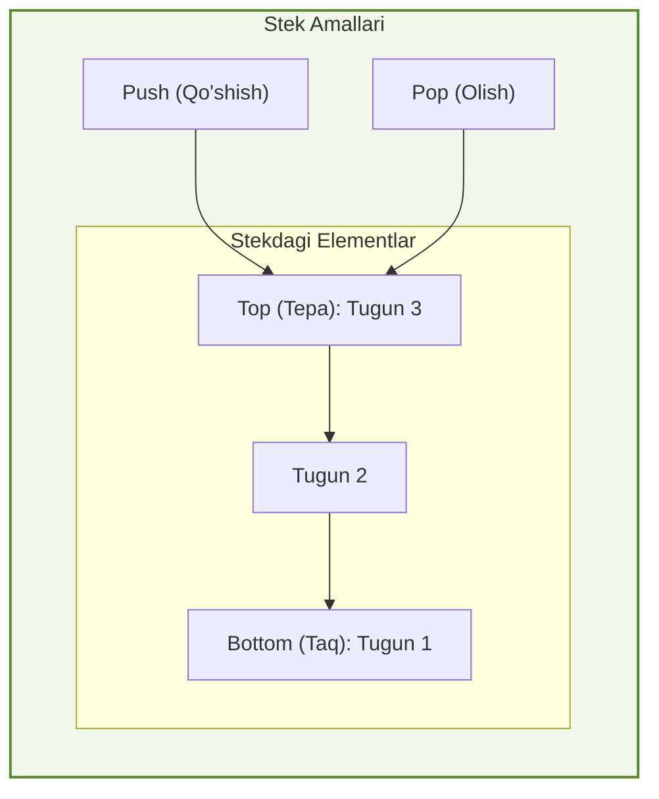
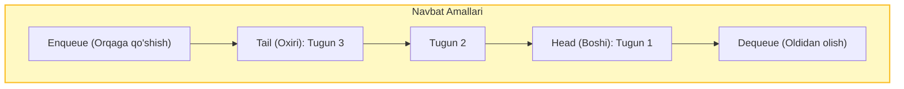

## 1. 💡 Sodda Tushuntirish va Analogiya

### Stack va Queue nima?
* **Stack (Stek):** Bu LIFO (**Last In, First Out** — Oxirgi kirgan, birinchi chiqadi) tamoyiliga asoslangan ma'lumotlar tuzilmasidir. Unga element faqat eng yuqorisidan qo'shiladi va olinadi.
* **Queue (Navbat):** Bu FIFO (**First In, First Out** — Birinchi kirgan, birinchi chiqadi) tamoyiliga asoslangan ma'lumotlar tuzilmasidir. Unga element oxiridan qo'shiladi (Enqueue) va boshidan olinadi (Dequeue).

### Real hayotiy analogiya
* **Stack analogiyasi:** Tasavvur qiling, **ustma-ust taxlangan likopchalar (plates)**:
  * Siz yangi yuvilgan likopchani faqat eng tepasiga qo'ya olasiz (Push).
  * Ovqatlanish uchun likopcha olganda ham eng ustidagisini (oxirgi qo'yilganini) olasiz (Pop).
  * Agar tagidan olishga harakat qilsangiz, likopchalar sinishi mumkin.
* **Queue analogiyasi:** Tasavvur qiling, **avtobus bekatidagi yoki do'kondagi odamlar navbati**:
  * Navbatga yangi kelgan odam oxiriga borib turadi (Enqueue).
  * Birinchi bo'lib kelgan odamga birinchi xizmat ko'rsatiladi va u navbatni tark etadi (Dequeue).

---

## 2. 💻 Real Kod Misollari

### 1. JavaScript-da Stack yaratish (Class yordamida)
```javascript
class Stack {
  constructor() {
    this.items = [];
  }

  // Element qo'shish
  push(element) {
    this.items.push(element);
  }

  // Element o'chirish va qaytarish
  pop() {
    if (this.isEmpty()) return "Stack bo'sh";
    return this.items.pop();
  }

  // Yuqori elementni ko'rish
  peek() {
    return this.items[this.items.length - 1];
  }

  isEmpty() {
    return this.items.length === 0;
  }
}
```

### 2. JavaScript-da Bog'langan Ro'yxat (Linked List) yordamida optimallashtirilgan Queue yaratish
Oddiy massiv yordamida `.shift()` qilish sekin ishlagani uchun, O(1) vaqt oluvchi Queue yaratishda bog'langan ro'yxatdan foydalanamiz:
```javascript
class QueueNode {
  constructor(val) {
    this.val = val;
    this.next = null;
  }
}

class Queue {
  constructor() {
    this.head = null;
    this.tail = null;
    this.length = 0;
  }

  // Navbat oxiriga qo'shish (Enqueue)
  enqueue(val) {
    const newNode = new QueueNode(val);
    if (!this.head) {
      this.head = newNode;
      this.tail = newNode;
    } else {
      this.tail.next = newNode;
      this.tail = newNode;
    }
    this.length++;
  }

  // Navbat boshidan olish (Dequeue)
  dequeue() {
    if (!this.head) return null;
    const removedNode = this.head;
    this.head = this.head.next;
    if (!this.head) {
      this.tail = null;
    }
    this.length--;
    return removedNode.val;
  }
}
```

---

## 3. ⚙️ Qanday Ishlaydi (Under the Hood)

### Chaqiriqlar steki vs Xotira hovuzi (Call Stack vs Memory Heap)
Operatsion tizim darajasida va JavaScript Engine (masalan V8) ichida Stack va Queue quyidagicha ishlaydi:

1. **Call Stack (Chaqiriqlar Steki - LIFO):**
   * Funksiya chaqirilganda, u Stack freymi (execution frame) sifatida Call Stack-ka joylanadi (`Push`). U yerda funksiyaning parametrlari va lokal primitiv o'zgaruvchilari saqlanadi.
   * Funksiya o'z ishini yakunlaganda, u Call Stackdan o'chiriladi (`Pop`).
   * **Stack Overflow:** Rekursiv funksiya to'xtash shartisiz cheksiz chaqirilaversa, Call Stack uchun ajratilgan cheklangan xotira to'lib ketadi va "Maximum call stack size exceeded" xatosi yuzaga keladi.

2. **Task Queue (Vazifalar Navbati - FIFO):**
   * Asinxron amallar (masalan, `setTimeout`, `fetch` yoki foydalanuvchi hodisalari callbacklari) Web API tomonidan bajarilib bo'lingach, ularning callback funksiyalari **Task Queue (Navbat)** ga yuboriladi.
   * **Event Loop** doimiy ravishda Call Stackni tekshiradi. Call Stack to'liq bo'shaganda, Task Queue-dan eng birinchi navbatda turgan vazifani FIFO tamoyili asosida olib, bajarish uchun Call Stackka yuklaydi.

### Xotirani optimallashtirish (Array-based vs Linked List-based)
* Massiv yordamida Queue yaratish oson, ammo `.shift()` metodini chaqirish $O(n)$ vaqt oladi. Chunki massiv elementlarining barcha indekslari xotirada 1 qadam chapga surilishi kerak.
* Bog'langan ro'yxat (Linked List) orqali yaratilgan Queue esa $O(1)$ xotira amali va tezligiga ega. Bizda doimiy ravishda `head` (navbat boshi) va `tail` (navbat oxiri) ko'rsatkichlari bo'ladi. Element qo'shganda `tail.next = newNode`, element o'chirilganda esa `head = head.next` amali bajariladi. Bunga hech qanday indekslarni siljitish talab qilinmaydi.

---

## 4. ❌ Ko'p Uchraydigan Xatolar (Junior Mistakes)

### 1. Massiv `.shift()` metodini Queue uchun ishlatish va uning og'irligini bilmaslik
Ko'plab dasturchilar massivni Queue sifatida ishlatganda `.shift()` yoki `.unshift()` metodlarini chaqirishadi. 
* **Muammo:** `.shift()` massivdagi barcha elementlar indekslarini bir qadam chapga surib chiqadi. Bu esa chiziqli vaqt O(n) oladi. Katta hajmli ma'lumotlarda bu loyiha ishlashini keskin sekinlashtiradi.
* **Tuzatish:** Elementlarni indeks pointer orqali boshqaradigan yoki Linked List yordamida yaratilgan O(1) lik maxsus Queue klassidan foydalaning.

### 2. Bo'sh Stack-dan element olishga urinish (Underflow)
Bo'sh stek yoki navbatdan element o'chirishga harakat qilganda xatolikni tekshirmaslik dasturning noto'g'ri ishlashiga (masalan, `undefined` qaytishiga) sabab bo'ladi.
* **Tuzatish:** Har doim `pop()` yoki `dequeue()` qilishdan oldin stek yoki navbat bo'sh emasligini tekshiring (`isEmpty()`).

---

## 5. 💬 12 ta Intervyu Savollari

### Junior
1. **Stack nima va u qaysi tamoyilga asoslanadi?**
   * *Javob:* LIFO (Last In, First Out) qoidasi bo'yicha ishlaydigan ma'lumotlar tuzilmasi.
2. **Queue nima va uning asosiy operatsiyalari qaysilar?**
   * *Javob:* FIFO (First In, First Out) tuzilmasi bo'lib, uning asosiy amallari `enqueue` (qo'shish) va `dequeue` (olish) dir.
3. **Peek operatsiyasi nima qiladi?**
   * *Javob:* Stack yoki Queue-dan elementni o'chirmasdan, eng yuqoridagi yoki boshidagi elementni ko'rish imkonini beradi.
4. **JS-da massiv yordamida Stack-ni qanday simulyatsiya qilish mumkin?**
   * *Javob:* Massivning `.push()` va `.pop()` metodlari yordamida.

### Middle
5. **Nega oddiy massiv `.shift()` metodi Queue uchun samarasiz?**
   * *Javob:* Chunki `.shift()` elementni o'chirgandan keyin barcha qolgan elementlar indeksini o'zgartiradi (chapga suradi), bu O(n) vaqt talab qiladi.
6. **Stack Overflow nima va u qachon sodir bo'ladi?**
   * *Javob:* Chaqiriqlar steki (Call Stack) o'ziga ajratilgan xotira chegarasidan oshib ketganda sodir bo'ladi, ko'pincha cheksiz rekursiya sababli yuz beradi.
7. **Ikki Stack yordamida Queue algoritmini qanday yozish mumkin?**
   * *Javob:* `stack1`ga elementlarni qo'shamiz (enqueue). `dequeue` amali bo'lganda, `stack2` bo'sh bo'lsa, `stack1`dagilarni `stack2`ga pop qilib o'tkazamiz va `stack2`dan pop qilamiz.
8. **Valid Parentheses (To'g'ri qavslar) masalasi qanday hal qilinadi?**
   * *Javob:* Stack yordamida. Ochuvchi qavslar stack-ga push qilinadi, yopuvchi kelganda stack yuqorisidagi qavs solishtirilib pop qilinadi.

### Senior
9. **Monotonik Stack nima va u qayerda qo'llaniladi?**
   * *Javob:* Elementlari har doim faqat o'suvchi yoki kamayuvchi bo'lgan maxsus Stack. U "keyingi eng katta element" (Next Greater Element) kabi masalalarda O(n) yechim topishda ishlatiladi.
10. **Priority Queue (Ustuvorlikka ega navbat) nima?**
    * *Javob:* Oddiy navbatdan farqli o'laroq, har bir element ma'lum bir ustuvorlik (priority) darajasiga ega bo'ladi va navbatdan birinchi bo'lib eng ustuvor element chiqadi (odatda Heap yordamida amalga oshiriladi).
11. **JavaScript Event Loop-dagi Microtask Queue va Macrotask Queue farqi nimada?**
    * *Javob:* Microtask Queue (Promises, queueMicrotask) yuqori ustuvorlikka ega bo'lib, har bir Macrotask (setTimeout, setInterval) bajarilishidan oldin to'liq bo'shatib olinadi.
12. **Double Ended Queue (Deque) nima?**
    * *Javob:* Elementlarni ham boshidan, ham oxiridan qo'shish va o'chirish imkonini beruvchi ikki tomonlama navbat.

---

## 6. 🎨 Interaktiv Vizual

### Stack Strukturasi (LIFO)
Elementlar faqat yuqoridan qo'shiladi va olinadi.



### Queue Strukturasi (FIFO)
Elementlar oxiridan qo'shiladi (tail) va oldidan olinadi (head).



---

## 7. 🛠️ Amaliy Topshiriqlar

Amaliy mashqlar `stacksQueues_exercises.json` faylida berilgan. U yerda siz qavslarni tekshirish, ikki stack yordamida navbat yaratish va har doim minimum qiymatni tezkor beruvchi `MinStack` klassini yozasiz.

---

## 8. 📝 12 ta Mini Test

Dars oxirida o'zlashtirgan bilimlaringizni tekshirish uchun 12 ta test savollari tayyorlangan bo'lib, ular `stacksQueues_quizzes.json` faylida joylashgan.

---

## 9. 🎯 Real Project Case Study

### Matn Muharriridagi Undo / Redo Tizimi (Orqaga va Oldinga Qaytarish)
Katta matn muharrirlarida foydalanuvchining har bir yozgan amali xotirada saqlanishi va orqaga qaytarilishi kerak.
* **Yechim:** Ikkita Stack orqali `Undo` (Orqaga) va `Redo` (Oldinga) amallarini boshqarish.
* **Kod ko'rinishi:**
```javascript
class TextEditor {
  constructor() {
    this.text = "";
    this.undoStack = [];
    this.redoStack = [];
  }

  write(newText) {
    this.undoStack.push(this.text); // Hozirgi holatni saqlaymiz
    this.redoStack = []; // Yangi yozilganda redo steki tozalanadi
    this.text += newText;
  }

  undo() {
    if (this.undoStack.length > 0) {
      this.redoStack.push(this.text); // Hozirgi holatni redo-ga saqlaymiz
      this.text = this.undoStack.pop(); // Eski holatga qaytamiz
    }
  }

  redo() {
    if (this.redoStack.length > 0) {
      this.undoStack.push(this.text); // Hozirgi holatni undo-ga saqlaymiz
      this.text = this.redoStack.pop(); // Keyingi holatga o'tamiz
    }
  }
}
```

---

## 10. 📌 Cheat Sheet

| Ma'lumotlar Tuzilmasi | Tamoyili | Qo'shish (Push/Enqueue) | O'chirish (Pop/Dequeue) | Eng ustidagini ko'rish (Peek) | Qo'llanilishi |
| :--- | :--- | :--- | :--- | :--- | :--- |
| **Stack (Stek)** | **LIFO** (Last In, First Out) | O(1) | O(1) | O(1) | Undo/Redo, Call Stack, Qavslarni tekshirish |
| **Queue (Navbat)** | **FIFO** (First In, First Out) | O(1) | O(1) | O(1) | Print queue, So'rovlarni navbatda bajarish |
| **Deque (Double Ended Queue)** | Ikki tomonlama | O(1) | O(1) | O(1) | Ikki tomondan ham dynamic boshqarish |
