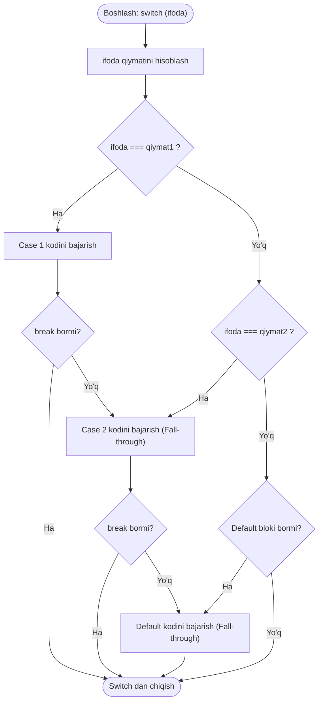

## 1. 💡 Sodda Tushuntirish va Analogiya

### Switch-Case nima?
* **`switch-case` operatori** — bu dasturdagi ma'lum bir o'zgaruvchi yoki ifodaning qiymatiga qarab, kodning turli tarmoqlarini (bloklarini) ishga tushirish imkonini beruvchi boshqaruv operatoridir. 
* Agar sizda bitta o'zgaruvchini ko'plab aniq qiymatlar bilan solishtirish kerak bo'lsa, ketma-ket yozilgan `if-else if-else` zanjiri o'rniga `switch-case` operatoridan foydalanish kodni ancha sodda va o'qilishi oson holga keltiradi.

### Real hayotiy analogiya
Tasavvur qiling, siz **vending avtomatidan (ichimlik sotadigan apparat)** foydalanyapsiz:
* **`if-else` usuli:** Siz apparatdan ichimlik tanlash uchun har bir tugmani birma-bir tekshirib chiqasiz: "Bu tugma kofemi? Yo'q. Bu tugma sharbatmi? Yo'q. Bu tugma suvmi? Ha!" (Bu juda ko'p vaqt va energiya oladi).
* **`switch-case` usuli:** Siz apparat panelidagi kerakli kodni kiritasiz (masalan, `B4`). Apparat kiritilgan kodni qabul qiladi va to'g'ridan-to'g'ri `B4` kamerasidagi ichimlikni chiqarib beradi (hech qanday ketma-ket savollarsiz, aniq va tez).

Biz kiritgan kod (`B4`) — bu **switch ifodasi**, har bir alohida kamera — **case (holat)**, avtomatning mos keluvchi ichimlikni chiqarishi — **bajariladigan kod bloki**, agar mavjud bo'lmagan kod kiritilsa rad etishi esa — **default (standart holat)** hisoblanadi.

---

## 2. 💻 Real Kod Misollari

### 1. Basic Example (Oddiy Switch-Case va Break)
Hafta kunining raqamiga qarab nomini aniqlash. Bunda har bir holat qat'iy tenglik bilan tekshiriladi va `break` orqali switch yakunlanadi:
```javascript
function getDayName(dayNumber) {
  let dayName;
  
  switch (dayNumber) {
    case 1:
      dayName = "Dushanba";
      break;
    case 2:
      dayName = "Seshanba";
      break;
    case 3:
      dayName = "Chorshanba";
      break;
    case 4:
      dayName = "Payshanba";
      break;
    case 5:
      dayName = "Juma";
      break;
    case 6:
      dayName = "Shanba";
      break;
    case 7:
      dayName = "Yakshanba";
      break;
    default:
      dayName = "Noto'g'ri kun raqami";
  }
  
  return dayName;
}

console.log(getDayName(1)); // "Dushanba"
console.log(getDayName(5)); // "Juma"
console.log(getDayName(9)); // "Noto'g'ri kun raqami"
```

### 2. Intermediate Example (Fall-Through / Guruhlash)
Agar bir nechta case bloklari uchun bir xil kod bajarilishi kerak bo'lsa, ularni ketma-ket yozish (guruhlash) mumkin. Bunga `break`ni ataylab yozmaslik orqali erishiladi:
```javascript
function getDayType(dayNumber) {
  let type;
  
  switch (dayNumber) {
    case 1:
    case 2:
    case 3:
    case 4:
    case 5:
      type = "Ish kuni";
      break; // Faqat beshinchi case'dan keyin chiqib ketiladi
    case 6:
    case 7:
      type = "Dam olish kuni";
      break;
    default:
      type = "Noma'lum kun";
  }
  
  return type;
}

console.log(getDayType(3)); // "Ish kuni"
console.log(getDayType(6)); // "Dam olish kuni"
```

### 3. Advanced Example (`switch(true)` Patterni)
Agar biz aniq qiymatni emas, balki ma'lum bir diapazon yoki oraliqlarni tekshirmoqchi bo'lsak, `switch(true)` yondashuvidan foydalanamiz:
```javascript
function categorizeAge(age) {
  if (typeof age !== "number" || age < 0) {
    return "Noto'g'ri yosh kiritildi";
  }

  // switch ifodasi sifatida true beriladi va case'larda shartlar baholanadi
  switch (true) {
    case age < 13:
      return "Bola";
    case age >= 13 && age < 20:
      return "O'smir";
    case age >= 20 && age < 60:
      return "Kattalar";
    default:
      return "Keksalar";
  }
}

console.log(categorizeAge(8));   // "Bola"
console.log(categorizeAge(16));  // "O'smir"
console.log(categorizeAge(65));  // "Keksalar"
```

---

## 3. ⚠️ Muammo va Nima uchun Muhimligi

### Qaysi muammoni hal qiladi?
1. **If-Else Spaghetti (Kodni chalkashligi):** Agar sizda 10 xil holat bo'lsa va ularni `if (x === 1) {} else if (x === 2) {} ...` ko'rinishida tekshirsangiz, kod vizual jihatdan juda og'irlashadi. `switch-case` ushbu jarayonni vizual ravishda ustun shaklida toza va tartibli ko'rinishga keltiradi.
2. **Kodni takrorlanishi:** Guruhlanadigan shartlarda if-else operatorlari ichida `||` (OR) larni juda ko'p yozishga to'g'ri keladi. `switch` orqali case'larni shunchaki ketma-ket yopishtirib yozish bu muammoni hal qiladi.
3. **Konstruktiv boshqaruv:** Qat'iy tenglik tekshiruvi orqali kutilmagan tiplarni avtomatik tarzda `default` bloki yordamida ushlab qolishni osonlashtiradi.

---

## 4. ❌ Ko'p Uchraydigan Xatolar (Junior Mistakes)

### 1. `break` operatorini yozishni unutish (Kutilmagan Fall-through)
Eng ko'p uchraydigan xato. Agar `break` qo'yilmasa, dastur keyingi shartlar mos keladimi yoki yo'qmi, ularga qaramasdan keyingi case kodlarini ham bajarib yuboradi.
* **Xato:**
  ```javascript
  const role = "admin";
  switch (role) {
    case "admin":
      console.log("Tizimga to'liq kirish huquqi");
    case "user":
      console.log("Faqat o'qish huquqi"); // Bu ham bajarilib ketadi!
  }
  ```
* **To'g'ri usul:**
  ```javascript
  const role = "admin";
  switch (role) {
    case "admin":
      console.log("Tizimga to'liq kirish huquqi");
      break;
    case "user":
      console.log("Faqat o'qish huquqi");
      break;
  }
  ```

### 2. Tiplarni noto'g'ri solishtirish (Strict Equality tuzog'i)
`switch` operatori solishtirishda qat'iy tenglikdan (`===`) foydalanadi. Satr tipidagi qiymatni son bilan solishtirsangiz moslik topilmaydi.
* **Xato:**
  ```javascript
  const count = "2"; // String
  switch (count) {
    case 2: // Number - solishtirish: "2" === 2 (false)
      console.log("Ikki element");
      break;
    default:
      console.log("Topilmadi"); // Default blok ishga tushadi
  }
  ```
* **To'g'ri usul:** Tiplar bir xil bo'lishi kerak yoki solishtirishdan oldin tipni o'zgartirish (cast qilish) zarur:
  ```javascript
  const count = "2";
  switch (Number(count)) {
    case 2:
      console.log("Ikki element"); // Muvaffaqiyatli ishlaydi
      break;
  }
  ```

### 3. Case bloklarida o'zgaruvchilarni qayta e'lon qilish (Scope to'qnashuvi)
Butun switch operatori bitta umumiy blok scope hisoblangani uchun, turli case-lar ichida bir xil nomli o'zgaruvchini `let` yoki `const` bilan e'lon qilib bo'lmaydi.
* **Xato:**
  ```javascript
  switch (action) {
    case "create":
      let message = "Yaratildi";
      console.log(message);
      break;
    case "delete":
      let message = "O'chirildi"; // SyntaxError: Identifier 'message' has already been declared
      console.log(message);
      break;
  }
  ```
* **To'g'ri usul:** Har bir case blokini jingalak qavslar `{}` ichiga olib, alohida local scope yaratish lozim:
  ```javascript
  switch (action) {
    case "create": {
      let message = "Yaratildi";
      console.log(message);
      break;
    }
    case "delete": {
      let message = "O'chirildi"; // Xatoliksiz ishlaydi
      console.log(message);
      break;
    }
  }
  ```

---

## 5. 💬 12 ta Intervyu Savollari

### Junior (1–4)
1. **Savol:** `switch-case` operatorida `default` bloki majburiymi?
   * **Javob:** Yo'q, u majburiy emas. Agar yozilmasa va hech bir case sharti mos kelmasa, switch hech qanday kod ishlatmasdan tugaydi.
2. **Savol:** `switch` operatori case qiymatlarini tekshirishda qanday solishtirish operatoridan foydalanadi?
   * **Javob:** U qat'iy tenglik (`===`) operatoridan foydalanadi, ya'ni qiymatlarning tipi ham, o'zi ham teng bo'lishi shart.
3. **Savol:** `break` operatori yozilmasa nima sodir bo'ladi?
   * **Javob:** "Fall-through" effekti yuz beradi, ya'ni mos kelgan case bajarilgach, dastur pastga qarab keyingi case shartlarini tekshirmasdan ularning kodlarini ham ishga tushirib ketadi.
4. **Savol:** Obyektlarni `switch` operatori yordamida to'g'ridan-to'g'ri solishtirsa bo'ladimi?
   * **Javob:** Solishtirsa bo'ladi, lekin JavaScript obyektlarni reference (havola) bo'yicha solishtirgani sababli, qiymatlari bir xil bo'lsa ham turli xil yaratilgan obyektlar teng bo'lmaydi va `default`ga o'tib ketadi.

### Middle (5–8)
5. **Savol:** `switch` operatorining ketma-ket yozilgan `if-else`dan afzalliklari nimada?
   * **Javob:** O'qilishi ancha oson (cleaner code), holatlarni guruhlash qulay va u ko'p sonli case'lar mavjud bo'lgan holatlarda JS dvigatellari tomonidan optimallashtiriladi.
6. **Savol:** Bir nechta case uchun bitta kod bajarilishini qanday yozamiz?
   * **Javob:** Case kalit so'zlarini ketma-ket yozib, eng oxirgisida kod va break qo'yamiz. Masalan: `case 'A': case 'B': runCode(); break;`.
7. **Savol:** `switch(true)` sintaksisining maqsadi nima?
   * **Javob:** Case qismlarida diapazonlar (masalan: `score > 80`) yoki boshqa dinamik boolean ifodalarni tekshirish uchun ishlatiladi.
8. **Savol:** Nima uchun case ichida `let x = 5` deb yozganimizda xatolik beradi va uni qanday yechish mumkin?
   * **Javob:** Chunki butun switch bitta scope-ga ega va boshqa case-da `let x` qayta e'lon qilinsa ziddiyat yuzaga keladi. Buni hal qilish uchun har bir case kodini `{}` blok qavsga olish kerak.

### Senior (9–12)
9. **Savol:** JavaScript dvigatellari (V8 kabi) `switch` operatorini qanday optimallashtiradi?
   * **Javob:** Agar case'lar soni ko'p (masalan, 10-20 tadan ko'p) va ular izchil sonlar yoki satrlardan iborat bo'lsa, dvigatel uni xotirada `jump table` (sakrash jadvali) yoki `lookup table`ga aylantiradi. Bu orqali qidirish tezligi O(N) chiziqli vaqtdan O(1) konstant vaqtga kamayadi.
10. **Savol:** `switch` va `if-else` ishlash tezligi o'rtasidagi farq qachon sezilarli bo'ladi?
    * **Javob:** Holatlar soni o'ta katta bo'lganda (masalan, 50+ holat). Oddiy kundalik loyihalarda bu farq amalda sezilmaydi va tanlov faqat kodning o'qiluvchanligiga (readability) qarab qilinadi.
11. **Savol:** JavaScript-dagi `switch` operatorini boshqa tillardagi Pattern Matching (masalan, Rust yoki Scala) bilan solishtiring.
    * **Javob:** JS-dagi `switch` juda sodda va faqat qiymat tengligini tekshira oladi. U destructuring, tiplar mosligi yoki murakkab naqshlar bo'yicha pattern matching-ni qo'llab-quvvatlamaydi (biz faqat `switch(true)` orqali buni simulyatsiya qilishimiz mumkin).
12. **Savol:** Tizimda xavfsizlik va xatolarni oldini olish uchun `default` blokidan qanday foydalanish tavsiya etiladi?
    * **Javob:** Dasturga yangi turdagi qiymatlar qo'shilganda ularni esdan chiqarmaslik uchun, `default` blokida kutilmagan holat bo'yicha maxsus xatolik otish (throw error) tavsiya etiladi (Exhaustive checking).

---

## 6. 🛠️ Amaliy Topshiriqlar

Quyidagi oqim diagrammasi (flowchart) `switch-case` operatorining ishlash mexanizmini, ya'ni qat'iy tenglik tekshiruvi, `break` operatori mavjudligi va `default` blokiga o'tish jarayonini ko'rsatib beradi:



---

## 7. 📝 12 ta Mini Test

Ushbu mavzu bo'yicha bilimingizni sinash uchun dars oxiridagi quizzes faylida tayyorlangan 12 ta savoldan iborat mini testni yechib ko'ring.

---

## 8. 🎯 Real Project Case Study

### Redux/State Management yoki Event Dispatcher loyihalarida qo'llanilishi
Haqiqiy loyihalarda `switch-case` operatori eng ko'p ishlatiladigan joylardan biri — bu **state management** (holatni boshqarish) va **event routing** (voqealarni yo'naltirish) hisoblanadi. Masalan, foydalanuvchilar to'lov tizimida har xil to'lov turlarini ("uzcard", "humo", "visa") tanlaganda quyidagicha yo'naltiriladi.

#### To'lovlarni xavfsiz marshrutlash misoli (Clean Code):
```javascript
// Har xil to'lov provayderlarini boshqarish funksiyasi
function processPayment(paymentMethod, amount) {
  let statusMessage;

  switch (paymentMethod) {
    case "uzcard": {
      // Alohida blok yaratamiz
      const commission = amount * 0.01;
      statusMessage = `UzCard orqali ${amount} UZS to'landi. Komissiya: ${commission} UZS`;
      break;
    }
    case "humo": {
      const commission = amount * 0.005;
      statusMessage = `Humo orqali ${amount} UZS to'landi. Komissiya: ${commission} UZS`;
      break;
    }
    case "visa": {
      const commission = amount * 0.02;
      statusMessage = `Visa orqali ${amount} UZS to'landi. Komissiya: ${commission} UZS`;
      break;
    }
    default:
      // Kutilmagan to'lov turi bo'lganda dastur xavfsizligi uchun xatolik beramiz
      throw new Error(`Tizimda qo'llab-quvvatlanmaydigan to'lov turi: ${paymentMethod}`);
  }

  return statusMessage;
}

try {
  console.log(processPayment("humo", 100000)); // "Humo orqali 100000 UZS to'landi. Komissiya: 500 UZS"
  console.log(processPayment("payme", 50000)); // Xatolik otadi
} catch (error) {
  console.error("Xatolik:", error.message);
}
```

---

## 9. 🚀 Performance va Optimization

### Linear Search (If-Else) vs Jump Table (Switch)
JavaScript kompilyatorlari (JIT Compiler) switch tarkibida ko'plab case'lar mavjud bo'lganda kod ishlashini optimallashtirishga harakat qiladi:
* **If-Else (O(N)):** Dastur har safar har bir shartni yuqoridan pastga chiziqli tartibda tekshirib chiqadi. Agar eng oxirgi shart to'g'ri bo'lsa, u barcha oldingi noto'g'ri shartlarni ham baholashga vaqt sarflaydi.
* **Switch-Case (O(1)):** Agar case qiymatlari sodda va son jihatdan ko'p bo'lsa, V8 dvigateli case qiymatlarining xotiradagi manzillarini bog'lab, **Jump Table** (o'tish jadvali) yaratadi. Kiruvchi qiymat to'g'ridan-to'g'ri jadval orqali kerakli manzilga sakraydi. Bu O(1) tezlikni beradi, ya'ni case'lar soni ortishi dastur tezligiga ta'sir qilmaydi.

### Optimallashtirish bo'yicha tavsiyalar:
1. **Tez-tez uchraydigan holatlarni tepaga joylashtiring:** Agar dvigatel Jump Table yarata olmasa (masalan, case'lar juda murakkab yoki aralash bo'lsa), u holda eng ko'p bajariladigan holatlarni switch'ning yuqori qismiga qo'ygan ma'qul. Bu orqali keraksiz solishtirishlar soni qisqaradi.
2. **Qat'iy taqqoslashdan unumli foydalaning:** Switch ichida tiplarni avtomatik o'zgartirish sodir bo'lmasligi (`===` ishlatilishi) uning ishlash tezligini if-else da yozilgan `==` solishtirishlariga qaraganda ancha tezlashtiradi.

---

## 10. 📌 Cheat Sheet

| Kalit so'z / Usul | Vazifasi | Misol ko'rinishi | Eslatma |
| :--- | :--- | :--- | :--- |
| **`switch (ifoda)`** | Baholanuvchi asosiy ifoda yoki o'zgaruvchini belgilash | `switch (status) { ... }` | Qat'iy tenglik (`===`) asosida ishlaydi. |
| **`case qiymat:`** | Ifoda mos kelishi mumkin bo'lgan holat (qiymat) | `case "success":` | Agar mos kelsa, pastdagi kod bloki ishga tushadi. |
| **`break`** | Switch operatori blokidan darhol chiqish | `break;` | Yozilmasa, "fall-through" yuz berib, keyingi case'lar ham bajariladi. |
| **`default`** | Hech bir case mos kelmaganda ishlovchi zaxira bloki | `default: doFallback();` | Majburiy emas, lekin xavfsizlik uchun tavsiya etiladi. |
| **`switch (true)`** | Diapazonlar va murakkab shartlar bo'yicha tekshirish | `switch (true) { case age > 18: ... }` | Case qismlarida boolean qiymat beruvchi ifodalar yoziladi. |
| **`case qiymat: { }`** | Case ichida o'zgaruvchi e'lon qilishda scope ziddiyatlarini yechish | `case 1: { let x = 10; break; }` | Jingalak qavslar alohida block scope yaratadi. |
