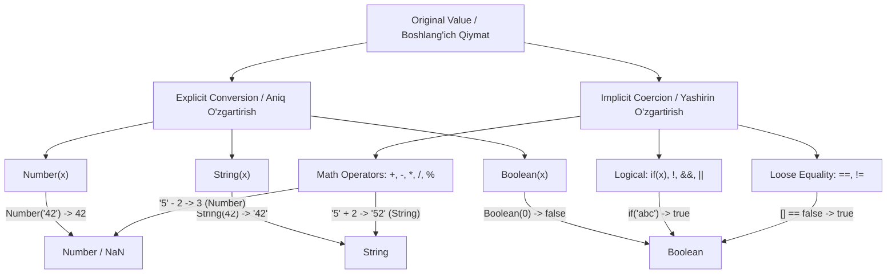

## 1. 💡 Sodda Tushuntirish va Analogiya

### Type Conversion (Turlarni O'zgartirish) nima?
JavaScript **dinamik tiplangan** (dynamically typed) tildir. Bu shuni anglatadiki, o'zgaruvchilar ma'lum bir ma'lumot turi (datatype) bilan cheklanib qolmaydi va ularning turlari dastur davomida o'zgarishi mumkin. Turlarni o'zgartirish ikki xil ko'rinishda bo'ladi:
* **Explicit Conversion (Aniq o'zgartirish):** Dasturchi o'z kodi orqali qiymat turini aniq ko'rsatib o'zgartirishi (masalan, `Number()`, `String()` funksiyalari orqali).
* **Implicit Coercion (Yashirin o'zgartirish):** JavaScript dvigateli amallarni bajarish paytida qiymat turini o'z-o'zidan (avtomatik) boshqa turga o'tkazishi (masalan, `5 + '5'` bajarilganda).

### Real hayotiy analogiya
Tasavvur qiling, siz **chet elga sayohatga chiqdingiz**:
* **Explicit Conversion (Aniq o'zgartirish):** Siz aeroportdagi bank shaxobchasiga borib, Dollaringizni aniq kurs bo'yicha So'mga almashtirasiz. Siz nima qilayotganingizni aniq bilasiz va natijani nazorat qilasiz.
* **Implicit Coercion (Yashirin o'zgartirish):** Siz chet eldagi kafeda o'z hamyoningizdagi xalqaro plastik kartangiz orqali to'lov qilasiz. Siz terminalga Dollar kartangizni tekkizasiz, lekin orqa fonda bank tizimi avtomatik ravishda pulni mahalliy valyutaga o'zgartirib to'lovni amalga oshiradi. Siz hech qanday qo'lda almashtirish funksiyasini chaqirmadingiz, hammasi yashirincha bajarildi.

---

## 2. 💻 Real Kod Misollari

### 1. Basic Example (Aniq o'zgartirish - Explicit Conversion)
Dasturchi qiymat turini o'rnatilgan global funksiyalar yordamida o'zgartiradi:
```javascript
// 1. String turiga o'tkazish
const age = 25;
const ageAsString = String(age); 
console.log(typeof ageAsString); // "string"

// 2. Number turiga o'tkazish
const price = "199.99";
const priceAsNumber = Number(price);
console.log(typeof priceAsNumber); // "number"

// 3. Boolean turiga o'tkazish
const hasAccess = 1;
const hasAccessBool = Boolean(hasAccess);
console.log(hasAccessBool); // true
```

### 2. Intermediate Example (Yashirin o'zgartirish - Implicit Coercion)
Matematik va mantiqiy amallarda JavaScript qiymatlarni avtomatik o'zgartirib yuboradi:
```javascript
// Qo'shish (+) operatori va String coercion
console.log("Qimmat: " + 100); // "Qimmat: 100" (Raqam stringga aylandi)
console.log("5" + 3);          // "53" (3 stringga aylandi va birlashtirildi)

// Ayirish (-), Ko'paytirish (*), Bo'lish (/) operatorlari
console.log("10" - 2);         // 8 (String raqamga aylandi)
console.log("5" * "3");        // 15 (Ikkala string ham raqamga aylandi)
console.log("abc" - 2);        // NaN (Matnni raqamga o'girib bo'lmagani uchun)

// Boolean Coercion shart operatorlarida
const username = "Jasur";
if (username) {
  console.log("Tizimga kirildi"); // username bo'sh bo'lmagani uchun true deb olinadi
}
```

### 3. Advanced Example (Obyektlarni ibtidoiy turlarga o'zgartirish - Object-to-Primitive Coercion)
Obyektlar qanday qilib oddiy matn yoki raqamga aylanadi?
```javascript
const obj = {
  valueOf() {
    return 42;
  },
  toString() {
    return "Mening obyektim";
  }
};

console.log(obj + 10); // 52 (valueOf() chaqirildi va 42 qaytarildi)
console.log(String(obj)); // "Mening obyektim" (toString() chaqirildi)

const arr = [1, 2, 3];
console.log(arr + "4"); // "1,2,34" (Massiv toString() orqali "1,2,3" bo'ladi)
```

---

## 3. ⚙️ Qanday Ishlaydi (Under the Hood)

### JavaScript ToPrimitive algoritmi
JavaScript obyektni string yoki raqam kabi ibtidoiy (primitive) turga o'zgartirmoqchi bo'lganida ichki `ToPrimitive` algoritmini ishga tushiradi. Algoritm obyekt ichidagi maxsus metodlarni quyidagi tartibda qidiradi:

1. **`[Symbol.toPrimitive](hint)`** metodi borligini tekshiradi. Agar u mavjud bo'lsa, uni chaqiradi.
2. Agar `hint` (kutilayotgan tur) `"string"` bo'lsa:
   - Avval `toString()` keyin `valueOf()` metodlarini chaqiradi.
3. Agar `hint` `"number"` yoki `"default"` bo'lsa:
   - Avval `valueOf()` keyin `toString()` metodlarini chaqiradi.

### Booleans (Truthy va Falsy qiymatlar)
JavaScriptda har bir qiymat o'z-o'zidan `true` yoki `false` guruhiga kiradi. Faqatgina quyidagi 8 ta qiymat **Falsy** (yolg'on) hisoblanadi va mantiqiy amallarda `false` ga aylanadi:
1. `false`
2. `0` (nol)
3. `-0` (minus nol)
4. `0n` (BigInt nol)
5. `""` (bo'sh string)
6. `null`
7. `undefined`
8. `NaN`

Qolgan barcha qiymatlar, jumladan bo'sh massiv `[]`, bo'sh obyekt `{}`, va `"0"` (ichida nol bo'lgan string) **Truthy** (rost) hisoblanadi.

---

## 4. ❌ Ko'p Uchraydigan Xatolar (Junior Mistakes)

### 1. `==` (Loose Equality) va `===` (Strict Equality) farqi
Junior dasturchilar ko'pincha bu ikki operatorni aralashtirib yuborishadi. `==` operatori taqqoslashdan oldin turlarni avtomatik o'zgartiradi (implicit coercion), `===` esa turlarni o'zgartirmaydi.
* **Xato yo'l (Tushunarsiz natijalar):**
  ```javascript
  console.log("" == 0); // true (Chunki ikkalasi ham raqam 0 ga aylanadi)
  console.log([] == false); // true (Massiv stringga, keyin esa raqamga o'tadi)
  ```
* **To'g'ri yo'l (Qat'iy taqqoslash):**
  ```javascript
  console.log("" === 0); // false (Turlari har xil: string va number)
  console.log([] === false); // false
  ```

### 2. `NaN` ni to'g'ridan-to'g'ri tenglik bilan tekshirish
`NaN` o'ziga o'zi teng bo'lmagan yagona qiymatdir. Uni `==` yoki `===` yordamida tekshirib bo'lmaydi.
* **Xato:**
  ```javascript
  const result = Number("abc"); // NaN
  if (result === NaN) { // Bu shart HECH QACHON bajarilmaydi!
    console.log("Bu raqam emas");
  }
  ```
* **To'g'ri:**
  ```javascript
  if (Number.isNaN(result)) {
    console.log("Bu raqam emas");
  }
  ```

### 3. `undefined` ustida matematik amallar bajarish
`null` matematik amallarda `0` ga aylanadi, lekin `undefined` esa `NaN` qaytaradi.
```javascript
console.log(5 + null); // 5 (5 + 0)
console.log(5 + undefined); // NaN (5 + NaN)
```

---

## 5. 💬 12 ta Intervyu Savollari

### Junior (1–4)
1. **Savol:** JavaScriptda yashirin (implicit) va aniq (explicit) tur o'zgartirish nima?
   * **Javob:** Aniq o'zgartirish dasturchi tomonidan funksiyalar (masalan, `Number(x)`) orqali yoziladi. Yashirin o'zgartirish esa JS dvigateli tomonidan amallar bajarilayotgan paytda (masalan, `5 + '2'`) avtomatik ravishda bajariladi.
2. **Savol:** Qaysi qiymatlar falsy (yolg'on) deb hisoblanadi?
   * **Javob:** `false`, `0`, `-0`, `0n`, `""` (bo'sh string), `null`, `undefined`, va `NaN`.
3. **Savol:** `Number("10px")` va `parseInt("10px")` natijalari qanday bo'ladi?
   * **Javob:** `Number("10px")` natijasi `NaN` bo'ladi, chunki u butun matnni toza raqamga o'tkazmoqchi bo'ladi. `parseInt("10px")` esa `10` qaytaradi, chunki u matn boshidagi raqam belgilarini ajratib oladi.
4. **Savol:** `typeof NaN` nima qaytaradi?
   * **Javob:** `"number"` qaytaradi. Nomiga qaramay (Not a Number), u raqamlar toifasiga tegishli maxsus son qiymatdir.

### Middle (5–8)
5. **Savol:** Nima uchun `[] == ![]` ifodasi `true` qaytaradi?
   * **Javob:** 
     1. Avval `![]` bajariladi. Massiv `truthy` bo'lgani uchun uning inkori `false` bo'ladi. Ifoda `[] == false` holiga keladi.
     2. `==` bo'lganligi sababli, ikkala tomon ham raqamga o'zgartiriladi. `Number([])` stringga o'tib `""` bo'ladi, `Number("")` esa `0` beradi.
     3. `Number(false)` ham `0` ga teng. Natijada `0 == 0` bo'lib, `true` qaytadi.
6. **Savol:** Obyektlarni raqam yoki string turlariga o'zgartirishda `valueOf` va `toString` metodlarining roli qanday?
   * **Javob:** JavaScript obyektni oddiy turga o'zgartirishda ulardan foydalanadi. Odatda matematik amallar uchun avval `valueOf` chaqiriladi. Agar u ibtidoiy qiymat qaytarmasa, keyin `toString` chaqiriladi. String o'zgartirishlarida esa ketma-ketlik teskari bo'ladi.
7. **Savol:** `+` operatori va `-` operatorining turlar o'zgarishiga ta'siri qanday farq qiladi?
   * **Javob:** `+` operatori ham qo'shish, ham matnlarni ulash vazifasini bajaradi, agar operatorlardan biri string bo'lsa, qolganlari ham stringga aylanadi. `-` operatori esa faqat matematik operator bo'lib, har doim ikkala tomonni ham raqamga aylantiradi.
8. **Savol:** `Boolean(new Boolean(false))` natijasi nima bo'ladi?
   * **Javob:** `true` bo'ladi. Chunki `new Boolean(false)` orqali obyekt (wrapper object) yaratiladi. JavaScriptda esa barcha obyektlar (hatto ichi bo'sh yoki false bo'lsa ham) truthy hisoblanadi.

### Senior (9–12)
9. **Savol:** `[Symbol.toPrimitive]` metodi nima va u qanday ishlaydi?
   * **Javob:** Bu ES6 bilan kirib kelgan maxsus tizimli simvol bo'lib, obyektlarni ibtidoiy qiymatga o'zgartirish algoritmini to'liq nazorat qilish imkonini beradi. U bitta `hint` (qiymati `"number"`, `"string"` yoki `"default"`) parametrini qabul qiladi.
10. **Savol:** Nima uchun JavaScriptda `0.1 + 0.2 !== 0.3` bo'ladi? Buni tur o'zgartirishga aloqasi bormi?
    * **Javob:** Bu sonlarning IEEE 754 suzuvchi nuqtali standartida ikkilik (binary) sanoq tizimida cheksiz kasr shaklida ifodalanishi sababli yuzaga keladi. Bu turlar o'zgarishi emas, balki kompyuter xotirasida sonlarning saqlanish muammosidir.
11. **Savol:** `{} + []` va `[] + {}` ifodalari brauzer konsolida qanday natijalar beradi?
    * **Javob:** 
      - `[] + {}` natijasi `"[object Object]"` bo'ladi, chunki massiv bo'sh stringga `""` aylanadi va obyektning string shakli `"[object Object]"` bilan birlashadi.
      - `{} + []` ifodasi ba'zi muhitlarda (masalan, to'g'ridan-to'g'ri konsolda) birinchi turgan `{}` ni bo'sh kod bloki deb hisoblab tashlab yuboradi va ifoda shunchaki `+[]` bo'lib qoladi. Bu esa massivni raqamga o'tkazib `0` natija beradi. Agar qavsga olinsa, `({} + [])` har doim `"[object Object]"` bo'ladi.
12. **Savol:** Dasturimizda yashirin tur o'zgarishlari (implicit coercion) keltirib chiqaradigan muammolarni qanday minimallashtirish mumkin?
    * **Javob:** Doimo `===` (strict equality) operatoridan foydalanish, qiymatlarni kerakli turlarga explicit (aniq) ravishda `Number()`, `String()` orqali o'tkazish, TypeScript kabi qat'iy tiplangan vositalardan foydalanish va `NaN` yuzaga kelish ehtimoli bor joylarda default qiymatlar yoki `isNaN` tekshiruvlarini qo'llash orqali.

---

## 6. 🛠️ Amaliy Topshiriqlar

Quyidagi chizma orqali JavaScriptda qiymatlarning Aniq (Explicit) va Yashirin (Implicit) yo'llar bilan qaysi turlarga o'tishini ko'rishingiz mumkin:



Ushbu dars uchun tayyorlangan 3 ta amaliy topshiriqni bajaring:
1. **Raqamga O'zgartirish (Explicit Conversion):** Kelgan qiymatni xavfsiz tarzda raqamga aylantirish.
2. **Truthy yoki Falsy Tekshiruvchi:** Qiymatlarning boolean kontekstdagi qiymatini aniqlash.
3. **Xavfsiz Qo'shish (Safe Sum):** Matematik xatolarni oldini olib qiymatlarni qo'shish.

---

## 7. 📝 12 ta Mini Test

Dars yakunida bilimlaringizni sinash uchun 12 ta multiple-choice (ko'p tanlovli) test savollarini javoblang. Testlar yashirin tur o'zgarishlarining nozik jihatlarini qamrab olgan.

---

## 8. 🎯 Real Project Case Study

### URL Query parametrlarini va Env o'zgaruvchilarni parse qilish
Real loyihalarda ma'lumotlar bazasidan, atrof-muhit o'zgaruvchilaridan (Environment Variables) yoki URL-manzildan olinadigan barcha ma'lumotlar string formatida keladi. Biz ularni tizimda ishlatishdan oldin to'g'ri va xavfsiz turlarga o'tkazishimiz kerak.

Quyidagi kod loyihadagi string ma'lumotlarni xavfsiz pars qiluvchi yordamchi funksiyani ko'rsatadi:

```javascript
function parseConfig(rawConfig) {
  const cleanConfig = {};

  for (const [key, value] of Object.entries(rawConfig)) {
    // 1. Agar qiymat bo'sh bo'lsa, null yoki undefined saqlaymiz
    if (value === undefined || value === null || value === "") {
      cleanConfig[key] = null;
      continue;
    }

    // 2. Boolean turiga o'tkazish (yashirin coercion xavfli: "false" stringi true bo'ladi)
    if (value.toLowerCase() === "true") {
      cleanConfig[key] = true;
      continue;
    }
    if (value.toLowerCase() === "false") {
      cleanConfig[key] = false;
      continue;
    }

    // 3. Raqamga o'tkazish (isNaN tekshiruvi bilan)
    const numericValue = Number(value);
    if (!Number.isNaN(numericValue) && value.trim() !== "") {
      cleanConfig[key] = numericValue;
      continue;
    }

    // 4. Aks holda asl string holida qoldiramiz
    cleanConfig[key] = value;
  }

  return cleanConfig;
}

// Loyihadagi xom ma'lumotlar
const rawEnv = {
  PORT: "8080",
  DEBUG_MODE: "true",
  API_KEY: "xyz123",
  MAX_USERS: "abc", // Noto'g'ri raqam
  TIMEOUT: "" // Bo'sh qiymat
};

const config = parseConfig(rawEnv);
console.log(config);
/*
Natija:
{
  PORT: 8080,          // Raqamga o'tdi
  DEBUG_MODE: true,    // Boolean ko'rinishiga o'tdi (xavfsiz)
  API_KEY: "xyz123",   // Matn holida qoldi
  MAX_USERS: "abc",    // Raqamga o'tmagani uchun string qoldi
  TIMEOUT: null        // Bo'sh bo'lgani uchun null bo'ldi
}
*/
```

---

## 9. 🚀 Performance va Optimization

### 1. `+` operatori vs `Number()`
Matnni raqamga o'zgartirishda `+str` operatori `Number(str)` funksiyasiga qaraganda biroz tezroq ishlaydi, chunki u to'g'ridan-to'g'ri dvigatel darajasida amal bajaradi. Biroq, kodning o'qilishi (readability) jihatidan `Number(str)` tushunarliroq.

### 2. Hot-path (tez-tez ishlovchi) kodlarda implicit coerciondan qoching
Tsikllar ichida yoki tez-tez chaqiriladigan funksiyalarda yashirin o'zgartirishlardan foydalanish JavaScript dvigatelining optimallashtirish (JIT compiler) ishini qiyinlashtiradi. Turlarni oldindan aniq o'zgartirib olish tavsiya etiladi.

### 3. `parseInt` vs `Number` unumdorligi
`parseInt` butun boshli matnni harfma-harf parse qiladi. Agar sizga faqat toza raqam kerak bo'lsa, `Number()` yoki unar `+` operatori ancha tezroq ishlaydi.

---

## 10. 📌 Cheat Sheet

| Boshlang'ich Qiymat | `String()` ga o'zgartirish | `Number()` ga o'zgartirish | `Boolean()` ga o'zgartirish |
| :--- | :--- | :--- | :--- |
| `undefined` | `"undefined"` | `NaN` | `false` |
| `null` | `"null"` | `0` | `false` |
| `true` | `"true"` | `1` | `true` |
| `false` | `"false"` | `0` | `false` |
| `0` | `"0"` | `0` | `false` |
| `1` | `"1"` | `1` | `true` |
| `""` (bo'sh string) | `""` | `0` | `false` |
| `"123"` | `"123"` | `123` | `true` |
| `"abc"` | `"abc"` | `NaN` | `true` |
| `[]` (bo'sh massiv) | `""` | `0` | `true` |
| `[1, 2]` | `"1,2"` | `NaN` | `true` |
| `{}` (bo'sh obyekt) | `"[object Object]"` | `NaN` | `true` |
