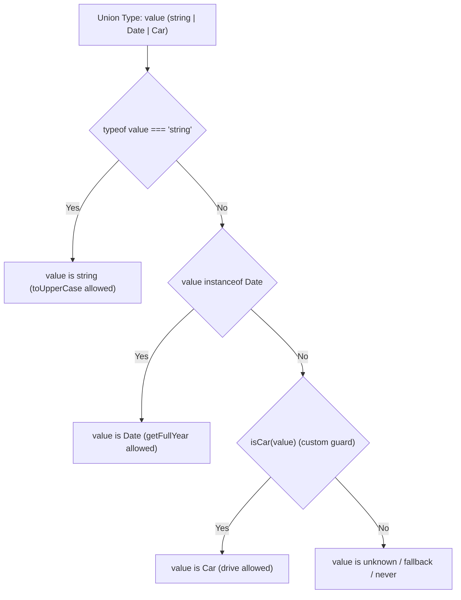

## 1. 💡 Sodda Tushuntirish va Analogiya

### Type Narrowing va Type Guards nima?
* **Type Narrowing (Tipni toraytirish):** TypeScript-da biror o'zgaruvchi bir nechta tipni qabul qila olganda (ya'ni Union type: `string | number`), uning aniq metodlaridan to'g'ridan-to'g'ri foydalana olmaymiz. Masalan, `string | number` tipiga ega o'zgaruvchiga `.toUpperCase()` deb murojaat qilsak, TypeScript kompilyatori xatolik beradi. Nega? Chunki u qiymat son bo'lib qolishi mumkinligidan xavotir oladi. Type Narrowing — bu shartlar va tekshiruvlar yordamida o'zgaruvchining tipini torroq va aniqroq sohaga olib kelish jarayonidir.
* **Type Guard (Tip qo'riqchisi):** Dasturning runtime (ishlash) vaqtida o'zgaruvchi tipini tekshiruvchi va natijasiga qarab compile-time (kompilyatsiya) vaqtida tipni toraytiruvchi maxsus ifoda yoki funksiyadir.

### Real hayotiy analogiya
Buni aeroportdagi **xavfsizlik nazorati (security checkpoint)** bilan solishtirish mumkin:
Barcha yo'lovchilar va ularning yuklari bitta umumiy oqimda (union type) keladi. Lekin bojxona xodimlari ularni tekshirish vaqtida turli guruhlarga ajratishadi (narrowing):
* Agar yuk metall buyum bo'lsa (`typeof` check), uni maxsus metall qidiruvchiga yuborishadi.
* Agar yo'lovchi xorijiy fuqaro bo'lsa (`instanceof` Passport check), pasport nazoratiga yuboriladi.
* Agar yukda taqiqlangan buyum borligi shubha qilinsa (`in` check), uni alohida tintuv qilishadi.

Ushbu tekshiruvlardan so'ng, har bir yo'lovchi o'z yo'nalishi bo'yicha ketadi va u yerda unga mos bo'lgan maxsus amallar bajariladi.

---

## 2. 💻 Real Kod Misollari

### 1. Basic Example (`typeof` operatori yordamida primitivlarni toraytirish)
JavaScript-dagi standart `typeof` operatori primitiv tiplarni (`string`, `number`, `boolean`, `symbol`) tekshirish uchun ishlatiladi:
```typescript
function formatPrice(price: string | number) {
  if (typeof price === "string") {
    // Bu blok ichida price avtomatik string deb hisoblanadi
    return price.trim().toUpperCase();
  } else {
    // Bu yerda esa faqat number bo'la oladi
    return price.toFixed(2);
  }
}
```

### 2. Intermediate Example (`instanceof` va `in` operatorlari)
* **`instanceof`** — obyekt ma'lum bir klass yoki konstruktordan yaratilganligini tekshiradi:
```typescript
function logFormattedDate(x: Date | string) {
  if (x instanceof Date) {
    // x aniq Date obyekti ekanligi kafolatlandi
    console.log(x.toUTCString());
  } else {
    // x string tipi deb qabul qilinadi
    console.log(new Date(x).toUTCString());
  }
}
```
* **`in`** — obyekt tarkibida ma'lum bir xossa mavjudligini tekshiradi:
```typescript
interface Admin {
  role: string;
  deleteUser: () => void;
}
interface User {
  name: string;
  profile: () => void;
}

function processUser(person: Admin | User) {
  if ("deleteUser" in person) {
    // person tarkibida deleteUser bor, demak u Admin
    person.deleteUser();
  } else {
    // person foydalanuvchi
    person.profile();
  }
}
```

### 3. Advanced Example (Custom Type Guards va Assertion Functions)
* **Custom Type Guard:** Maxsus funksiya yordamida tipni aniqlash. Funksiya qaytarish tipi sifatida `parameter is Type` yoziladi:
```typescript
interface Car { drive: () => void }
interface Boat { sail: () => void }

function isCar(vehicle: Car | Boat): vehicle is Car {
  return (vehicle as Car).drive !== undefined;
}

function moveVehicle(v: Car | Boat) {
  if (isCar(v)) {
    v.drive(); // Car ekanligi kafolatlandi
  } else {
    v.sail(); // Boat ekanligi kafolatlandi
  }
}
```
* **Assertion Function:** Agar shart to'g'ri kelmasa, xatolik otuvchi va keyingi kodda tipni toraytiruvchi funksiyalar:
```typescript
function assertIsString(val: unknown): asserts val is string {
  if (typeof val !== "string") {
    throw new Error("Qiymat satr bo'lishi shart!");
  }
}

function processUnknown(val: unknown) {
  assertIsString(val);
  // Bu qatordan boshlab val string deb qabul qilinadi
  console.log(val.toUpperCase());
}
```

---

## 3. ⚠️ Muammo va Nima uchun Muhimligi

### Qaysi muammoni hal qiladi?
Agar bizda union tiplar yoki `unknown` qiymatlar bo'lsa, ularni tekshiruvsiz ishlatish xavfli hisoblanadi. TypeScript bizga quyidagi xatoliklarning oldini olishga yordam beradi:
1. **Runtime Error (Ishga tushishdagi xatolar):** Obyektda mavjud bo'lmagan metodni chaqirish (masalan, `TypeError: x.toFixed is not a function`).
2. **Kompilyatsiya xavfsizligi:** Dasturchi kod yozayotgan paytda noto'g'ri metodlarni chaqirishdan ogohlantiradi.
3. **Kodni tozalash:** `any` turidan butunlay voz kechish va tiplarni aniq boshqarish imkonini beradi.

---

## 4. ❌ Ko'p Uchraydigan Xatolar (Junior Mistakes)

### 1. `typeof null === 'object'` tuzog'i
Junior dasturchilar ko'pincha qiymat null emasligini tekshirish uchun faqat `typeof obj === 'object'` dan foydalanadilar.
* **Xato:**
```typescript
function process(obj: object | null) {
  if (typeof obj === "object") {
    // Xatolik! null ham object qaytaradi va bu yerda obj.hasOwnProperty() xato berishi mumkin
    console.log(obj.toString()); 
  }
}
```
* **To'g'ri usul:**
```typescript
function process(obj: object | null) {
  if (obj !== null && typeof obj === "object") {
    console.log(obj.toString());
  }
}
```

### 2. Interfeyslar ustida `instanceof` ishlatish
TypeScript interfeyslari faqat kompilyatsiya vaqtida mavjud bo'ladi. JavaScript-ga o'girilganda interfeyslar butunlay o'chib ketadi.
* **Xato:**
```typescript
interface Bird { fly: () => void }
// if (pet instanceof Bird) { ... } -> Xato! Bird sinf emas, u runtime-da mavjud emas!
```
* **To'g'ri usul:** Interfeyslar uchun `in` operatori yoki Custom Type Guard-lardan foydalaning.

### 3. Custom Type Guard-da noto'g'ri logika
Custom type guard-da funksiya `true` qaytarsa, TypeScript siz ko'rsatgan tipga ishonadi, hatto logika noto'g'ri bo'lsa ham.
* **Xato:**
```typescript
function isNumber(x: any): x is number {
  return typeof x === "string"; // Noto'g'ri return, lekin TS baribir x ni number deb hisoblaydi!
}
```

---

## 5. 💬 12 ta Intervyu Savollari

### Junior (1–4)
1. **Savol:** TypeScript-da Type Narrowing nima?
   * **Javob:** Union tipli o'zgaruvchini shartli tekshiruvlar yordamida kichikroq va aniqroq tip doirasiga olib kelish jarayoni.
2. **Savol:** JavaScript `typeof` operatori qaysi tiplarni aniqlay oladi?
   * **Javob:** Primitiv turlarni: `string`, `number`, `boolean`, `symbol`, `undefined`, `object`, `function`, `bigint`.
3. **Savol:** `instanceof` qachon ishlatiladi?
   * **Javob:** Obyekt prototipi zanjirida berilgan klass mavjudligini tekshirish uchun (masalan, `Date`, `Error` yoki maxsus klasslar).
4. **Savol:** Obyektda biror xossa borligini qaysi operator yordamida tekshirish mumkin?
   * **Javob:** `in` operatori yordamida. Masalan: `"fly" in animal`.

### Middle (5–8)
5. **Savol:** Discriminated Union nima va u qanday yaratiladi?
   * **Javob:** Har bir interfeysga umumiy literal nomli (masalan, `kind` yoki `type`) maydon qo'shish va uning qiymatlari orqali tiplarni ajratish.
6. **Savol:** Custom Type Guard yaratish sintaksisi qanday?
   * **Javob:** Funksiya qaytaruvchi qiymati sifatida `parameter is Type` (masalan, `x is string`) yoziladi va funksiya boolean qiymat qaytarishi shart.
7. **Savol:** Nima uchun `typeof null` natijasi `'object'` bo'lib chiqadi?
   * **Javob:** Bu JavaScript-ning dastlabki versiyalaridan qolgan tarixiy xato bo'lib, null xotirada 000 ko'rinishida saqlangani uchun uni obyekt deb hisoblagan.
8. **Savol:** Type predicate (`parameter is Type`) oddiy `boolean`dan nima bilan farq qiladi?
   * **Javob:** Oddiy `boolean` faqat true/false qaytaradi, TypeScript kompilyatori esa shart blokida tipni toraytira olmaydi. Type predicate esa TypeScript-ga o'zgaruvchining tipini o'zgartirish haqida buyruq beradi.

### Senior (9–12)
9. **Savol:** Assertion function (`asserts x is Type`) oddiy type guard funksiyasidan nimasi bilan farq qiladi?
   * **Javob:** Type guard boolean qaytaradi va `if` sharti bilan ishlaydi. Assertion funksiyasi esa agar tekshiruv muvaffaqiyatsiz bo'lsa xatolik otadi va shart bloklarisiz undan keyingi barcha kodlarda tipni toraytiradi.
10. **Savol:** exhaustive check (to'liq tekshirish) nima va unga qanday erishiladi?
    * **Javob:** `never` tipi yordamida switch-case yoki if-else bloklarida barcha mumkin bo'lgan tiplar qamrab olinganini tekshirish. Agar yangi tip qo'shilsa va u tekshirilmay qolsa, kompilyator xatolik beradi.
11. **Savol:** Dinamik API ma'lumotlarini tekshirishda qaysi turdagi guard eng mos keladi?
    * **Javob:** Custom type guards yoki Zod/Yup kabi runtime validation kutubxonalari orqali ma'lumot strukturasi to'liq tekshirilgandan keyin safe narrowing qilish.
12. **Savol:** TypeScript-da narrowing faqat runtime tekshiruvlarga tayanadimi?
    * **Javob:** Tekshiruv logikasi (typeof, instanceof, in) JavaScript runtime-da bajariladi. Lekin undan keyingi tip toraytirish va static tekshiruvlar faqat compile-time vaqtida TypeScript tomonidan bajariladi.

---

## 6. 🛠️ Amaliy Topshiriqlar

Bu bo'limda siz amaliy mashqlar orqali tiplarni toraytirishni o'rganasiz.

Quyidagi diagramma union tip (`string | Date | Car`) qanday qilib tegishli type guard orqali bosqichma-bosqich toraytirilishini ko'rsatadi:



---

## 7. 📝 12 ta Mini Test

Dars oxiridagi test topshiriqlari quyidagi quizzes bo'limida keltirilgan.

---

## 8. 🎯 Real Project Case Study

### API javoblarini Discriminated Unions orqali xavfsiz boshqarish
Tasavvur qiling, bizda serverdan keladigan turli xil javob holatlari mavjud. Ularni to'g'ri ajratmasak, yo'q maydonlarga murojaat qilib xatoga yo'l qo'yamiz.

#### Exhaustive checking bilan yechim:
```typescript
interface SuccessResponse {
  status: "success";
  data: { id: number; name: string };
}

interface ErrorResponse {
  status: "error";
  message: string;
}

interface LoadingResponse {
  status: "loading";
}

type ApiResponse = SuccessResponse | ErrorResponse | LoadingResponse;

function handleApiResponse(response: ApiResponse) {
  switch (response.status) {
    case "success":
      // response.data xavfsiz o'qiladi
      console.log("Foydalanuvchi nomi:", response.data.name);
      break;
    case "error":
      // response.message xavfsiz o'qiladi
      console.error("Xatolik yuz berdi:", response.message);
      break;
    case "loading":
      console.log("Yuklanmoqda...");
      break;
    default:
      // Exhaustive check: yangi javob turi qo'shilsa va case yozilmasa, bu yerda xato beradi
      const _exhaustiveCheck: never = response;
      return _exhaustiveCheck;
  }
}
```

---

## 9. 🚀 Performance va Optimization

* **Zero Runtime Overhead:** TypeScript-ning tiplarni toraytirish tekshiruvlari JavaScript-ning standart operatorlari (`typeof`, `instanceof`, `in`) yordamida yoziladi. Ular qo'shimcha runtime kutubxonalari yoki ortiqcha kodlarsiz ishlaydi.
* **V8 Engine optimizatsiyasi:** Discriminated Union-larda literal maydonlar (masalan: `status: "success"`) tekshiruvi juda tez ishlaydi, chunki JS dvigatellari (V8) string yoki son literals solishtirishni optimallashtirilgan shaklda bajaradi.
* **Yengil custom type guardlar:** Custom type guard yozayotganda ichkarida og'ir va ko'p vaqt oladigan operatsiyalar yoki tarmoq so'rovlarini amalga oshirmaslik kerak, chunki bu shartli tekshiruvlar har safar bajarilganda dastur ishlashini sekinlashtiradi.

---

## 10. 📌 Cheat Sheet

| Shart turi | Runtime operatori | Sintaksis misoli | Qaysi hollarda qo'llaniladi |
| :--- | :--- | :--- | :--- |
| **Primitiv tiplar** | `typeof` | `typeof val === "string"` | `string`, `number`, `boolean`, `symbol` va boshqalar |
| **Klass nusxalari** | `instanceof` | `val instanceof Date` | Klaslar, sanalar (`Date`), xatolar (`Error`) |
| **Xossa mavjudligi** | `in` | `"fly" in animal` | Interfeyslar va obyekt xossalarini tekshirish |
| **Custom Tip Guard** | Type predicate (`is`) | `x is Car` | Murakkab obyektlar va custom tiplar |
| **Tasdiq (Assertion)** | `asserts` | `asserts val is string` | Testlar va run-time tekshiruvlarda majburiy toraytirish |
