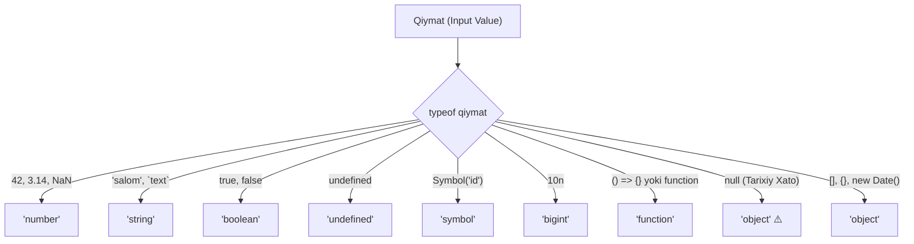

## 1. 💡 Sodda Tushuntirish va Analogiya

### `typeof` operatori nima?
JavaScript-da har qanday o'zgaruvchi yoki qiymat ma'lum bir **ma'lumot turiga (data type)** tegishli bo'ladi. `typeof` operatori — bu ma'lum bir o'zgaruvchi yoki qiymatning turini aniqlab beruvchi maxsus JavaScript vositasidir. U qiymat turini ifodalovchi **satr (string)** qaytaradi.

### Real hayotiy analogiya
Tasavvur qiling, siz do'konga bordingiz va sizga yopiq qutilarda turli mahsulotlar berildi. Siz qutining ichida nima borligini bilmaysiz (u sutmi, nonmi yoki o'yinchoqmi). 
* **`typeof` operatori** — bu har bir qutining ustidagi shtrix-kodni o'qib, sizga "sut", "non" yoki "o'yinchoq" deb aytib beradigan **skaner qurilmasi**.
* Skaner sizga qutining ichidagi aniq sut brendini yoki nonning og'irligini aytmaydi, u faqat mahsulotning umumiy turini (kategoriyasini) aniqlab beradi.

---

## 2. 💻 Real Kod Misollari

### 1. Basic Example (Sodda misol)
Primitiv ma'lumot turlarini `typeof` yordamida aniqlash:
```javascript
console.log(typeof 42);           // "number"
console.log(typeof "Assalomu alaykum"); // "string"
console.log(typeof true);         // "boolean"
console.log(typeof undefined);    // "undefined"
console.log(typeof Symbol("id")); // "symbol"
console.log(typeof 9007199254n);  // "bigint" (oxirida 'n' bor)
```

### 2. Intermediate Example (O'rtacha misol)
O'zgaruvchining turini tekshirib, shunga qarab dastur logikasini boshqarish (Type Guard):
```javascript
function formatCurrency(value) {
  // Agar qiymat son bo'lsa, uni pul formatiga o'tkazamiz
  if (typeof value === "number") {
    return `${value.toFixed(2)} UZS`;
  }
  
  // Agar qiymat matn bo'lsa va unda son yozilgan bo'lsa
  if (typeof value === "string") {
    const parsed = parseFloat(value);
    if (!isNaN(parsed)) {
      return `${parsed.toFixed(2)} UZS`;
    }
  }
  
  // Boshqa barcha holatlar uchun xatolik matni
  return "Noto'g'ri pul formati";
}

console.log(formatCurrency(15000));     // "15000.00 UZS"
console.log(formatCurrency("25000.5"));  // "25000.50 UZS"
console.log(formatCurrency(null));       // "Noto'g'ri pul formati"
```

### 3. Advanced Example (Murakkab misol)
Funksiya yoki konfiguratsiya obyektlarini dynamic ravishda qayta ishlash:
```javascript
function processInput(input, action) {
  console.log(`Kirish qiymati turi: ${typeof input}`);
  
  // Agar 'action' funksiya bo'lsa, uni ishga tushiramiz (Callback)
  if (typeof action === "function") {
    action(input);
  } 
  // Agar 'action' obyekt bo'lsa, uning ichidagi handler-ni chaqiramiz
  else if (typeof action === "object" && action !== null) {
    if (typeof action.handle === "function") {
      action.handle(input);
    } else {
      console.log("Obyekt ichida 'handle' funksiyasi topilmadi.");
    }
  } 
  else {
    console.log("Amalni bajarib bo'lmaydi: action noto'g'ri turda.");
  }
}

// Chaqirilishi:
processInput("Ma'lumot", (data) => console.log(`Funksiya ishladi: ${data}`));
processInput("Tizim", { handle: (data) => console.log(`Obyekt handler ishladi: ${data}`) });
```

---

## 3. ⚙️ Qanday Ishlaydi (Under the Hood)

### JavaScript-da qiymatlarning xotiradagi tuzilishi
JavaScript dastlabki yillarda (1995-yil) qiymatlarni xotirada 32-bitli zanjir ko'rinishida saqlagan. Ushbu bitlarning birinchi 1 dan 3 bitigacha bo'lgan qismi qiymatning turini aniqlaydigan maxsus **tur teglari (type tags)** bo'lgan:

* `000` — Obyekt (Object)
* `1` — Butun son (Integer / Number)
* `010` — Haqiqiy son (Double / Number)
* `100` — Satr (String)
* `110` — Mantiqiy qiymat (Boolean)

### Tarixiy Bug: `typeof null === 'object'`
JavaScript-da `null` qiymati bo'sh ko'rsatkich (null pointer) hisoblanadi. Shuning uchun uning barcha bitlari `0` bo'lgan (ya'ni `00000000...`). 

`typeof` operatori qiymatning turini aniqlayotganda birinchi 3 ta bitga qaraydi. `null` ning birinchi 3 biti `000` bo'lgani uchun, operator uni **Obyekt (`object`)** deb hisoblagan va `'object'` satrini qaytargan. 

Bu tilning arxitekturasidagi xatolikdir. Keyinchalik bu xatoni tuzatish bo'yicha takliflar kiritilgan, ammo dunyo bo'yicha millionlab mavjud saytlar va tizimlar ushbu xususiyatga tayanib yozilgani sababli, orqaga moslikni (backward compatibility) buzmaslik uchun ushbu xato o'zgarishsiz qoldirilgan.

---

## 4. ❌ Ko'p Uchraydigan Xatolar (Junior Mistakes)

### 1. Massivni (Array) tekshirishda `typeof`ga tayanish
#### Xato:
```javascript
const list = [1, 2, 3];
if (typeof list === "array") { // Hech qachon ishlamaydi!
  console.log("Bu massiv");
}
```
#### Nima uchun:
JavaScript-da massivlar ham obyektlarning bir turi bo'lganligi sababli, `typeof list` har doim `'object'` qaytaradi.
#### To'g'ri usul:
Massivni tekshirish uchun maxsus `Array.isArray()` metodidan foydalanish kerak:
```javascript
if (Array.isArray(list)) {
  console.log("Bu massiv");
}
```

### 2. `null` qiymatini tekshirmasdan obyekt xossalariga murojaat qilish
#### Xato:
```javascript
let user = null;
if (typeof user === "object") {
  console.log(user.name); // TypeError: Cannot read properties of null
}
```
#### Nima uchun:
`typeof null` sizga `'object'` bergani bilan, `null` ichida hech qanday xossa yoki metod bo'lmaydi. Uni oddiy obyekt deb hisoblash xatolikka olib keladi.
#### To'g'ri usul:
Qiymat `null` emasligini alohida tekshiring:
```javascript
if (user !== null && typeof user === "object") {
  console.log(user.name);
}
```

### 3. Konstruktor yordamida yaratilgan wrapper (qobiq) obyektlari
#### Xato:
```javascript
const nameObj = new String("Jasur");
console.log(typeof nameObj); // "object" qaytaradi, "string" emas!
```
#### Nima uchun:
`new` kalit so'zi bilan yaratilgan har qanday qiymat oddiy ibtidoiy qiymat emas, balki qobiq obyekt (wrapper object) hisoblanadi. Shuning uchun ibtidoiy qiymatlarni yaratishda hech qachon `new String()`, `new Number()` yoki `new Boolean()` ishlatmang.

---

## 5. 💬 12 ta Intervyu Savollari

### Junior darajasi uchun
1. **Savol:** `typeof` operatori nima qaytaradi?
   * **Javob:** Qiymatning turini ko'rsatadigan kichik harflardagi satr (string) qaytaradi (masalan: `'number'`, `'string'`, `'boolean'`).
2. **Savol:** `typeof null` natijasi nima va nima uchun?
   * **Javob:** Natija `'object'`. Bu JavaScript-ning dastlabki bit-tizimidagi tarixiy xatodir (null pointer bitlari 000 bo'lgani sababli).
3. **Savol:** `typeof undefined` natijasi nima?
   * **Javob:** `'undefined'`.
4. **Savol:** `typeof` operatorini qavslar bilan yozish kerakmi? Masalan: `typeof(x)` yoki `typeof x`?
   * **Javob:** Ikkala usul ham to'g'ri. `typeof` bu funksiya emas, operator. Qavslar faqat ifodani guruhlash uchun xizmat qiladi.

### Middle darajasi uchun
5. **Savol:** `typeof NaN` natijasi nima?
   * **Javob:** `'number'`. `NaN` (Not-a-Number) sonli qiymatlarning noto'g'ri matematik amallar natijasidagi holatini ifodalaydi.
6. **Savol:** E'lon qilinmagan o'zgaruvchiga `typeof` ishlatilsa nima sodir bo'ladi?
   * **Javob:** Xatolik tashlanmaydi, aksincha xavfsiz tarzda `'undefined'` qaytadi.
7. **Savol:** Massiv (Array) va oddiy obyekt (Object) uchun `typeof` nima qaytaradi? Ularni qanday ajratish mumkin?
   * **Javob:** Har ikkalasi uchun ham `'object'` qaytaradi. Ularni ajratish uchun `Array.isArray(x)` yoki `x instanceof Array` ishlatish kerak.
8. **Savol:** `typeof new Function()` nima qaytaradi?
   * **Javob:** `'function'`. Barcha funksiyalar va funksiya konstruktorlari uchun `'function'` qaytadi.

### Senior darajasi uchun
9. **Savol:** `typeof typeof 1` natijasi nima?
   * **Javob:** `'string'`. Chunki birinchi `typeof 1` natijasi `'number'` satridir. Keyin esa `typeof 'number'` bajariladi va u har doim `'string'` bo'ladi.
10. **Savol:** `typeof` yordamida obyektning klassini yoki custom turini aniqlab bo'ladimi?
    * **Javob:** Yo'q, `typeof` faqat asosiy tiplarni qaytaradi. Maxsus klasslarni aniqlash uchun `instanceof` operatori yoki `Object.prototype.toString.call(obj)`dan foydalaniladi.
11. **Savol:** `typeof` ning qanday cheklovlari bor?
    * **Javob:** U `null`, `Array`, `Date`, `RegExp` va oddiy obyektlarni farqlay olmaydi — hammasiga `'object'` qaytaradi.
12. **Savol:** `typeof 10n` nima beradi?
    * **Javob:** `'bigint'`. Bu ES2020 da kiritilgan BigInt primitiv turining natijasidir.

---

## 6. 🛠️ Amaliy Topshiriqlar

Quyidagi Mermaid diagrammasida `typeof` operatorining har xil turdagi qiymatlarni qanday satrlarga xaritalashi (map qilishi) batafsil ko'rsatilgan. Tarixiy `null` xatoligiga ham alohida e'tibor bering:



Ushbu qoidalar asosida o'zingizni sinash uchun `typeof` yordamida ma'lumotlarni validatsiya qilishni boshlang.

---

## 7. 📝 12 ta Mini Test

Bilimingizni sinash uchun ushbu darsga biriktirilgan test savollarini yechib chiqing. Testlar primitiv turlar, funksiyalar va JavaScript-ning o'ziga xos xususiyatlarini qamrab oladi.

---

## 8. 🎯 Real Project Case Study

### API Ma'lumotlarini Validatsiya Qilish Tizimi (Schema Validator)
Loyihada tashqi API-dan kelayotgan JSON ma'lumotlarini tekshirish juda muhim. Agar kelgan ma'lumot turi xato bo'lsa, dasturimiz to'xtab qolishi mumkin. Buning uchun `typeof` yordamida oddiy sxema validatori yozamiz:

```javascript
function validateSchema(data, schema) {
  for (let key in schema) {
    const expectedType = schema[key];
    const actualValue = data[key];
    
    // Agar kutilayotgan maydon ma'lumotda bo'lmasa
    if (actualValue === undefined) {
      return { valid: false, error: `'${key}' maydoni kiritilishi shart.` };
    }
    
    // Agar kutilayotgan tur funksiya yoki boshqa ma'lumot turi bo'lsa
    if (typeof actualValue !== expectedType) {
      return { 
        valid: false, 
        error: `'${key}' maydoni '${expectedType}' turida bo'lishi kerak. Amalda: '${typeof actualValue}'` 
      };
    }
  }
  return { valid: true };
}

// Loyihadagi sxema:
const userSchema = {
  id: "number",
  username: "string",
  isActive: "boolean"
};

// API-dan kelgan to'g'ri ma'lumot:
const correctResponse = { id: 101, username: "admin", isActive: true };
console.log(validateSchema(correctResponse, userSchema)); // { valid: true }

// API-dan kelgan noto'g'ri ma'lumot:
const badResponse = { id: 101, username: "admin", isActive: "true" }; // isActive string bo'lib kelgan
console.log(validateSchema(badResponse, userSchema)); 
// { valid: false, error: "'isActive' maydoni 'boolean' turida bo'lishi kerak. Amalda: 'string'" }
```

---

## 9. 🚀 Performance va Optimization

* **Tezlik:** `typeof` operatori JavaScript-dagi eng tezkor operatsiyalardan biridir. U xotiradagi tur tagiga qarab ishlaydi, shuning uchun uning bajarilish vaqti doimiy ya'ni $O(1)$ dir.
* **Statik turlardan foydalanish:** JavaScript dynamic tipli til bo'lgani sababli `typeof`ni juda ko'p tekshiruvlarda ishlatishga to'g'ri keladi. Ammo katta loyihalarda dynamic tekshiruvlarni kamaytirish va xatolarni dasturlash vaqtidayoq aniqlash uchun **TypeScript**dan foydalanish tavsiya etiladi. TypeScript compile vaqtida turlarni tekshirib beradi, natijada run-time da `typeof` tekshiruvlariga ehtiyoj kamayadi.

---

## 10. 📌 Cheat Sheet

| Qiymat | `typeof` Natijasi | Izoh / Tavsif |
| :--- | :--- | :--- |
| `undefined` | `'undefined'` | Qiymat berilmagan o'zgaruvchi |
| `null` | `'object'` | **Tarixiy xato (bug)**, obyekt emas |
| `true` / `false` | `'boolean'` | Mantiqiy qiymat |
| `42` / `3.14` / `NaN` | `'number'` | Oddiy va maxsus sonlar |
| `10n` | `'bigint'` | Katta o'lchamli butun son |
| `"salom"` | `'string'` | Matnli ma'lumot |
| `Symbol("id")` | `'symbol'` | Unikal identifikator turi |
| `() => {}` | `'function'` | Arrow yoki oddiy funksiyalar |
| `[]` | `'object'` | Massivlar aslida obyekt |
| `{}` | `'object'` | Oddiy obyekt |
