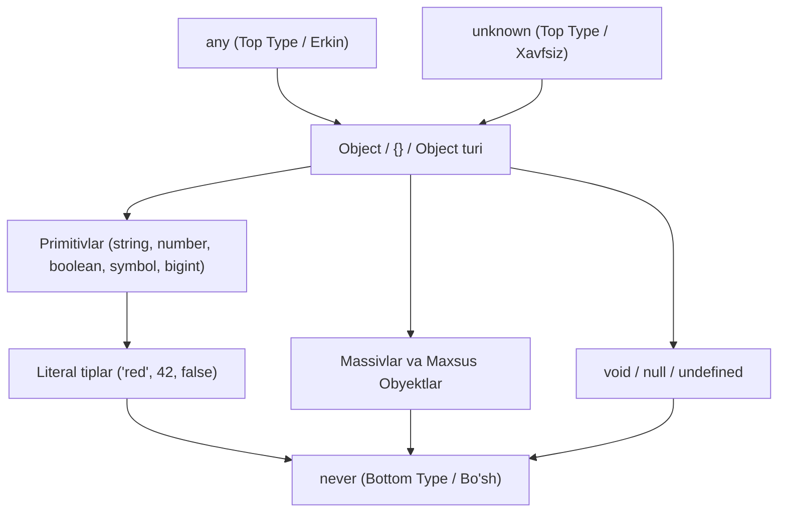

## 1. 💡 Sodda Tushuntirish va Analogiya

### JavaScript va TypeScript farqi
* **JavaScript** dinamik tipli tildir. Bu shuni anglatadiki, o'zgaruvchi e'lon qilinganda uning tipi belgilanmaydi va dastur ishlash jarayonida (runtime) o'zgaruvchi ixtiyoriy tipdagi qiymatni qabul qilishi mumkin. Bu moslashuvchanlikni oshirsa-da, katta loyihalarda kutilmagan xatolarni (runtime errors) keltirib chiqaradi.
* **TypeScript** esa Microsoft tomonidan yaratilgan bo'lib, JavaScript ustiga qurilgan va unga **statik tiplash** (static typing) xususiyatini qo'shadi. TypeScript koddagi tiplarni dastur ishga tushishidan oldin (compile-time) tekshiradi. Bu orqali xatoliklarni kod yozish jarayonidayoq aniqlash mumkin bo'ladi.

### Real hayotiy analogiya
JavaScript-ni **vilkalar va rozetkalarsiz simlarga** o'xshatish mumkin: siz istalgan simni istalgan joyga ulashingiz mumkin, lekin noto'g'ri ulasangiz, qisqa tutashuv (runtime error) yuz beradi.
TypeScript esa **maxsus shaklli rozetka va vilkalarga** o'xshaydi: yumaloq vilkani faqat yumaloq rozetkaga ulay olasiz. Agar to'rtburchak vilkani ulamoqchi bo'lsangiz, tizim sizga elektr oqimi boshlanishidan oldinoq (kompilyatsiyada) xato haqida ogohlantiradi.

---

## 2. 💻 Real Kod Misollari

### 1. Basic Example (Oddiy tiplar)
```typescript
let age: number = 25;
let username: string = "Ali";
let isDeveloper: boolean = true;
```

### 2. Intermediate Example (Massivlar va Tuple)
```typescript
// Massivlar
let scores: number[] = [90, 85, 95];
let fruits: Array<string> = ["Olma", "Banan"];

// Tuple (Kortej)
let coords: [number, number] = [41.2995, 69.2401];
let userSession: [string, boolean] = ["admin", true];
```

### 3. Advanced Example (Unknown va Type Assertion)
```typescript
// Unknown tipidan foydalanish
let inputVal: unknown = "Salom";

// Type Narrowing (Tipni aniqlashtirish)
if (typeof inputVal === "string") {
  console.log(inputVal.toUpperCase()); // "SALOM"
}

// Type Assertion (Tipni majburlash)
let canvasElement = document.getElementById("main_canvas") as HTMLCanvasElement;
```

---

## 3. ⚠️ Muammo va Nima uchun Muhimligi

### Qaysi muammoni hal qiladi?
1. **Runtime Errorlar (Ish vaqtidagi xatoliklar):** JavaScript-da funksiyaga noto'g'ri parametr yuborilsa, xato dastur ishga tushib foydalanuvchiga yetganda aniqlanadi. TypeScript esa buni compile-time (kod yozish va build) vaqtida aniqlaydi.
2. **Kodni hujjatlashtirish:** Katta jamoalarda kimdir yozgan funksiya qanday ma'lumot qabul qilishi va nima qaytarishini bilish qiyin bo'ladi. Tiplar kodni o'z-o'zidan tushunarli hujjatga aylantiradi.

---

## 4. ❌ Ko'p Uchraydigan Xatolar (Junior Mistakes)

### 1. Barcha joyga `any` ishlatish ("Any-Script")
Xato xavfsizlikni to'liq yo'q qiladi:
```typescript
// Noto'g'ri
let data: any = { id: 1, name: "Ali" };
data.someNonExistentMethod(); // Kompilyator xato bermaydi, lekin runtime-da xato bo'ladi
```

### 2. `unknown` tipini tekshiruvsiz ishlatish
`unknown` xavfsiz tipdir, lekin uni ishlatishdan oldin tipini aniqlash shart:
```typescript
// Noto'g'ri
let value: unknown = "test";
let len = value.length; // XATO! 'value' unknown tipida

// To'g'ri
let value: unknown = "test";
if (typeof value === "string") {
  let len = value.length; // To'g'ri
}
```

### 3. Tuple va Oddiy Array farqini tushunmaslik
Tuple qat'iy tartib va o'lchamga ega:
```typescript
let info: [string, number] = ["Ali", 30];
// info = [30, "Ali"]; // XATO! Birinchi element string bo'lishi kerak
```

---

## 5. 💬 12 ta Intervyu Savollari

### Junior (1–4)
1. **Savol:** TypeScript nima?
   * **Javob:** TypeScript — JavaScript-ning ustiga qurilgan, statik tiplash tizimiga ega dasturlash tilidir. U JS-ga kompilyatsiya bo'ladi.
2. **Savol:** Type Inference (Tip xulosasi) nima?
   * **Javob:** Agar o'zgaruvchiga qiymat biriktirilsa, TypeScript uning tipini avtomatik aniqlab oladi (masalan: `let x = 10` son deb hisoblanadi).
3. **Savol:** `any` va `unknown` farqi nima?
   * **Javob:** Ikkalasi ham har qanday qiymatni oladi, lekin `any` hech qanday tekshiruv talab qilmaydi, `unknown` esa ishlatishdan oldin tip tekshiruvini majburlaydi.
4. **Savol:** Tuple nima?
   * **Javob:** Elementlari soni va har bir indeksdagi tiplari qat'iy belgilangan massiv turi.

### Middle (5–8)
5. **Savol:** `void` va `never` farqi nimada?
   * **Javob:** `void` hech qanday qiymat qaytarmaydigan funksiyalar uchun ishlatiladi (lekin funksiya normal tugaydi). `never` esa hech qachon oxiriga yetmaydigan (xato otadigan yoki cheksiz aylanadigan) funksiyalar uchun.
6. **Savol:** Type Assertion nima va u `as` operatori orqali qanday ishlaydi?
   * **Javob:** Dasturchi kompilyatorga o'zgaruvchi tipini aniq bilishini va uni ma'lum bir tip deb hisoblashini buyurishidir (masalan: `val as string`).
7. **Savol:** TypeScript kodi brauzerda qanday ishlaydi?
   * **Javob:** Brauzerlar TS-ni tushunmaydi. TS kodi transpilyator yordamida oddiy JavaScript-ga o'giriladi, barcha tip belgilari o'chirib tashlanadi.
8. **Savol:** Enum nima?
   * **Javob:** Mantiqan bog'liq konstantalarni bitta guruhga birlashtirish vositasi (masalan, foydalanuvchi rollari).

### Senior (9–12)
9. **Savol:** TypeScript-ning tiplash tizimi nominalmi yoki tarkibiy (structural)?
   * **Javob:** Tarkibiy (Structural). Ikki xil nomli obyekt/tip tarkibi (xossalari va metodlari) bir xil bo'lsa, TypeScript ularni bir-biriga mos deb hisoblaydi.
10. **Savol:** Type Alias (`type`) va `Interface` farqi nimada?
    * **Javob:** Interface-lar obyekt tuzilmalari uchun mo'ljallangan bo'lib, declaration merging (birlashish) ni qo'llaydi. Type alias-lar esa istalgan tipga (union, primitivlar) yangi nom berish uchun ishlatiladi va birlasha olmaydi.
11. **Savol:** `const` o'zgaruvchilar va `readonly` klass maydonlari farqi nimada?
    * **Javob:** `const` o'zgaruvchilarni qayta o'zlashtirishni taqiqlaydi (runtime darajasida). `readonly` esa TypeScript-ning faqat o'qish uchun mo'ljallangan kompilyatsiya vaqtidagi cheklovidir.
12. **Savol:** TypeScript runtime loyiha tezligiga qanday ta'sir qiladi?
    * **Javob:** Mutlaqo ta'sir qilmaydi (Zero Runtime Overhead). Kompilyatsiyadan so'ng barcha tiplar o'chib, faqat toza JavaScript qoladi.

---

## 6. 🛠️ Amaliy Topshiriqlar

Mashqlar pastda keltirilgan testlar orqali avtomatik tekshiriladi. Kod yozishda tiplar xavfsizligiga e'tibor bering.

### TypeScript Tip Ierarxiyasi (any dan never gacha)

Quyidagi Mermaid diagrammasida TypeScript-dagi tiplarning o'zaro munosabati va ierarxiyasi ko'rsatilgan:



---

## 7. 📝 12 ta Mini Test

Dars oxirida interaktiv testlar taqdim etiladi. Bilimlaringizni sinab ko'ring!

---

## 8. 🎯 Real Project Case Study

### API javobini xavfsiz qabul qilish va tekshirish
Tashqi API orqali ma'lumot kelganda, uning formati qat'iy kafolatlanmagan bo'ladi. Bunday holatda unga `any` emas, `unknown` berish va tipni tekshirish eng xavfsiz usuldir.

```typescript
interface User {
  id: number;
  name: string;
}

// API dan kelgan natija noma'lum
function processApiResponse(payload: unknown): User | null {
  if (
    payload &&
    typeof payload === "object" &&
    "id" in payload &&
    "name" in payload &&
    typeof (payload as any).id === "number" &&
    typeof (payload as any).name === "string"
  ) {
    // Tip tekshirilgandan keyin xavfsiz cast qilamiz
    return payload as User;
  }
  
  console.error("Noto'g'ri formatdagi API javobi");
  return null;
}
```

---

## 9. 🚀 Performance va Optimization

* **Tipni o'chirish (Type Erasure):** Kompilyatsiya vaqtida barcha tiplar butunlay olib tashlanadi va JS kodi hajmi kamayadi.
* **Strict Flags:** Loyihada `strict: true` va `noImplicitAny: true` sozlamalarini yoqish tavsiya etiladi. Bu kod sifatini oshiradi va yashirin `any` tiplari paydo bo'lishining oldini oladi.

---

## 10. 📌 Cheat Sheet

| Tip | Vazifasi | Misol |
| :--- | :--- | :--- |
| `number` | Barcha sonlar (butun va o'nlik) | `let x: number = 5.5;` |
| `string` | Matnli ma'lumotlar | `let s: string = "Salom";` |
| `boolean` | Mantiqiy `true` yoki `false` | `let ok: boolean = true;` |
| `any` | Har qanday qiymat (tiplashni o'chiradi) | `let a: any = 123;` |
| `unknown` | Har qanday qiymat (ishlatishdan oldin tekshirish shart) | `let u: unknown = "test";` |
| `void` | Qiymat qaytarmaydigan funksiyalar | `function log(): void {}` |
| `never` | Hech qachon yakunlanmaydigan holatlar | `function err(): never { throw Error(); }` |
| `[T, U]` | Tuple - qat'iy massiv | `let pair: [string, number] = ["a", 1];` |
| `enum` | Konstantalar to'plami | `enum Color { Red, Blue }` |
