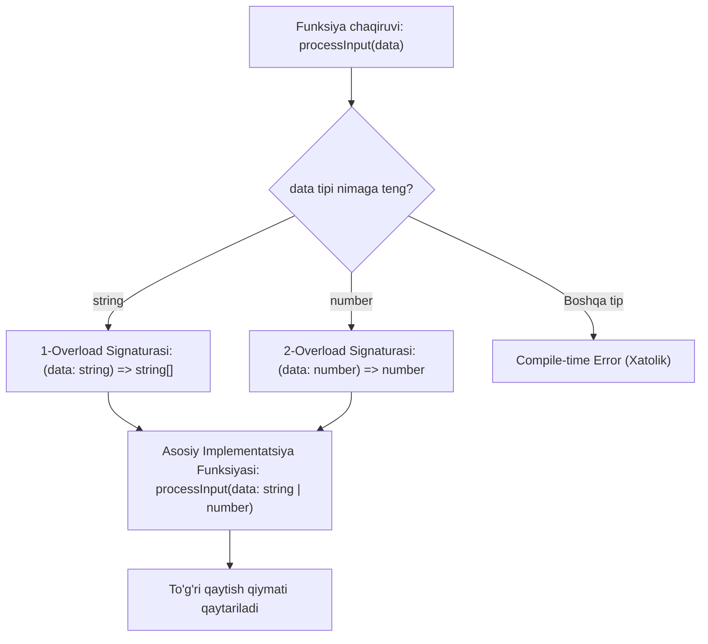

## 1. 💡 Sodda Tushuntirish va Analogiya

### TypeScript-da Funksiyalar nima?
JavaScript-da funksiyalar juda erkin: ular har qanday tipdagi argumentlarni qabul qilaveradi va istalgan qiymatni qaytaradi. Bu esa katta loyihalarda kutilmagan xatolarga (masalan, son kutilgan joyga string yoki undefined kelib qolishiga) sabab bo'ladi.
**TypeScript-da funksiyalar** — bu funksiyaga kirayotgan parametrlar (argumentlar) va undan qaytayotgan natijaning tiplari qat'iy nazorat qilinishidir. Shuningdek, u bizga ixtiyoriy parametrlarni, standart qiymatlarni va har xil kirish parametrlariga mos ravishda har xil chiqish tiplarini belgilash imkonini beruvchi **Function Overloads** (funksiya yuklamasi) mexanizmini taqdim etadi.

### Real hayotiy analogiya
Funksiyani **kartoshka tozalaydigan va to'g'raydigan mashinaga** o'xshatish mumkin:
* **JavaScript funksiyasi:** Bu mashina ichiga kartoshka o'rniga tosh, g'isht yoki poyabzal tashlasangiz ham ishlashga harakat qiladi va natijada runtime (ish jarayoni) paytida buziladi.
* **TypeScript funksiyasi:** Bu mashinaning kirish qismida faqat "Kartoshka" (`number`) qabul qilinishi va chiqishida faqat "Tozalangan to'g'ralgan kartoshka" (`string`) olinishi oldindan qat'iy e'lon qilingan. Agar g'isht tashlamoqchi bo'lsangiz, tizim hali mashinani yoqmasdan oldinoq (kompilyatsiya bosqichida) xatolik beradi va ishlashni rad etadi.

---

## 2. 💻 Real Kod Misollari

### 1. Basic Example (Oddiy parametr va return tiplari)
```typescript
// Parametrlar ham, qaytish qiymati ham son (number) bo'lishi shart
function calculateArea(width: number, height: number): number {
  return width * height;
}

const area = calculateArea(10, 5); // To'g'ri
// calculateArea("10", 5); // Xatolik! Birinchi parametr string bo'la olmaydi
```

### 2. Intermediate Example (Ixtiyoriy va default parametrlar hamda Rest)
```typescript
// greeting parametri default qiymatga ega, title esa ixtiyoriy (?)
function greetUser(name: string, title?: string, greeting: string = "Xush kelibsiz"): string {
  const prefix = title ? `${title} ` : "";
  return `${greeting}, ${prefix}${name}!`;
}

console.log(greetUser("Sardor")); // "Xush kelibsiz, Sardor!"
console.log(greetUser("Dilnoza", "Doktor")); // "Xush kelibsiz, Doktor Dilnoza!"

// Rest parametrlarni massiv sifatida tiplash:
function sumAll(...numbers: number[]): number {
  return numbers.reduce((sum, num) => sum + num, 0);
}
```

### 3. Advanced Example (Function Overloads va Call Signatures)
```typescript
// 1. Overload signaturalari (faqat tiplar tavsifi)
function formatData(value: string): string;
function formatData(value: number): string[];

// 2. Yagona implementatsiya (haqiqiy kod yoziladigan qism)
function formatData(value: string | number): string | string[] {
  if (typeof value === "string") {
    return value.toUpperCase();
  } else {
    return value.toString().split("");
  }
}

const resStr = formatData("salom"); // Tipi: string
const resArr = formatData(123); // Tipi: string[]
```

---

## 3. ⚠️ Muammo va Nima uchun Muhimligi

### Qaysi muammoni hal qiladi?
1. **Dynamic typing xavflari:** JS-da funksiyaga noto'g'ri argument uzatilsa, funksiya xato natija qaytaradi yoki runtime-da `TypeError: Cannot read properties of undefined` kabi xatolarni keltirib chiqaradi. TypeScript parametrlar mosligini static tekshiruv vaqtida hal qiladi.
2. **`this` kontekstining chalkashligi:** JavaScript-da funksiya ichidagi `this` obyektini tiplash qiyin edi. TypeScript funksiyaning birinchi argumenti sifatida `this` kalit so'zini tiplash imkonini beradi.
3. **Murakkab interfeyslar bilan ishlash:** Bir xil funksiya har xil tipli argumentlar uchun har xil turdagi qiymat qaytarganda, return tipini `any` yoki `union` qilib qo'yish tiplar xavfsizligini yo'qotadi. Function Overloading yordamida har bir kirish tipiga mos aniq chiqish tipini kompilyatorga tushuntirish mumkin.

---

## 4. ❌ Ko'p Uchraydigan Xatolar (Junior Mistakes)

### 1. Rest parametrlarni oddiy o'zgaruvchi kabi tiplash
Rest parametr (`...args`) doimo uzatilgan barcha argumentlarni bitta massivga yig'adi, shuning uchun uning tipi massiv bo'lishi shart.
* **Xato:** `function log(...messages: string)`
* **Tuzatish:** `function log(...messages: string[])`

### 2. Callback funksiyani shunchaki `Function` deb e'lon qilish
`Function` tipi har qanday funksiyani qabul qiladi, lekin uning argumentlari va qaytish qiymatini tekshirmaydi.
* **Xato:**
  ```typescript
  function execute(callback: Function) {
    callback("data"); // Parametrlar tipi nazorat qilinmaydi
  }
  ```
* **Tuzatish:**
  ```typescript
  function execute(callback: (data: string) => void) {
    callback("data");
  }
  ```

### 3. Overload signaturalarini implementatsiya bilan to'g'ri moslashtirmaslik
Implementatsiya funksiyasi barcha overload signaturalarini to'liq qamrab olishi kerak, aks holda TypeScript kompilyatsiya xatosini beradi.
* **Xato:**
  ```typescript
  function process(x: string): string;
  function process(x: number): number;
  function process(x: string) { return x; } // Xatolik! number signaturasi qamrab olinmagan
  ```
* **Tuzatish:**
  ```typescript
  function process(x: string): string;
  function process(x: number): number;
  function process(x: string | number): any { return x; }
  ```

---

## 5. 💬 12 ta Intervyu Savollari

### Junior (1–4)
1. **Savol:** TypeScript-da funksiya parametrlari qanday tiplanadi?
   * **Javob:** Har bir parametrdan keyin ikki nuqta (`:`) va uning tipi yoziladi. Masalan: `function add(a: number, b: number)`.
2. **Savol:** Qaytish tipi (`return type`) yozilmasa nima bo'ladi?
   * **Javob:** TypeScript uni return qilinayotgan qiymatga qarab o'zi aniqlaydi (Type Inference). Agar return bo'lmasa, `void` deb hisoblaydi.
3. **Savol:** Ixtiyoriy parametr (`?`) va default parametr farqi nimada?
   * **Javob:** Ixtiyoriy parametr qiymat berilmaganda `undefined` bo'ladi. Default parametr esa qiymat berilmaganda o'zining standart qiymatini oladi.
4. **Savol:** `void` va `never` tiplarining farqi nimada?
   * **Javob:** `void` hech qanday qiymat qaytarmaydigan funksiyalar uchun (lekin funksiya o'z ishini tugatadi). `never` esa hech qachon tugamaydigan yoki faqat xato otadigan funksiyalar uchun ishlatiladi.

### Middle (5–8)
5. **Savol:** Function Overloading nima va uning asosiy qoidasi qanday?
   * **Javob:** Bir xil nomli, lekin parametrlari yoki qaytish tiplari har xil bo'lgan bir nechta signaturalarni e'lon qilish. Asosiy qoidasi: barcha signaturalardan keyin bitta umumiy implementatsiya funksiyasi yozilishi shart.
6. **Savol:** Rest parametrlar qanday tiplanadi va Tuple ishlatish mumkinmi?
   * **Javob:** Rest parametrlar odatda massiv tipi bilan tiplanadi. Shuningdek, ularni aniq tartibdagi tiplarga ega Tuple (kortej) sifatida ham yozish mumkin: `...args: [number, string]`.
7. **Savol:** Funksiya ichida `this` parametrining roli nima va u JS-ga qanday o'tadi?
   * **Javob:** Funksiya tanasida `this` konteksti qaysi obyektga tegishli ekanini tekshirish uchun ishlatiladi. U parametrlarning eng boshida `this: Type` ko'rinishida yoziladi va kompilyatsiya qilinganda JS kodidan butunlay o'chib ketadi.
8. **Savol:** Call Signature (murojaat signaturasi) nima va u qachon ishlatiladi?
   * **Javob:** Obyekt ham funksiya sifatida chaqirilishi, ham o'z xususiyatlariga ega bo'lishi kerak bo'lgan holatlarda interfeys ichida yoziladigan maxsus signatura. Masalan: `interface Fn { (x: number): boolean; desc: string; }`.

### Senior (9–12)
9. **Savol:** Construct Signature (konstruktor signaturasi) nima va uning Call Signature-dan farqi nima?
   * **Javob:** Construct Signature `new` kalit so'zi yordamida obyekt yaratuvchi (konstruktor) funksiyalarni tiplaydi: `interface Ctor { new (x: number): Point; }`. Call signature esa oddiy chaqiriladigan funksiyalar uchun ishlatiladi.
10. **Savol:** Overload signaturalari tartibi kompilyatorga qanday ta'sir qiladi?
    * **Javob:** TypeScript mos keladigan signaturani birinchisidan boshlab tartib bilan qidiradi. Shuning uchun kengroq yoki umumiyroq signaturalarni teparoqqa emas, pastroqqa yozish tavsiya etiladi.
11. **Savol:** TypeScript funksiyalar mosligi (assignability) parametrlar soni bo'yicha qanday ishlaydi?
    * **Javob:** TypeScript kamroq parametrli funksiyalarni ko'proq parametr kutayotgan joylarga mos deb biladi (masalan, callbacklarda ortiqcha parametrlarni tashlab yuborish imkoni borligi sababli).
12. **Savol:** `never` qaytaruvchi funksiya orqali "Exhaustiveness checking" qanday amalga oshiriladi?
    * **Javob:** Switch-case yoki if-else shartlarida barcha mumkin bo'lgan tiplar (masalan, union variantlar) tekshirib bo'lingach, qolgan `else/default` blokida `never` tipidagi o'zgaruvchiga qiymat yuklanadi. Agar yangi tip qo'shilib, tekshirilmay qolsa, kompilyator xato beradi.

---

## 6. 🛠️ Amaliy Topshiriqlar

Quyida function overloading yoki parametrlar oqimi jarayonining vizual sxemasi ko'rsatilgan:



---

## 7. 📝 12 ta Mini Test

Dars oxirida bilimingizni sinab ko'rish uchun testlar berilgan.

---

## 8. 🎯 Real Project Case Study

### Moslashuvchan Konfiguratsiya Yuklovchi (Configuration Loader)
Katta loyihalarda konfiguratsiyalar ko'pincha inline JSON string ko'rinishida yoki URL orqali asinxron ravishda yuklanadi. Bizga har ikkala holatni ham xavfsiz boshqara oladigan bitta funksiya kerak.

```typescript
interface AppConfig {
  apiUrl: string;
  debugMode: boolean;
}

// 1. JSON string qabul qilganda obyektni sinxron qaytaradi
function configureApp(jsonConfig: string): AppConfig;

// 2. URL qabul qilganda Promise qaytaradi (asinxron)
function configureApp(url: string, fetchTimeout: number): Promise<AppConfig>;

// 3. Implementatsiya
function configureApp(source: string, timeout?: number): AppConfig | Promise<AppConfig> {
  if (timeout !== undefined) {
    // Asinxron fetch simulyatsiyasi
    return new Promise((resolve) => {
      setTimeout(() => {
        resolve({ apiUrl: source, debugMode: false });
      }, timeout);
    });
  }
  
  // Sinxron JSON parse
  return JSON.parse(source) as AppConfig;
}

// Foydalanish:
const syncConf = configureApp('{"apiUrl": "localhost", "debugMode": true}'); // Tipi: AppConfig
const asyncConfPromise = configureApp("https://api.example.com", 2000); // Tipi: Promise<AppConfig>
```

---

## 9. 🚀 Performance va Optimization

1. **Compile-time va Runtime xarajatlari:** TypeScript tiplash va signatura tekshiruvlari faqat kompilyatsiya bosqichida mavjud. Transpayldan so'ng JS faylda hech qanday tip tekshiruvi qolmaydi, shuning uchun bu runtime tezligiga ta'sir qilmaydi.
2. **Rest Parametrlar va xotira:** Rest parametrlarni (`...nums`) ishlatganda JavaScript har gal funksiya chaqirilganda yangi massiv yaratadi. O'ta yuqori unumdorlik talab etiladigan "hot paths" (tez-tez chaqiriladigan kodlar)da rest parametr o'rniga oddiy argumentlardan yoki oldindan yaratilgan massivlardan foydalanish tavsiya etiladi.
3. **Overload implementatsiyasi optimalligi:** Implementatsiya funksiyasi ichida `typeof`, `instanceof` yoki "type guards" orqali tiplarni ajratish tez va yengil bo'lishi kerak.

---

## 10. 📌 Cheat Sheet

| Funksiya Turi / Parametr | Yozilish Sinraksi | Qisqa Tavsif |
| :--- | :--- | :--- |
| **Oddiy Funksiya** | `function f(x: number): number` | Kirish va chiqish son bo'lgan qat'iy funksiya |
| **Ixtiyoriy Parametr** | `function f(x: number, y?: number)` | `y` parametri majburiy emas (undefined bo'lishi mumkin) |
| **Standart Parametr** | `function f(x: number, y = 10)` | Qiymat berilmaganda `y` ning qiymati `10` ga teng |
| **Rest Parametr** | `function f(...args: string[])` | Istalgancha string argumentlarni massivga yig'adi |
| **Function Overload** | `function f(x: string): string;` | Har xil signaturalarni bitta nom ostida birlashtirish |
| **Call Signature** | `interface F { (a: number): void; d: string; }` | Funksiya sifatida chaqiriladigan va xossalarga ega obyekt |
