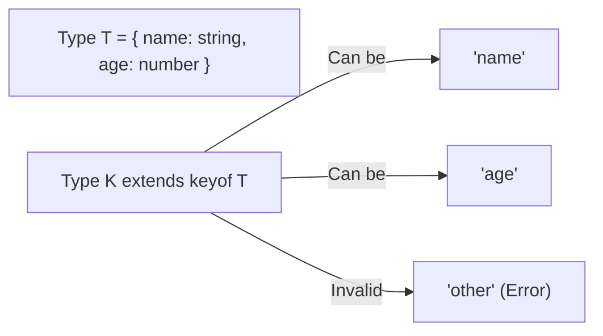

## 1. 💡 Sodda Tushuntirish va Analogiya

### Generics (Umumiylashtirish) nima?
Dasturlashda ko'pincha har xil turdagi ma'lumotlar bilan ishlaydigan qayta ishlatiladigan komponentlar yoki funksiyalar yozish talab qilinadi. Masalan, massivlar bilan ishlaydigan yordamchi funksiya sonlar massivini ham, satrlar massivini ham qayta ishlay olishi kerak.
Agar biz har bir tip uchun alohida funksiya yozsak, kod hajmi ko'payadi. Agar `any` tipini ishlatsak, tiplar xavfsizligidan (type safety) butunlay voz kechgan bo'lamiz.
**Generics** esa bu muammoni hal qiladi: ular funksiya, klass yoki interfeys chaqirilayotgan vaqtda qaysi tip bilan ishlashini parametr sifatida qabul qilish imkonini beradi. Bu kodning qayta ishlatilishini oshiradi va tiplar xavfsizligini 100% saqlaydi.

### Real hayotiy analogiya
Generics-ni **bo'sh yuk konteynerlariga (shipping containers)** o'xshatish mumkin:
* **Oddiy tipli klass/funksiya** — bu faqat **olma** uchun maxsus qurilgan qutidir (unga nok solib bo'lmaydi).
* **`any` tipli klass/funksiya** — bu **aralash qutidir**. Unga hamma narsani tartibsiz solaverasiz, lekin ichidan olma olayotganda, u nok bo'lib chiqishi yoki buzilib ketgan bo'lishi mumkin (runtime error).
* **Generic klass/funksiya (`Container<T>`)** — bu **universal bo'sh konteynerdir**. Uni ishlatish paytida siz unga `Apple` yorlig'ini yopishtirasiz va u faqat olmalarni xavfsiz saqlaydi. Boshqa safar esa unga `Orange` yorlig'ini urib, faqat apelsinlar uchun ishlata olasiz.

---

## 2. 💻 Real Kod Misollari

### 1. Basic Example (Generic Identity Funksiyasi)
Qiymatni o'zidek qaytaruvchi oddiy generic funksiya:
```typescript
function identity<T>(arg: T): T {
  return arg;
}

// Ishlatilishi (majburiy tip ko'rsatish)
let output1 = identity<string>("Salom Dunyo"); 

// Avtomatik aniqlash (Type Inference)
let output2 = identity(100); // T avtomatik ravishda number deb topiladi
```

### 2. Intermediate Example (Generic Constraints va keyof)
Generic tip parametrlarini cheklash (`extends`) va obyekt kalitlarini tekshirish:
```typescript
interface Lengthwise {
  length: number;
}

// T faqat .length xossasiga ega bo'lgan tiplarni qabul qila oladi
function loggingIdentity<T extends Lengthwise>(arg: T): T {
  console.log(arg.length);
  return arg;
}

// Obyektdan kalit bo'yicha qiymat olish (keyof constraint)
function getProperty<T, K extends keyof T>(obj: T, key: K): T[K] {
  return obj[key];
}

const x = { a: 1, b: 2, c: 3 };
getProperty(x, "a"); // To'g'ri: 1 qaytadi
// getProperty(x, "m"); // Xato: "m" xossasi x da mavjud emas!
```

### 3. Advanced Example (Generic Class va Factory Funksiyalar)
Ma'lumotlarni xavfsiz saqlash klassi va klass konstruktori yordamida obyekt yaratuvchi factory funksiya:
```typescript
class DataStore<T> {
  private items: T[] = [];

  addItem(item: T): void {
    this.items.push(item);
  }

  getItems(): T[] {
    return this.items;
  }
}

// Klass tiplari bilan factory yaratish
function createInstance<T>(clazz: new () => T): T {
  return new clazz();
}

class Car {
  drive() {
    console.log("Mashina haydalmoqda...");
  }
}
const myCar = createInstance(Car); // Car instansiyasi xavfsiz yaratiladi
```

---

## 3. ⚠️ Muammo va Nima uchun Muhimligi

### Qaysi muammolarni hal qiladi?
* **Kod takrorlanishi (Code Duplication):** Agar loyihada `number`, `string` va `User` obyektlari uchun alohida ro'yxat (List/Queue) klasslari kerak bo'lsa, generic-siz 3 ta alohida klass yozishga majbur bo'lar edik. Generics buni bitta `List<T>` klassiga jamlaydi.
* **`any` xavfi (Loss of Type Safety):** `any` tipidan foydalanilganda TypeScript o'zining asosiy kuchi — tiplar nazoratini yo'qotadi. Generics esa har xil tiplarni qabul qilsa ham, kirish va chiqish qiymatlarining bog'liqligini qat'iy saqlaydi.
* **Tushunarsiz Kast qilishlar (Type Casting):** Generics yordamida ma'lumotlarni o'qiyotganda qo'shimcha `as targetType` deb majburiy o'tkazish (casting) qilishga hojat qolmaydi.

---

## 4. ❌ Ko'p Uchraydigan Xatolar (Junior Mistakes)

### 1. Generic xususiyatlarni asossiz cheklash
#### Xato:
```typescript
function getLength<T>(arg: T): number {
  return arg.length; // Xatolik: T tipida 'length' xossasi borligi kafolatlanmagan
}
```
#### To'g'ri usul:
```typescript
function getLength<T extends { length: number }>(arg: T): number {
  return arg.length; // extends yordamida cheklov qo'shildi
}
```

### 2. Generics-ni keraksiz joyda ishlatish
#### Xato:
```typescript
function logValue<T>(value: T): void {
  console.log(value); // Agar T faqat kirishda ishlatilib, qaytishda yoki o'zaro bog'liqlikda kerak bo'lmasa
}
```
#### To'g'ri usul:
```typescript
function logValue(value: unknown): void {
  console.log(value); // Generics o'rniga unknown yoki konkret tip ishlatish koddagi murakkablikni kamaytiradi
}
```

### 3. Static a'zolarda generic-ni ishlatishga urinish
#### Xato:
```typescript
class Box<T> {
  static defaultValue: T; // Xato: static a'zolar generic tiplardan foydalana olmaydi
}
```
#### To'g'ri usul:
Static a'zolar klass instansiyasi yaratilmasdan oldin mavjud bo'lgani sababli, ular generic tiplardan mustaqil bo'lishi kerak. Kerak bo'lsa, static metodning o'ziga alohida generic parametr bering.

---

## 5. 💬 12 ta Intervyu Savollari

### Junior (1–4)
1. **Savol:** Generics nima va u `any` tipidan nimasi bilan farq qiladi?
   * **Javob:** Generics tiplar xavfsizligini saqlagan holda moslashuvchan kod yozish imkonini beradi. `any` esa barcha tiplar tekshiruvini o'chirib yuboradi.
2. **Savol:** Generic funksiyada `<T>` nimani anglatadi?
   * **Javob:** Bu tip o'zgaruvchisi bo'lib, funksiya chaqirilgan vaqtda uzatiladigan aniq tipni vaqtinchalik saqlaydi.
3. **Savol:** Type Inference (Tipni aniqlash) generics bilan qanday ishlaydi?
   * **Javob:** Agar funksiya chaqirilganda burchak qavslarda tip yozilmasa, TypeScript argumentlarga qarab tipni o'zi aniqlab oladi (masalan, `identity(5)` -> `T` son deb olinadi).
4. **Savol:** Default Generic Parameters nima?
   * **Javob:** Agar tip uzatilmasa, sukut bo'yicha ishlatiladigan tip. Masalan: `<T = string>`.

### Middle (5–8)
5. **Savol:** Generic constraints (Cheklovlar) nima uchun kerak va u qanday yoziladi?
   * **Javob:** Generic tip qabul qilishi mumkin bo'lgan tiplarni cheklash uchun. `extends` kalit so'zi yordamida yoziladi. Masalan: `<T extends string>`.
6. **Savol:** `keyof` kalit so'zi generics-da qanday qo'llaniladi?
   * **Javob:** Biror obyekt tipining barcha kalitlarini union tip qilib olish uchun. Masalan, `<K extends keyof T>` orqali `K` faqat `T` obyektining kalitlaridan biri bo'lishini ta'minlaydi.
7. **Savol:** Generic Interface nima?
   * **Javob:** Ichidagi maydonlari yoki metodlari o'zgaruvchan tiplarni qabul qila oladigan interfeys. Masalan: `interface ApiResponse<T> { data: T; status: number; }`.
8. **Savol:** Nima uchun static metod yoki maydonlarda sinfning generic parametridan foydalanib bo'lmaydi?
   * **Javob:** Chunki static a'zolar sinf instansiyasi yaratilishidan oldin yuklanadi va instansiyadagi generic tip bilan bog'liq bo'lmaydi.

### Senior (9–12)
9. **Savol:** TypeScript-da factory funksiya yozishda klass tipi generic parametr sifatida qanday uzatiladi?
   * **Javob:** `new () => T` yoki `new (...args: any[]) => T` konstruktor signaturasi orqali uzatiladi.
10. **Savol:** Type Erasure (Tiplarning o'chirilishi) nima va generics runtime-da mavjud bo'ladimi?
    * **Javob:** TypeScript kodi JavaScript-ga transpayl qilinganda barcha generic tiplar, cheklovlar va burchak qavslar o'chiriladi. Runtime-da generics mavjud bo'lmaydi.
11. **Savol:** generic parametrlar bilan `T & U` (Intersection) qanday ishlaydi?
    * **Javob:** Ikkita alohida generic obyekt tiplarini birlashtirib, har ikkala obyektning barcha xossalariga ega yangi yagona tip yaratishda ishlatiladi.
12. **Savol:** `Record<K, T>` utility tipi qanday yozilgan?
    * **Javob:** U ichki generic tip bo'lib, `type Record<K extends keyof any, T> = { [P in K]: T; }` ko'rinishida yozilgan.

---

## 6. 🛠️ Amaliy Topshiriqlar

Bu bo'limda siz generics bilan bog'liq asosiy amallarni bajarasiz.

### Generic Type Constraints va Mappings Vizualizatsiyasi

Quyidagi diagrammada generic tiplar uchun cheklovlar (`extends`) va uning tekshirilish jarayoni tasvirlangan:

```mermaid
graph TD
    T["T (Generic Type)"] -->|extends| Constraint["{ id: number } (Constraint)"]
    Input1["{ id: 1, name: 'Ali' }"] -->|Valid (Matches Constraint)| T
    Input2["{ name: 'Vali' }"] -->|Invalid (Missing id property)| T
```

Quyidagi diagrammada esa `keyof` kalit so'zi yordamida kalitlar union-ini yaratish va uni cheklash sxemasi ko'rsatilgan:



---

## 7. 📝 12 ta Mini Test

Dars oxiridagi test topshiriqlari orqali bilimlaringizni sinab ko'ring.

---

## 8. 🎯 Real Project Case Study

### Xavfsiz HTTP Client Adapteri
Katta loyihalarda tashqi API'lar bilan ishlaganda ma'lumotlar turli shaklda qaytadi. Quyida API'dan ma'lumotlarni tiplar xavfsizligi bilan oluvchi generic HTTP service yozilgan:

```typescript
interface ApiResponse<T> {
  data: T;
  status: number;
  message: string;
}

class ApiClient {
  private baseUrl: string;

  constructor(baseUrl: string) {
    this.baseUrl = baseUrl;
  }

  // Generic request metodi
  async get<T>(path: string): Promise<ApiResponse<T>> {
    const response = await fetch(`${this.baseUrl}${path}`);
    if (!response.ok) {
      throw new Error(`HTTP xatosi! Status: ${response.status}`);
    }
    const data = (await response.json()) as T;
    return {
      data,
      status: response.status,
      message: "Muvaffaqiyatli yuklandi"
    };
  }
}

// Loyihadagi foydalanish misoli:
interface User {
  id: number;
  name: string;
  email: string;
}

const client = new ApiClient("https://api.example.com");

async function loadUser() {
  // get metodi User qaytarishini aniq bilamiz
  const response = await client.get<User>("/users/1");
  console.log(response.data.name); // Ali (Autocomplete va Type safety ishlaydi!)
}
```

---

## 9. 🚀 Performance va Optimization

* **Zero Runtime Overhead:** TypeScript generics faqat kompilyatsiya vaqtida (compile-time) tekshiriladi. JavaScript transpayl bo'lganda barcha tiplar o'chirib yuborilgani bois, u ishlab chiqarish muhitida hech qanday yuklama (overhead) hosil qilmaydi.
* **Avoid redundant generics:** Loyihalarda build va type-checking tezligini saqlash uchun generics-ni faqat haqiqatan ham parametrli moslashuvchanlik kerak bo'lgan joylardagina qo'llash tavsiya etiladi.

---

## 10. 📌 Cheat Sheet

| Tushuncha | Sintaksis / Misol | Tavsifi |
| :--- | :--- | :--- |
| **Generic Funksiya** | `function f<T>(x: T): T` | Har xil tiplarni qabul qiladigan va bog'liqlikni saqlaydigan funksiya |
| **Generic Interface** | `interface Box<T> { val: T }` | Maydonlari tipi o'zgaruvchan bo'lgan obyekt shakli |
| **Generic Class** | `class Store<T> { item: T }` | Obyekt yaratilishida tip parametrlari aniqlanadigan sinf |
| **Generic Constraints** | `T extends Lengthwise` | Generic tipni ma'lum bir interfeys yoki shart bilan cheklash |
| **Obyekt Kalitlari Cheklovi** | `K extends keyof T` | Parametrni faqat obyektdagi mavjud kalitlar bilan cheklash |
| **Default Generic Param** | `<T = string>` | Agar chaqiruvda tip ko'rsatilmasa, sukut bo'yicha string-ni olish |
