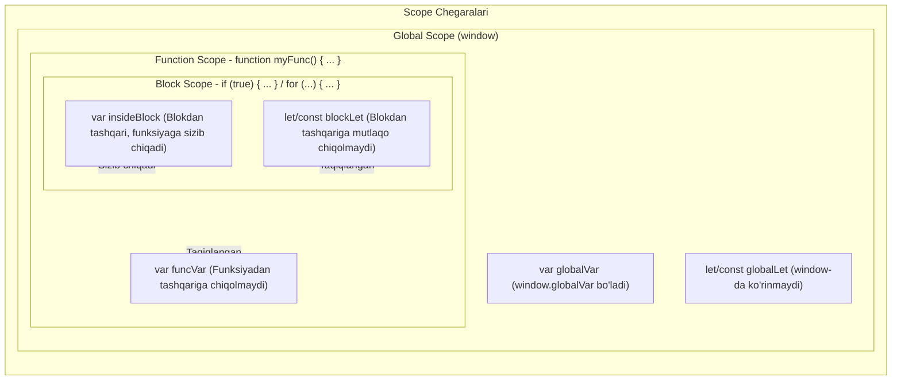

## 1. 💡 Sodda Tushuntirish va Analogiya

### O'zgaruvchilar nima va var, let, const farqlari qanday?
JavaScript-da o'zgaruvchilar ma'lumotlarni saqlash uchun qutilardir. Ammo bu qutilar o'zining mustahkamligi va kirish doirasi (scope) bo'yicha farq qiladi:
* **`var` (Eski va erkin xizmatkor):** ES6 gacha (2015-yil) ishlatilgan eski usul. U juda erkin, blok doirasini (masalan, `if` yoki `for` qavslarini) tan olmaydi va butun funksiya bo'ylab o'z bilganicha ishlayveradi. Bir xil nom bilan bir necha marta qayta e'lon qilinsa ham e'tiroz bildirmaydi.
* **`let` (Zamonaviy va tartibli yordamchi):** Faqat o'zi e'lon qilingan jingalak qavslar `{}` (blok) ichida amal qiladi. U xonadan tashqariga chiqib ketmaydi. Bitta blok ichida bir xil nomda qayta e'lon qilsangiz, darhol xatolik beradi. Qiymatini o'zgartirish (reassign) mumkin.
* **`const` (Sodiq va o'zgarmas qo'riqchi):** `let` kabi blok doirasida ishlaydi, lekin unga bir marta qiymat berilgach, uni butunlay yangi qiymatga qayta tayinlab bo'lmaydi. U o'ziga topshirilgan qiymatni oxirigacha himoya qiladi.

### Real hayotiy analogiya
Tasavvur qiling, siz **ofis boshqaruvchisiz**:
* **`var` (Doskadagi bo'r yozuvi):** Siz ofisning umumiy zalidagi doskaga yozuv yozdingiz. Istalgan xodim kelib, bu yozuvni o'chirib, o'rniga boshqa narsa yozishi yoki xuddi shu nom bilan boshqa ma'lumot yozishi mumkin. U hamma uchun ko'rinadi va nazorat qilish qiyin.
* **`let` (Qalam bilan yozilgan daftar):** Har bir xodimning o'z xonasi (bloki) va daftari bor. Xodim faqat o'z xonasi ichida daftardagi ma'lumotlarni o'chirib, yangilay oladi (reassign). Lekin boshqa xonadagilar bu daftarni ko'ra olmaydi. Shuningdek, bir varoqda bir xil nomli ikkita yozuv yozish taqiqlanadi.
* **`const` (Eshikdagi metall lavha):** Xonaning eshigiga o'rnatilgan metall lavha. Undagi yozuvni (ismni) butunlay o'chirib, boshqa lavhaga almashtirib bo'lmaydi. Lekin lavha ustiga kichik stiker yopishtirib, qo'shimcha ma'lumot yozish mumkin (obyekt mutatsiyasi).

---

## 2. 💻 Real Kod Misollari

### 1. Basic Example (Blok doirasi va Sizib chiqish)
`var` blokni tan olmaydi va undan tashqariga sizib chiqadi. `let` esa blok ichida qoladi:
```javascript
if (true) {
  var leakedVar = "Men blokdan qochib chiqdim!";
  let blockLet = "Men blok ichida mahbusman!";
}

console.log(leakedVar); // "Men blokdan qochib chiqdim!"
console.log(blockLet);  // ReferenceError: blockLet is not defined
```

### 2. Intermediate Example (const va Obyektlar Mutatsiyasi)
`const` o'zgaruvchini qayta tayinlashni taqiqlaydi, lekin massiv yoki obyekt ichidagi qiymatlarni o'zgartirishga to'sqinlik qilmaydi:
```javascript
const user = { name: "Jasur", age: 25 };

// 1. Obyekt ichini o'zgartirish (MUMKIN - mutatsiya)
user.age = 26; 
console.log(user.age); // 26

// 2. Yangi obyektga qayta bog'lash (XATO - reassignment)
try {
  user = { name: "Olim", age: 30 }; // TypeError: Assignment to constant variable.
} catch (e) {
  console.log("Xatolik:", e.message);
}
```

### 3. Advanced Example (Loop-lar va Asinxron Closures)
Klassik `var` muammosi: sikl ichidagi asinxron kodda `var` oxirgi qiymatni olib qoladi. `let` esa har bir qadamda yangi doira (scope) yaratadi:
```javascript
// var bilan yozilganda:
for (var i = 1; i <= 3; i++) {
  setTimeout(() => {
    console.log("var i:", i); // 3 soniyadan keyin uch marta "4" chiqadi
  }, 100);
}

// let bilan yozilganda:
for (let j = 1; j <= 3; j++) {
  setTimeout(() => {
    console.log("let j:", j); // 1, 2, 3 tartibida chiqadi
  }, 100);
}
```

---

## 3. ⚙️ Qanday Ishlaydi (Under the Hood)

### 1. Hoisting va Leksik Muhit (Lexical Environment)
JavaScript kodni bajarishdan oldin uni **kompilyatsiya fazasidan** o'tkazadi. Bu paytda barcha o'zgaruvchilar xotirada ro'yxatdan o'tadi:
* `var` o'zgaruvchisi xotirada yaratiladi va unga darhol `undefined` qiymati beriladi.
* `let` va `const` o'zgaruvchilar ham hoisting bo'ladi (xotirada ro'yxatga olinadi), lekin ularga hech qanday boshlang'ich qiymat berilmaydi (uninitialized holatda qoladi).

### 2. Temporal Dead Zone (TDZ)
O'zgaruvchi xotirada ro'yxatga olingan vaqtdan to kod bajarilishi jarayonida uning e'lon qilingan (declaration) qatoriga yetib kelguncha bo'lgan vaqt oralig'i **Vaqtinchalik O'lik Hudud (TDZ)** deyiladi.
```javascript
// --- TDZ boshlandi (value o'zgaruvchisi uchun) ---
// value xotirada bor, lekin unga kirish taqiqlangan.

try {
  console.log(value); // ReferenceError: Cannot access 'value' before initialization
} catch (e) {
  console.log(e.message);
}

let value = "Salom"; // --- TDZ tugadi ---
console.log(value);   // "Salom"
```

---

## 4. ❌ Ko'p Uchraydigan Xatolar (Junior Mistakes)

### 1. O'zgaruvchini e'lon qilishdan oldin ishlatish (TDZ xatosi)
* **Noto'g'ri:**
  ```javascript
  console.log(username); 
  let username = "Farhod"; // ReferenceError beradi
  ```
* **To'g'ri:**
  ```javascript
  let username = "Farhod";
  console.log(username); // To'g'ri tartib
  ```

### 2. const orqali e'lon qilingan o'zgaruvchiga qiymat bermaslik
* **Noto'g'ri:**
  ```javascript
  const PI; // SyntaxError: Missing initializer in const declaration
  PI = 3.14;
  ```
* **To'g'ri:**
  ```javascript
  const PI = 3.14; // Bir vaqtning o'zida e'lon qilinadi va qiymat beriladi
  ```

### 3. Global oynani (Window) ifloslantirish
* **Noto'g'ri:**
  ```javascript
  var config = "production"; // window.config ga aylanib, boshqa kutubxonalar bilan to'qnashishi mumkin
  ```
* **To'g'ri:**
  ```javascript
  let config = "production"; // window obyektiga qo'shilmaydi va xavfsiz qoladi
  ```

---

## 5. 💬 12 ta Intervyu Savollari

### Junior
1. **Savol:** `var`, `let` va `const` o'rtasidagi asosiy farqlar nimada?
   * **Javob:** `var` funksiya doirasiga ega, qayta e'lon qilinishi mumkin, hoisting-da `undefined` oladi. `let` blok doirasiga ega, qayta e'lon qilib bo'lmaydi, TDZ ga ega. `const` esa `let` kabi ishlaydi, lekin qiymatini qayta tayinlab bo'lmaydi.
2. **Savol:** Qachon `let` va qachon `const` ishlatish kerak?
   * **Javob:** O'zgaruvchi qiymati kelajakda o'zgarishi aniq bo'lsa (masalan, sikllar yoki hisoblagichlarda) `let`, boshqa barcha holatlarda (xavfsizlik va o'qishlilik uchun) standart sifatida `const` ishlatilishi lozim.
3. **Savol:** Blok doirasi (Block Scope) nima?
   * **Javob:** Jingalak qavslar `{}` ichidagi hudud (masalan, `if`, `for`, `while` yoki shunchaki bloklar). Bu blok ichida `let` yoki `const` bilan e'lon qilingan o'zgaruvchilar blokdan tashqarida ko'rinmaydi.
4. **Savol:** `var` hoisting bo'lganda nima uchun `ReferenceError` bermaydi?
   * **Javob:** Chunki JavaScript dvigateli `var` ni xotiraga joylashtirish paytida unga avtomatik ravishda `undefined` qiymatini biriktiradi.

### Middle
5. **Savol:** Temporal Dead Zone (TDZ) nima va u qanday foyda keltiradi?
   * **Javob:** TDZ — o'zgaruvchi yaratilganidan to u e'lon qilingan qatorgacha bo'lgan vaqt. U dasturchilarni o'zgaruvchilarni e'lon qilishdan oldin ishlatib yuborishdan (bu ko'p xatolarga sabab bo'ladi) himoya qiladi va kod sifatini oshiradi.
6. **Savol:** Nima uchun global `var` o'zgaruvchilari global obyekt (masalan, `window`) xususiyatiga aylanadi, lekin `let`/`const` aylanmaydi?
   * **Javob:** Bu tarixiy sabablar va ES6 spetsifikatsiyasi bilan bog'liq. Global doirada `let` va `const` Declarative Environment Record-da saqlanadi, `var` esa Object Environment Record-ga (ya'ni global obyektga) yoziladi.
7. **Savol:** Quyidagi kod bajarilganda nima yuz beradi va nima uchun?
   ```javascript
   let a = 10;
   {
     console.log(a);
     let a = 20;
   }
   ```
   * **Javob:** `ReferenceError` beradi. Blok ichidagi `let a = 20` o'sha blok doirasida hoisting bo'ladi va blok boshidan boshlab TDZ ni yaratadi. Shuning uchun tashqi `a = 10` ko'rinmaydi va e'lon qilinishidan oldin o'qishga harakat qilingani uchun xato yuz beradi.
8. **Savol:** `const` orqali e'lon qilingan massivga yangi element qo'shish mumkinmi?
   * **Javob:** Ha, mumkin. Chunki massiv obyektdir va uning ichiga element qo'shish (`arr.push(4)`) massivning xotiradagi havolasini (reference) o'zgartirmaydi, faqat tarkibini mutatsiyaga uchratadi.

### Senior
9. **Savol:** Lexical Environment (Leksik Muhit) va Variable Environment o'rtasidagi farq nima?
   * **Javob:** JavaScript Execution Context (bajarilish muhiti) tarkibida ikkala qism ham bor. `LexicalEnvironment` `let` va `const` deklaratsiyalarini va scope-larini saqlash uchun ishlatiladi, `VariableEnvironment` esa faqat `var` deklaratsiyalarini saqlaydi.
10. **Savol:** `Object.freeze()` va `const` farqi nimada?
    * **Javob:** `const` o'zgaruvchi havolasini qayta tayinlashni (reassignment) taqiqlaydi, lekin obyekt xususiyatlarini o'zgartirishga ruxsat beradi. `Object.freeze()` esa obyekt tarkibini butunlay muzlatib qo'yadi va xususiyatlarini o'zgartirishni taqiqlaydi, lekin uning havolasini o'zgartirish (agar u `let` bo'lsa) mumkin.
11. **Savol:** Dvigatel darajasida (V8 compiler) `const` o'zgaruvchilar qanday optimallashtiriladi?
    * **Javob:** V8 kompilyatori (Turbofan) `const` o'zgaruvchilarning qiymati hech qachon o'zgarmasligini bilgani uchun, ular ustida "constant folding" (o'zgaruvchini to'g'ridan-to'g'ri qiymat bilan almashtirish) va boshqa inline optimallashtirishlarni amalga oshiradi, bu esa kodning tezroq bajarilishini ta'minlaydi.
12. **Savol:** Nima uchun `let` va `const` redeclaration (qayta e'lon qilish) qilishga yo'l qo'ymaydi?
    * **Javob:** Bu til darajasidagi xavfsizlik chorasidir. Dastur yiriklashgan sari tasodifan bir xil nomdagi o'zgaruvchini qayta e'lon qilib, oldingi ma'lumotlarni o'chirib yuborish xavfi juda yuqori bo'ladi. ES6 ushbu muammoni bartaraf etdi.

---

## 6. 🛠️ Amaliy Topshiriqlar

Mashq topshiriqlari `/Users/farhod/Desktop/github/js-uz/scratch/variables_exercises.json` faylida berilgan. Ularni bajarib, bilimingizni mustahkamlang.

### O'zgaruvchilarning Scope Boundaries (Doira chegaralari) farqlari:

Quyidagi diagrammada `var` va `let/const` o'zgaruvchilarining kirish doirasi chegaralari va ularning cheklovlari ko'rsatilgan:



---

## 7. 📝 12 ta Mini Test

Test savollari `/Users/farhod/Desktop/github/js-uz/scratch/variables_quizzes.json` faylida joylashgan. Darsdan keyin testlarni yechib, o'zlashtirish darajangizni tekshiring.

---

## 8. 🎯 Real Project Case Study

### Case Study: Dynamic Buttons & Applications Configuration

Real loyihalarda `var`, `let`, `const` dan noto'g'ri foydalanish jiddiy muammolarga olib kelishi mumkin. Keling, 2 ta real holatni ko'rib chiqamiz:

#### 1. UI Event Listeners muammosi (let yechimi)
Dinamik yaratilgan tugmalarga hodisalarni bog'lashda `var` ishlatilsa, barcha tugmalar eng oxirgi tugmaning ma'lumotlarini ko'rsatadi:
```javascript
// XATO (var ishlatilganda):
function setupBadMenu(buttons) {
  for (var i = 0; i < buttons.length; i++) {
    buttons[i].onclick = function() {
      // i o'zgaruvchisi umumiy bo'lgani uchun, har doim oxirgi indeksni ko'rsatadi
      console.log("Bosilgan tugma ID:", i); 
    };
  }
}

// TO'G'RI (let ishlatilganda):
function setupGoodMenu(buttons) {
  for (let i = 0; i < buttons.length; i++) {
    buttons[i].onclick = function() {
      // Har bir sikl qadami uchun alohida i o'zgaruvchisi (block scope) yaratiladi
      console.log("Bosilgan tugma ID:", i); 
    };
  }
}
```

#### 2. Dastur Sozlamalari Himoyasi (const va Object.freeze yechimi)
Loyihamizdagi API config obyektini tasodifiy o'zgarishlardan himoya qilish:
```javascript
// Shunchaki const ishlatish yetarli emas, chunki ichki xususiyatlarni o'zgartirish mumkin:
const APP_CONFIG = {
  apiEndpoint: "https://api.mysite.uz",
  timeout: 5000
};
APP_CONFIG.timeout = 10000; // O'zgarib ketdi!

// To'liq himoya qilish uchun const va Object.freeze() birgalikda qo'llaniladi:
const SECURE_CONFIG = Object.freeze({
  apiEndpoint: "https://api.mysite.uz",
  timeout: 5000
});

// Endi bu amal xatolik beradi yoki inkor qilinadi:
SECURE_CONFIG.timeout = 10000; 
console.log(SECURE_CONFIG.timeout); // 5000 (o'zgarmadi)
```

---

## 9. 🚀 Performance va Optimization

### 1. Garbage Collection (Xotirani tozalash)
Blok doirasiga ega o'zgaruvchilar (`let`/`const`) blok yakunlangandan so'ng darhol xotiradan o'chirilishi (Garbage Collection) osonlashadi. Zero, dvigatel ularning hayot aylanish muddati ushbu blok bilan cheklanganini aniq biladi. `var` o'zgaruvchilari esa funksiya tugamaguncha xotirada qoladi, bu esa xotira sarfini (memory consumption) oshiradi.

### 2. Dvigatel Optimallashtirishi (V8 engines)
Zamonaviy JS dvigatellari `const` ishlatilgan o'zgaruvchilarni "read-only pointer" sifatida belgilab oladi. Bu esa kompilyatsiya vaqtida kodni optimallashtirishga (masalan, o'zgarmas qiymatlarni keshda saqlashga) yordam beradi.

---

## 10. 📌 Cheat Sheet

| Xususiyat | `var` | `let` | `const` |
| :--- | :--- | :--- | :--- |
| **Scope (Doirasi)** | Function scope | Block scope | Block scope |
| **Hoisting** | Ha (qiymati `undefined` bo'ladi) | Ha (lekin TDZ da qoladi) | Ha (lekin TDZ da qoladi) |
| **Qayta e'lon qilish (Redeclare)** | Ha, mumkin | Yo'q, taqiqlangan | Yo'q, taqiqlangan |
| **Qayta qiymat berish (Reassign)** | Ha, mumkin | Ha, mumkin | Yo'q, taqiqlangan |
| **Boshlang'ich qiymat berish** | Shart emas | Shart emas | **Majburiy** |
| **Global obyektga birikish (`window`)** | Ha | Yo'q | Yo'q |
