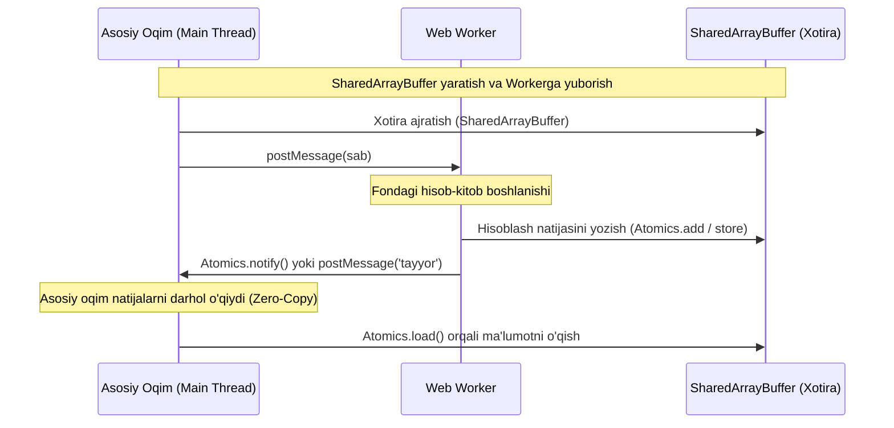

## 1. 💡 Sodda Tushuntirish va Analogiya

### WebAssembly (Wasm) nima?
JavaScript brauzerda dinamik va moslashuvchan tillardan biridir. Ammo u juda murakkab matematik hisob-kitoblar, video/audio tahrirlash, 3D o'yinlar yoki kriptografiya kabi ishlarni bajarganda sekinlashishi mumkin. 
**WebAssembly (Wasm)** — bu brauzerlar va Node.js muhitida JavaScript bilan yonma-yon, deyarli mahalliy (native) protsessor tezligida ishlash imkonini beruvchi quyi darajali (low-level) ikkilik (binary) formatdir. Siz Rust, C++ yoki Go tillarida kod yozasiz, uni `.wasm` formatiga kompilyatsiya qilasiz va JavaScript orqali chaqirasiz.

### Real hayotiy analogiya
Tasavvur qiling, siz **yirik qurilish kompaniyasi boshlig'isiz (JavaScript)**:
* Siz mijozlar bilan muzokara qilasiz, dizaynni tanlaysiz va umumiy ishlarni boshqarasiz. Siz juda moslashuvchansiz va odamlar bilan yaxshi muloqot qilasiz.
* Lekin poydevor uchun chuqur qazish yoki og'ir yuklarni ko'tarish kerak bo'lganda, siz o'zingiz belkurak olib ishlamaysiz. Buning o'rniga, maxsus **og'ir ekskavator va kranlarni (WebAssembly)** ishga solasiz.
* Ular gapira olmaydi (DOM yoki UI bilan ishlamaydi), lekin o'zlarining og'ir vazifalarini sizdan 100 baravar tezroq va samaraliroq bajarishadi. Siz (JS) ularga qayerda ishlashni buyurasiz, ular (Wasm) ishni tugatib javob berishadi.

---

## 2. 💻 Real Kod Misollari

### 1. Basic Example (Wasm Instantiating va Linear Memory)
Wasm baytlarni yuklash va uning chiziqli xotirasidan (Linear Memory) ma'lumot o'qish:
```javascript
// Oddiy 2 ta sonni qo'shuvchi WASM modulini yuklash
const wasmCode = new Uint8Array([
  0, 97, 115, 109, 1, 0, 0, 0, 1, 7, 1, 96, 2, 127, 127, 1, 127, 3, 2, 1, 0,
  7, 7, 1, 3, 97, 100, 100, 0, 0, 10, 9, 1, 7, 0, 32, 0, 32, 1, 106, 11
]); // Wasm binary magic bytes va sodda "add" funksiyasi

async function runWasm() {
  const { instance } = await WebAssembly.instantiate(wasmCode);
  console.log("Add natijasi:", instance.exports.add(5, 10)); // 15
}
runWasm();
```

### 2. Intermediate Example (Wasm.Memory va UTF-8 String o'qish)
Wasm faqat sonlar bilan ishlaydi. String uzatish uchun biz Wasmning chiziqli xotirasiga (Linear Memory) yozishimiz va u yerdan o'qishimiz kerak:
```javascript
// Chiziqli xotira (Linear Memory) yaratish (1 page = 64KB)
const memory = new WebAssembly.Memory({ initial: 1 });

function writeStringToMemory(str, memory) {
  const encoder = new TextEncoder();
  const bytes = encoder.encode(str);
  const uint8 = new Uint8Array(memory.buffer);
  
  // Ma'lumotni xotiraning boshiga yozamiz
  uint8.set(bytes, 0);
  return bytes.length; // Stringning bayt hajmi
}

function readStringFromMemory(offset, length, memory) {
  const uint8 = new Uint8Array(memory.buffer, offset, length);
  const decoder = new TextDecoder();
  return decoder.decode(uint8);
}

const len = writeStringToMemory("Salom Dunyo!", memory);
console.log(readStringFromMemory(0, len, memory)); // "Salom Dunyo!"
```

### 3. Advanced Example (SharedArrayBuffer va Atomics yordamida oqimlararo sinxronizatsiya)
Web Worker va Asosiy oqim o'rtasida umumiy xotirada xavfsiz hisob-kitob qilish:
```javascript
// 1. Umumiy xotira maydoni (SharedArrayBuffer) yaratamiz (4 bayt = 1 ta 32-bit butun son)
const sab = new SharedArrayBuffer(4);
const sharedArray = new Int32Array(sab);

// 2. Workerga sab ni yuboramiz (structured clone orqali pointer o'tadi)
// worker.postMessage({ sab });

// 3. Atomics yordamida xavfsiz increment qilish (Race Condition oldini oladi)
function safeIncrement() {
  Atomics.add(sharedArray, 0, 1);
  console.log("Joriy qiymat:", Atomics.load(sharedArray, 0));
}

// 4. Thread synchronization: Atomics.wait va Atomics.notify
// Thread A (Worker): Atomics.wait(sharedArray, 0, 0); // Agar index 0 dagi qiymat 0 bo'lsa, kutib turadi
// Thread B (Main): Atomics.store(sharedArray, 0, 1); Atomics.notify(sharedArray, 0, 1); // Uyg'otadi
```

---

## 3. ⚠️ Muammo va Nima uchun Muhimligi

### Qaysi muammoni hal qiladi?
* **Bridge Bottleneck (Ko'prik to'sig'i):** JS va C++/Rust o'rtasida har safar ma'lumot uzatilganda, u serializatsiya qilinadi. Katta hajmli ma'lumotlarni nusxalash sekinlashuvga olib keladi. Buni hal qilish uchun `WebAssembly.Memory` yoki `SharedArrayBuffer` yordamida to'g'ridan-to'g'ri umumiy xotiraga pointer beriladi (Zero-Copy).
* **Race Condition (Oqimlar poygasi):** Parallel ishlayotgan Web Workerlar bir vaqtda xotiradagi bitta o'zgaruvchini o'zgartirmoqchi bo'lganda, ma'lumotlar buziladi. `Atomics` obyekti (masalan, `Atomics.compareExchange`, `Atomics.wait`, `Atomics.notify`) CPU darajasidagi atomik amallar orqali parallel oqimlarni sinxronlashtiradi.

---

## 4. ❌ Ko'p Uchraydigan Xatolar (Junior Mistakes)

### 1. SharedArrayBuffer va oddiy ArrayBuffer-ni adashtirish
#### Xato:
`ArrayBuffer` oqimlararo `postMessage` qilinganda structured clone bo'ladi (yoki transferable sifatida o'tkazilganda oldingi oqimda nolga aylanadi). Uni bir vaqtda parallel o'zgartirib bo'lmaydi.
#### To'g'ri:
Faqat `SharedArrayBuffer` bir vaqtda bir nechta oqimlar tomonidan xotirada ulashiladi.

### 2. Atomics ishlatmasdan SharedArrayBuffer-ga to'g'ridan-to'g'ri yozish
#### Xato:
```javascript
// Ikki xil Workerda parallel ishlamoqda:
sharedArray[0]++; // Xavfli! Race condition kelib chiqadi.
```
#### To'g'ri:
```javascript
Atomics.add(sharedArray, 0, 1); // Xavfsiz, atomik amal.
```

### 3. Asosiy UI oqimida `Atomics.wait`ni ishlatish
#### Xato:
Asosiy oqimda (UI thread) `Atomics.wait` chaqirilsa, brauzer xatolik beradi (`TypeError`), chunki UI oqimini bloklash butun sahifani muzlatib qo'yadi.
#### To'g'ri:
`Atomics.wait` faqat Web Worker-lar ichida ishlatilishi kerak. Asosiy oqim esa `Atomics.notify` orqali ularni uyg'otadi.

---

## 5. 💬 12 ta Intervyu Savollari

### Junior (1–4)
1. **Savol:** WebAssembly (Wasm) nima?
   * **Javob:** Wasm — brauzerda JavaScript bilan parallel ravishda deyarli mahalliy tezlikda quyi darajali kodlarni bajarish imkonini beruvchi ikkilik formatdir.
2. **Savol:** Wasm DOM-ni to'g'ridan-to'g'ri o'zgartira oladimi?
   * **Javob:** Yo'q, Wasm bevosita DOM-ga kira olmaydi. U barcha DOM amallarini JavaScript orqali bajaradi.
3. **Savol:** WebAssembly.Memory nima?
   * **Javob:** Bu Wasm modulining chiziqli xotirasi (Linear Memory) bo'lib, uning tarkibida JS va Wasm o'rtasida ma'lumot almashish uchun ishlatiladigan ArrayBuffer saqlanadi.
4. **Savol:** SharedArrayBuffer nima?
   * **Javob:** Bu bir nechta oqimlar (masalan, Main Thread va Web Workers) o'rtasida nusxalamasdan, umumiy foydalaniladigan xotira buferidir.

### Middle (5–8)
5. **Savol:** Atomics obyekti nima va u nima uchun kerak?
   * **Javob:** `Atomics` — umumiy xotiraga (SharedArrayBuffer) xavfsiz yozish va o'qish amallarini ta'minlovchi global obyekt. U oqimlar poygasi (Race Conditions) oldini oladi.
6. **Savol:** Nima uchun `Atomics.wait()` asosiy oqimda ishlamaydi?
   * **Javob:** Chunki asosiy oqim (Main Thread) brauzer UI interfeysini boshqaradi. Uni bloklash butun sahifani javob bermaydigan holatga keltirib qo'yadi.
7. **Savol:** Wasm chiziqli xotirasining sahifa o'lchami (Page size) qancha?
   * **Javob:** WebAssembly-da 1 sahifa xotira har doim aniq 64 KB (65536 bayt) ga teng bo'ladi.
8. **Savol:** JS-dan WASM funksiyasiga string uzatish qanday amalga oshiriladi?
   * **Javob:** TextEncoder yordamida satr baytlarga o'giriladi, so'ng WASM xotirasiga (`WebAssembly.Memory`) yoziladi va WASM funksiyasiga ushbu xotira adresi (offset) hamda uzunligi uzatiladi.

### Senior (9–12)
9. **Savol:** WASM instansiyasini yuklashda `WebAssembly.instantiateStreaming` va `WebAssembly.instantiate` farqi nimada va qaysi biri afzal?
   * **Javob:** `instantiateStreaming` tarmoqdan `.wasm` fayli yuklanayotgan vaqtning o'zidayoq uni kompilyatsiya qiladi, bu yuklash tezligini sezilarli darajada oshiradi va Senior darajada har doim afzal ko'riladi.
10. **Savol:** `SharedArrayBuffer` xavfsizlik nuqtai nazaridan (masalan, Spectre va Meltdown) qanday cheklovlarga ega?
    * **Javob:** Spectre hujumi tufayli SharedArrayBuffer brauzerlarda vaqtincha o'chirilgan edi. Hozirda undan foydalanish uchun serverda `Cross-Origin-Opener-Policy: same-origin` va `Cross-Origin-Embedder-Policy: require-corp` sarlavhalari (Headers) o'rnatilishi shart.
11. **Savol:** `Atomics.compareExchange` qanday ishlaydi va uning foydasi nimada?
    * **Javob:** U massivdagi berilgan indeksdagi qiymat kutilgan qiymatga teng bo'lsa, uni yangi qiymatga o'zgartiradi va eski qiymatni qaytaradi. Bu lock-free algoritmlar va mutex-lar yaratishda asosiy rol o'ynaydi.
12. **Savol:** WebAssembly Garbage Collection (WasmGC) nima va u integratsiyani qanday osonlashtiradi?
    * **Javob:** WasmGC Wasm modullariga brauzerning ichki axlat yig'uvchisi (garbage collector) bilan integratsiya qilish imkonini beradi. Bu Java, Kotlin kabi tillarni Wasm-ga kichikroq hajmdagi fayllar bilan kompilyatsiya qilishga yordam beradi.

---

## 6. 🛠️ Amaliy Topshiriqlar

Bu bo'limda siz interaktiv kod muharriri orqali amaliy mashqlarni bajarasiz.

---

## 7. 📝 12 ta Mini Test

Dars oxiridagi test topshiriqlari.

---

## 8. 🎯 Real Project Case Study

### Web Workers va SharedArrayBuffer yordamida parallel Matrix Multiplication
Katta hajmli matritsalarni ko'paytirish hisob-kitobini 4 ta Web Workerga bo'lib berish va natijani bitta SharedArrayBufferda jamlash.



#### Amaliy kod sxemasi:
```javascript
// main.js
const sab = new SharedArrayBuffer(1024 * 4); // 1024 ta element
const sharedArray = new Int32Array(sab);

const worker = new Worker('worker.js');
worker.postMessage({ sab });

// Worker ishini tugatishini Atomics orqali kutish:
// (Eslatma: Asosiy oqimda wait ishlamasligi sababli, biz worker xabarini onmessage orqali olamiz)
worker.onmessage = () => {
  console.log("Worker natijani yozdi, index 0:", Atomics.load(sharedArray, 0));
};
```

---

## 9. 🚀 Performance va Optimization

* **Zero-Copy Architecture:** Ma'lumotlarni har safar Wasm va JS o'rtasida nusxalamaslik uchun `SharedArrayBuffer` yoki `WebAssembly.Memory` ko'rsatkichidan foydalaning.
* **Avoid Small Imports/Exports Calls:** JS dan WASM funksiyasini har mikrosekundda chaqirish overhead (qo'shimcha vaqt sarfi) keltirib chiqaradi. Yaxshisi, bitta chaqiruvda katta hajmdagi massivni WASM ga bering va u uzoqroq ishlab natijani qaytarsin.

---

## 10. 📌 Cheat Sheet

| Metod / Xossa | Vazifasi | Misol |
| :--- | :--- | :--- |
| `WebAssembly.Memory` | Chiziqli xotira yaratish | `new WebAssembly.Memory({ initial: 10 })` |
| `SharedArrayBuffer` | Oqimlararo umumiy xotira | `new SharedArrayBuffer(1024)` |
| `Atomics.add(arr, idx, val)` | Massiv indeksiga qiymatni atomik qo'shish | `Atomics.add(sharedArr, 0, 5)` |
| `Atomics.wait(arr, idx, val)` | Indeksdagi qiymat val bo'lsa, oqimni to'xtatib turish | `Atomics.wait(sharedArr, 0, 0)` |
| `Atomics.notify(arr, idx, count)` | Kutayotgan oqimlarni uyg'otish | `Atomics.notify(sharedArr, 0, 1)` |
| `Atomics.load(arr, idx)` | Indeksdagi qiymatni xavfsiz o'qish | `Atomics.load(sharedArr, 0)` |
