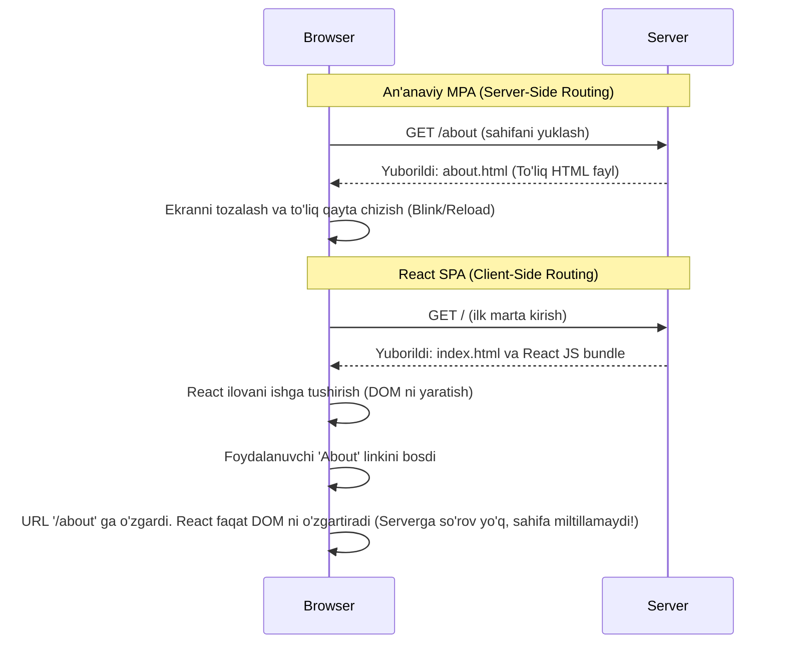

# React Routing (Marshrutizatsiya) asoslari va React Router DOM

## Routing nima o'zi? (What is Routing?)

Tasavvur qiling, siz katta savdo markazidasiz (Mall). Savdo markazi ko'plab do'konlardan iborat. Qaysi do'konga borishni xohlasangiz, yo'laklar orqali kerakli manzilga kelasiz. Savdo markazidagi yo'l ko'rsatkichlar va xaritalar sizga qaysi qavatda qaysi do'kon borligini ko'rsatadi. 

Veb-dasturlashda **Routing** (marshrutizatsiya) xuddi shu xarita va yo'naltirgich rolini o'ynaydi. Foydalanuvchi qaysi manzilni (URL ni) brauzerda qidirishiga yoki qaysi havolani (link) bosishiga qarab, unga tegishli sahifani yoki komponentni ko'rsatish jarayoni routing deb ataladi. Masalan, foydalanuvchi `www.saytim.uz/about` ga kirsa, unga "Biz haqimizda" ma'lumoti chiqishi kerak, `www.saytim.uz/contact` ga kirsa, "Aloqa" sahifasi ochilishi kerak.

### Client-Side Routing vs Server-Side Routing (Mijoz va Server tomonidagi marshrutizatsiya)

An'anaviy veb-saytlar (MPA - Multi-Page Applications) **Server-Side Routing** (SSR) dan foydalanadi. Bunda siz biror havolani bossangiz, brauzer serverga yangi sahifa so'rovini yuboradi. Server HTML sahifa shakllantiradi va qaytaradi. Brauzer esa oq ekran bo'lib, sahifani to'liq boshidan qayta yuklaydi.

React kabi zamonaviy kutubxonalar esa **Client-Side Routing** (CSR) dan foydalanib **SPA** (Single Page Application - Yagona sahifali ilova) qurish imkonini beradi. Bunda saytga birinchi marta kirganda barcha asosiy kodlar yuklanadi. Endi siz havolani bossangiz, brauzer serverga bormaydi! Shunchaki brauzerning URL manzili o'zgaradi va JavaScript darhol ekrandagi eski komponentni olib tashlab, o'rniga yangi komponentni chizib (render qilib) ko'rsatadi. Qayta yuklanish (refresh/blink) umuman bo'lmaydi!

#### Mermaid: SPA va MPA taqqoslovi



---

## React Router DOM asoslari

React kutubxonasi o'zida ichki routing tizimiga ega emas (u faqat UI yaratish uchun). Shuning uchun, bu ishni amalga oshirishda biz eng ommabop va kuchli kutubxona bo'lgan **React Router DOM** dan foydalanamiz. O'rnatish uchun: `npm install react-router-dom` buyrug'i ishlatiladi.

### Nega kerak?
Agar React Router bo'lmasa, har bir URL uchun o'zimiz shartlar yozishimizga to'g'ri kelardi: `if (window.location.pathname === '/about') return <About />`. Bu juda noqulay, boshqarish qiyin va xatoliklarga moyil yondashuv. React Router DOM bularning barchasini o'z zimmasiga oladi va juda oson sintaksis taqdim etadi.

### Asosiy komponentlar: `BrowserRouter`, `Routes`, `Route`, `Link`

1. **`BrowserRouter`**: Bu butun dasturingizni qamrab oluvchi bosh komponent. U brauzerning HTML5 History API-dan foydalanib URL-ni boshqaradi. Odatda dastur boshlanishida (masalan `main.jsx` yoki `index.jsx`) yoziladi. U butun savdo markazini boshqaradigan tizim kabi barcha yo'nalishlarni nazorat qiladi.
2. **`Routes`**: Barcha mumkin bo'lgan yo'llarni (routelarni) o'zida saqlovchi quti. URL o'zgarganda, bu quti o'z ichidagi eng mos keladigan bitta `Route` ni tanlab ekranga chiqaradi.
3. **`Route`**: Haqiqiy xarita va qoida. U ikkita asosiy props qabul qiladi: `path` (yo'l) va `element` (shu yo'lda nima ko'rinishi kerakligi). "Agar foydalanuvchi `/contact` yo'liga borsa, `<ContactComponent />` ni ko'rsat" deydigan qat'iy ko'rsatma.
4. **`Link`**: Boshqa sahifaga (komponentga) o'tish uchun maxsus havola (teg) komponenti. U tashqi ko'rinishidan oddiy `<a>` tegiga o'xshaydi, lekin ishlash mantig'i umuman boshqa.

---

## `<a>` tegi muammosi va nega `<Link>` ishlatamiz?

**Nega kerak?** Nima uchun shunchaki oddiy HTML `<a>` tegidan foydalana olmaymiz? Sababi oddiy `<a>` tegi o'zining tabiatiga ko'ra brauzerga sahifani **to'liq qayta yuklashni** (full page refresh) buyuradi. Bu bizning SPA (Single Page Application) g'oyamizga butunlay zid! Agar siz sahifani qayta yuklasangiz, barcha React state'lar o'chib ketadi, kiritilgan formalar o'chadi va dastur qayta boshidan ishlashga majbur bo'ladi.

`<Link>` komponenti esa xuddi qutqaruvchidek ishlaydi. U bosilganda ichki `event.preventDefault()` mexanizmini ishga tushiradi (refreshni to'xtatadi) va HTML History API orqali URL-ni sekingina o'zgartiradi. Natijada faqat ekrandagi kerakli komponentlar o'zgaradi. Dastur xotirasi (State) esa o'z o'rnida qolaveradi!

### Do's and Don'ts (Yaxshi va Yomon Amaliyotlar)

❌ **Yomon amaliyot (Don't do this):**
```jsx
// HTML dagi oddiy 'a' tegi butun sahifani qayta yuklaydi va barcha State'larni xotiradan o'chiradi
export default function Navbar() {
  return (
    <nav>
      <a href="/about">Biz haqimizda (Xato)</a>
      <a href="/contact">Aloqa (Xato)</a>
    </nav>
  );
}
```

✅ **Yaxshi amaliyot (Do this):**
```jsx
import { Link } from 'react-router-dom';

// React Router 'Link' tegi faqatgina URL'ni o'zgartiradi, sahifa tezkor va miltillashsiz yangilanadi!
export default function Navbar() {
  return (
    <nav>
      <Link to="/about">Biz haqimizda (To'g'ri)</Link>
      <Link to="/contact">Aloqa (To'g'ri)</Link>
    </nav>
  );
}
```

---

## Dynamic Parameters (Dinamik parametrlar) va Navigation Hooks

### Dinamik Parametrlar (URL Parameters)

Tasavvur qiling, sizda katta internet-do'kon bor va u yerda 10 000 ta mahsulot bor. Har bir mahsulot uchun alohida Route yozish (`/product/1`, `/product/2`, ... `/product/10000`) aqlga umuman sig'maydigan ish. Buning o'rniga biz dinamik parametrlardan foydalanamiz. Bu xuddi funksiya qabul qiladigan argumentga o'xshaydi. URL dagi ikki nuqta `:` belgisidan keyin kelgan nom o'zgaruvchi (parametr) deb o'qiladi.

```jsx
// App.jsx faylida routelarni sozlash
import { Routes, Route } from 'react-router-dom';

function App() {
  return (
    <Routes>
      <Route path="/products" element={<ProductList />} />
      
      {/* ':id' - bu yerda dinamik parametr hisoblanadi */}
      <Route path="/products/:id" element={<ProductDetails />} />
    </Routes>
  );
}
```

#### Nega kerak?
Dinamik parametrlar orqali qaysi aniq mahsulot bosilganini bilib olamiz va serverdan faqatgina o'sha kerakli mahsulot ma'lumotini so'raymiz.
Bu dinamik qiymatni komponent ichida tutib olish uchun esa `useParams` custom hook'idan foydalanamiz.

```jsx
// ProductDetails.jsx
import { useParams } from 'react-router-dom';
import { useEffect, useState } from 'react';

export default function ProductDetails() {
  // URL dagi :id (masalan /products/42 bo'lsa, id = "42") ni ushlab olamiz
  const { id } = useParams();
  const [product, setProduct] = useState(null);

  useEffect(() => {
    // Endi shu 'id' yordamida haqiqiy API dan aynan bitta mahsulotni yuklab olamiz
    fetch(`https://fakestoreapi.com/products/${id}`)
      .then(res => res.json())
      .then(data => setProduct(data));
  }, [id]);

  if (!product) return <h2>Yuklanmoqda...</h2>;

  return (
    <div>
      <h1>Mahsulot raqami: {id}</h1>
      <h2>Nomi: {product.title}</h2>
      <p>Narxi: ${product.price}</p>
    </div>
  );
}
```

### Navigation Hooks (Dasturiy ravishda navigatsiya)

Odatda sahifalararo o'tishlar `<Link>` bosish orqali amalga oshadi. Lekin ba'zida biz foydalanuvchini **dastur mantig'iga asosan**, u linkni bosmagan holatda ham boshqa sahifaga yo'naltirishimiz kerak bo'lib qoladi.
Masalan:
- Login va parolni to'g'ri kiritgandan so'ng, tizim o'zi avtomat "Profil" sahifasiga o'tkazishi.
- Xarid muvaffaqiyatli amalga oshganda "Tabriklaymiz" deb, keyin Bosh sahifaga qaytarishi.
- Faylni yuklash tugagandan so'ng natija sahifasiga otishi.

Bunday holatlar uchun React Router bizga `useNavigate` hook'ini sovg'a qiladi. Bu bizga istalgan funksiya ichidan turib yo'nalishni o'zgartirish (navigate) kuchini beradi.

```jsx
import { useNavigate } from 'react-router-dom';
import { useState } from 'react';

export default function LoginForm() {
  const navigate = useNavigate(); // Navigate obyektini chaqirib olamiz
  const [username, setUsername] = useState('');

  const handleLogin = (e) => {
    e.preventDefault();
    
    // Tasavvur qilamiz, bu yerda server tekshiruvi bor
    if (username === 'admin') {
      alert('Tizimga muvaffaqiyatli kirdingiz!');
      // Foydalanuvchini avtomatik tarzda '/dashboard' manziliga jo'natamiz
      navigate('/dashboard');
    } else {
      alert('Noto\'g'ri foydalanuvchi!');
    }
  };

  return (
    <form onSubmit={handleLogin}>
      <h2>Tizimga kirish</h2>
      <input 
        placeholder="Ismingiz (admin deb yozing)" 
        value={username} 
        onChange={(e) => setUsername(e.target.value)} 
      />
      <button type="submit">Kirish</button>
    </form>
  );
}
```

#### Brauzer tarixida orqaga qaytish (Go Back)
`useNavigate` shunchaki yangi sahifaga yo'naltiribgina qolmay, balki brauzer tarixida orqaga yoki oldinga qaytishni ham eplaydi. Agar funksiyaga manzil o'rniga manfiy raqam bersangiz, xuddi brauzerdagi ⬅️ orqaga (back) tugmasi bosilgandek ishlaydi.

```jsx
// Bir qadam orqaga qaytish uchun (-1 ni beramiz)
<button onClick={() => navigate(-1)}>⬅️ Orqaga qaytish</button>
```

---

## Xulosa qilib aytganda:

1. **Routing** veb-ilovangizni mantiqiy qismlarga va turli xil manzil (URL) larga ajratadi.
2. **React Router DOM** yordamida brauzerni umuman qayta yuklamasdan tezgina sahifalar o'rtasida poyezddek harakatlanish (SPA tajribasi) ta'minlanadi.
3. Katta va yagona qoida: React ichida boshqa sahifalarga o'tishda **hech qachon HTML `<a href="...">` tegidan foydalanmang**, barcha harakatlanishlar uchun faqat React Router DOM ning `<Link to="...">` komponentidan foydalaning.
4. **Dinamik parametrlar (`useParams`)** orqali yagona sahifa shablonini ko'plab mahsulotlar yoxud ma'lumotlar detallarini ko'rsatish uchun qayta ishlata olamiz.
5. **Dasturiy navigatsiya (`useNavigate`)** kod mantig'i tugagach (masalan muvaffaqiyatli avtorizatsiyadan keyin) foydalanuvchini avtomatik tarzda kerakli sahifaga olib borib qo'yadi.

Ushbu bilimlarni o'zlashtirganingizdan so'ng, sizning React ilovangiz oddiy bir varaqli saytdan haqiqiy, mukammal, ko'p sahifali web dasturiy platformaga aylanadi!
