# 11-Qadam: Context API va "Prop Drilling" Muammosi

React-da ma'lumotlar doimo yuqoridan pastga (ota komponentdan bola komponentga) `props` orqali uzatiladi. Kichik loyihalarda bu ajoyib ishlaydi. Ammo ilovangiz kattalashib, komponentlar daraxti chuqurlashib ketganda-chi? Bitta ma'lumotni daraxtning eng yuqorisidan eng pastiga uzatish kerak bo'lsa nima qilasiz? 

Aynan shu yerda biz React'ning eng muhim va qiziqarli konsepsiyalaridan biri — **Context API** bilan tanishamiz. Ammo yechimga o'tishdan oldin, keling kasallikning o'zi bilan tanishaylik.

---

## "Prop Drilling" O'zi Nima Va Nega U Bosh Og'rig'i?

Tasavvur qiling, siz bobosiz va sizning nevarangizga qoldirmoqchi bo'lgan muhim soatingiz (ma'lumot/state) bor. Ammo nevarangiz bilan to'g'ridan-to'g'ri ko'risha olmaysiz. Siz soatni o'g'lingizga berasiz, u o'zining xotiniga (keliningizga) beradi, keliningiz esa uni maktabga ketayotgan nevarangizning sumkasiga solib qo'yadi. O'rtadagi odamlarning (o'g'lingiz va keliningizning) bu soatga umuman qizig'i yo'q, lekin ular "pochtalyon" vazifasini bajarishga majbur. 

React-da aynan shu jarayon **Prop Drilling** (Prop burg'ulash) deb ataladi. Ma'lumot (prop) faqatgina eng pastki komponentga kerak bo'lsa-da, uni yetkazib berish uchun o'rtadagi barcha komponentlar orqali o'tkazib kelishga to'g'ri keladi.

### Prop Drilling Kod Misoli (Bad Practice - Yomon yondashuv)

```jsx
// ❌ YOMON: Prop Drilling
const App = () => {
  const [theme, setTheme] = useState('dark');
  
  return <Header theme={theme} />;
}

// Header'ga theme kerak emas, u faqat NavBar'ga uzatadi
const Header = ({ theme }) => {
  return <NavBar theme={theme} />;
}

// NavBar'ga ham theme kerak emas, u Menu'ga uzatadi
const NavBar = ({ theme }) => {
  return <Menu theme={theme} />;
}

// Va nihoyat Menu bu theme'dan foydalanadi!
const Menu = ({ theme }) => {
  return <button className={theme}>Menyu</button>;
}
```

Bu holat kodni o'qishni qiyinlashtiradi, refactoring (kodni tozalash va o'zgartirish) qilishni azobga aylantiradi. O'rtadagi komponentlar o'ziga kerak bo'lmagan props'larni qabul qilib, o'z bolalariga uzatishi — antpattern hisoblanadi.

---

## Context API: Muammoning Oqlangan Yechimi

**Context API** bu — React'da ma'lumotlarni komponentlar daraxtining istalgan chuqurligiga, o'rtadagi komponentlarni bezovta qilmasdan to'g'ridan-to'g'ri uzatish usuli. 

💡 **Real-world Analogi:** Tasavvur qiling, "Context" bu — global radio stansiyasi. Radio stansiya ma'lumotni havoga uzatadi (Broadcast qiladi). Endi bu ma'lumotni eshitish uchun uni bir odamdan ikkinchi odamga aytib berish (prop drilling) shart emas. Kimning radiopriyomnigi bo'lsa va to'g'ri to'lqinga to'g'rilasa (Context Consumer / useContext), o'sha odam ma'lumotni to'g'ridan-to'g'ri qabul qilaveradi!

---

## Vizual Taqqoslash: Prop Drilling vs Context API

Keling, buni Mermaid diagrammasi orqali vizual ko'rib chiqamiz:

```mermaid
graph TD
    subgraph Prop Drilling
        A1[App<br/>theme='dark'] -->|theme| B1[Header]
        B1 -->|theme| C1[NavBar]
        C1 -->|theme| D1[Menu]
        D1 -->|theme| E1[Button<br/>Ishlatadi!]
        
        style A1 fill:#ff9999,stroke:#333,stroke-width:2px
        style B1 fill:#ffcccc,stroke:#333,stroke-width:1px
        style C1 fill:#ffcccc,stroke:#333,stroke-width:1px
        style D1 fill:#ffcccc,stroke:#333,stroke-width:1px
        style E1 fill:#ff9999,stroke:#333,stroke-width:2px
    end

    subgraph Context API
        A2[App + ThemeProvider<br/>theme='dark'] --> B2[Header]
        B2 --> C2[NavBar]
        C2 --> D2[Menu]
        D2 --> E2[Button<br/>useContext]
        
        A2 -.->|To'g'ridan-to'g'ri uzatish| E2
        
        style A2 fill:#99ccff,stroke:#333,stroke-width:2px
        style B2 fill:#f9f9f9,stroke:#333,stroke-dasharray: 5 5
        style C2 fill:#f9f9f9,stroke:#333,stroke-dasharray: 5 5
        style D2 fill:#f9f9f9,stroke:#333,stroke-dasharray: 5 5
        style E2 fill:#99ccff,stroke:#333,stroke-width:2px
    end
```



Chap tomonda ko'rib turganingizdek, ma'lumot barcha qatlamlardan o'tishi shart. O'ng tomonda esa faqat qabul qiluvchi (Button) bevosita ma'lumot manbai bilan bog'lanmoqda. O'rtadagi komponentlar umuman xabarsiz va toza holatda qoladi.

---

## Qanday qilib Context yaratamiz va ishlatamiz?

Context bilan ishlash asosan **3 ta muhim qadam**dan iborat:
1. **Create** (Yaratish)
2. **Provide** (Yetkazib berish)
3. **Consume** (Qabul qilish / Iste'mol qilish)

### 1. Context Yaratish (`createContext`)

Birinchi navbatda alohida faylda (yoki komponentning tashqarisida) o'zimizning radio stansiyamizni yaratib olamiz.

```jsx
import { createContext } from 'react';

// 1. Context yaratamiz. Boshlang'ich qiymat berishimiz ham mumkin.
export const ThemeContext = createContext('light');
```

### 2. Context Yetkazib berish (`Provider`)

Endi ma'lumotlarni "efirga" uzatuvchi minora — **Provider** ni o'rnatamiz. U barcha farzand komponentlarni o'rab turishi kerak.

```jsx
import React, { useState } from 'react';
import { ThemeContext } from './ThemeContext';
import NavBar from './NavBar';

const App = () => {
  const [theme, setTheme] = useState('dark');

  const toggleTheme = () => {
    setTheme(prevTheme => prevTheme === 'dark' ? 'light' : 'dark');
  };

  return (
    // 2. Provider orqali ma'lumotni uzatamiz. 
    // "value" propiga o'zgaruvchilar, funksiyalar yoki obyekt berish mumkin.
    <ThemeContext.Provider value={{ theme, toggleTheme }}>
      <div className={`app-container ${theme}`}>
        <NavBar />
        {/* Boshqa komponentlar... */}
      </div>
    </ThemeContext.Provider>
  );
};

export default App;
```

### 3. Context'ni qabul qilib olish (`useContext`)

Endi eng qiziq joyi! `NavBar` ichidagi chuqur joylashgan qaysidir komponentda (masalan, `ThemeToggleButton` da) bu ma'lumotni olamiz.

```jsx
import React, { useContext } from 'react';
import { ThemeContext } from './ThemeContext';

const ThemeToggleButton = () => {
  // 3. useContext Hook'i orqali stansiyaga ulanib, "value" ni olamiz
  const { theme, toggleTheme } = useContext(ThemeContext);

  return (
    <button 
      onClick={toggleTheme}
      style={{
        backgroundColor: theme === 'dark' ? '#333' : '#FFF',
        color: theme === 'dark' ? '#FFF' : '#333'
      }}
    >
      Hozirgi mavzu: {theme}. O'zgartirish!
    </button>
  );
};

export default ThemeToggleButton;
```

✅ **Qarabsizki**, o'rtadagi hech qaysi komponent `theme` nimaligini bilishiga hojat qolmadi. Biz ma'lumotni to'g'ridan-to'g'ri kerakli joyda o'qib oldik!

---

## Nega Kerak? (Amaliy foydalari)

Context API odatda butun ilova bo'ylab (Global) yoki ma'lum bir katta bo'lim bo'ylab mavjud bo'lishi kerak bo'lgan ma'lumotlar uchun ishlatiladi:

1. **Theme / UI State:** Yorug'/qorong'u mavzular (Dark/Light mode).
2. **Autentifikatsiya (Auth):** Hozir tizimda qaysi foydalanuvchi tizimga kirganligi (`user` obyekti), tokenni saqlash.
3. **Lokalizatsiya (Til):** Ilovaning qaysi tilda ishlayotganligini barcha matnli komponentlarga yetkazish (O'zbek, Ingliz, Rus).
4. **Router xususiyatlari:** Masalan, React Router ham aynan Context API asosida qurilgan bo'lib, sizga qaysi sahifada ekanligingizni `useLocation` kabi hook'lar orqali yetkazadi.

---

## ⚠️ Qachon Context'dan FOYDALANMASLIK kerak?

Garchi Context ajoyib vosita bo'lsa-da, u "Kumush o'q" (barcha muammolarga yechim) emas. Uni noto'g'ri ishlatish loyihangizni sekinlashtirib, unumdorlik (performance) qotiliga aylanishi mumkin.

### 1. Katta va tez o'zgaruvchi holatlar (State'lar) uchun EMAS
Context'ning eng katta kamchiligi — **Re-renders (Qayta chizish)**. 
Context'ning `value` qismiga berilgan ma'lumot o'zgarganda, ushbu context'ni `useContext` orqali eshitib turgan **BARCHA** komponentlar majburiy tarzda qayta render bo'ladi. Hatto obyektning kichkina bir xususiyati o'zgarsa ham!

```jsx
// ❌ YOMON: Tez o'zgaruvchi ma'lumotlarni bitta katta Context'ga yig'ish
<GlobalContext.Provider value={{ theme, user, mousePositionX, searchInputValue }}>
   <App />
</GlobalContext.Provider>
```
Agar `mousePositionX` har millisoniyada o'zgarsa, faqat `theme`ni o'qiyotgan komponent ham qayta-qayta render bo'laveradi. 
**Yechim:** Bunday holatlar uchun Context'larni mantiqan ajratish kerak (`ThemeContext`, `AuthContext`) yoki `Redux`, `Zustand` kabi state menejerlardan foydalanish kerak.

### 2. Har bir komponent uchun Context ochish shart emas
Agar ma'lumot faqat 1-2 qatlam pastga ketayotgan bo'lsa, **Prop Drilling unchalik yomon narsa emas**. Bu aslida React'ning tabiiy va eng barqaror ishlash mexanizmi. Context kodni biroz murakkablashtiradi va komponentlaringizni aynan shu Context'ga qaram qilib qo'yadi (qayta ishlatishni - reusability'ni qiyinlashtiradi).

### Do's and Don'ts (Yaxshi va Yomon yondashuvlar)

| 🟢 Yaxshi (Do) | 🔴 Yomon (Don't) |
|---|---|
| Context'ni faqat global, kam o'zgaradigan ma'lumotlar uchun ishlatish (Auth, Theme) | Har soniyada o'zgaradigan animatsiya yoki input qiymatlarini Context'da saqlash |
| Mantiq jihatdan alohida ma'lumotlar uchun alohida Context'lar ochish (`AuthContext`, `ThemeContext`) | Butun ilovaning barcha state'larini bitta ulkan `AppContext` ga tiqib tashlash |
| Componentlarni iloji boricha props yordamida izolyatsiya qilish | Komponentni shunchaki bitta prop uzatishdan qochib, to'g'ridan-to'g'ri Context'ga bog'lab qo'yish |

---

## Xulosa

1. **Prop Drilling** — ma'lumotni komponentlar daraxti orqali ko'p marotaba, o'rtadagi keraksiz bosqichlar orqali pastga uzatish azobi.
2. **Context API** — bu muammoni hal qiluvchi, ma'lumotlarni "havo orqali" (to'g'ridan-to'g'ri) kerakli komponentga yetkazish mexanizmi.
3. Uni ishlatish uchun: `createContext` (yaratamiz), `Provider` (qamrab olamiz va uzatamiz), `useContext` (o'qib olamiz).
4. **Ogohlantirish:** Context ishlashi tez-tez o'zgaradigan murakkab state'lar uchun mo'ljallanmagan. U global sozlamalar, mavzular va foydalanuvchi ma'lumotlari kabi sekin o'zgaruvchi ma'lumotlar uchundir.

Katta loyihalarda Context API — Redux kabi katta kutubxonalarni o'rnatmasdan turib, state'ni global boshqarishning ajoyib va native (tug'ma) yechimidir. Undan to'g'ri maqsadlarda, joyida foydalaning!
