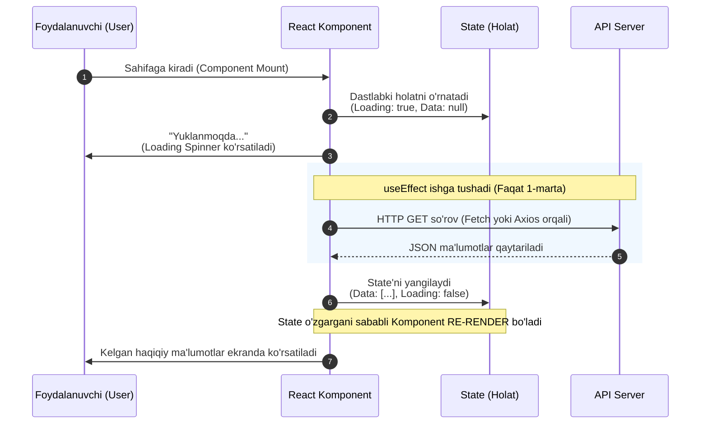

# 12-Qadam: React-da API bilan ishlash va Asinxron Dasturlash

## Asinxron Dasturlash o'zi nima va React-da nega kerak?

Tasavvur qiling, siz restorandasiz. Ofitsiantga buyurtma berdingiz (bu API ga so'rov yuborish). Agar ofitsiant ovqat tayyor bo'lguncha sizning oldingizda kutib tursa, u boshqa mijozlarga xizmat ko'rsata olmaydi. Bu **sinxron** jarayon bo'lar edi.
Lekin haqiqiy hayotda ofitsiant buyurtmani oshxonaga beradi va boshqa ishlari bilan shug'ullanadi. Ovqat tayyor bo'lgach, uni sizga olib keladi. Bu **asinxron** jarayon.

React-da ham xuddi shunday. Biz serverdan ma'lumot (masalan, foydalanuvchilar ro'yxati, ob-havo ma'lumotlari yoki ijtimoiy tarmoq postlarini) so'raganimizda, bu jarayon biroz vaqt oladi. Agar dasturimiz bu vaqt ichida to'xtab qolsa (qotib qolsa), foydalanuvchi interfeysi umuman ishlamay qoladi. Foydalanuvchi boshqa tugmalarni bosa olmaydi, sahifa "qotib" qoladi. Shuning uchun biz asinxron dasturlashdan (JavaScript-dagi `Promises`, `async/await`) foydalanamiz. Shu orqali brauzer ma'lumotlar kelishini kutib, ayni paytda boshqa interaktiv amallarni ham bajaraveradi.

---

## `useEffect` ichida Fetch tsikli (Standart Data Fetching)

React komponentida ma'lumotlarni qachon va qayerda yuklashimiz kerak? Asosiy qoida shuki: **Ma'lumot yuklash - bu "Side Effect" (nojo'ya ta'sir)**. React komponentlarining asosiy vazifasi UI (interfeys) ni chizishdir. Boshqa har qanday ish, jumladan tarmoqqa API so'rov yuborish, DOM ni qo'lda o'zgartirish yoki taymerlar o'rnatish `useEffect` hook'i ichida bajarilishi kerak.

### Nega boshlang'ich fetch uchun bo'sh dependency array `[]` kerak?

`useEffect` ning ikkinchi argumenti bu - **dependency array** (qaramliklar ro'yxati).
Agar siz bu array'ni bermasangiz, `useEffect` har bir render bo'lganda (ya'ni har safar state yoki prop o'zgarganda) qayta ishga tushadi. Agar siz ushbu effect ichida state'ni yangilasangiz, siz tasodifan dasturingizni buzib qo'yishingiz mumkin. Bu **cheksiz loop (infinite loop)** deb ataladi!

```jsx
// ❌ YOMON AMALIYOT (Cheksiz loop)
useEffect(() => {
  fetchData().then(data => setData(data)); 
  // Nima yuz beradi:
  // 1. Komponent render bo'ladi.
  // 2. useEffect ishga tushib, fetch qiladi.
  // 3. setData() ishga tushadi.
  // 4. State o'zgargani uchun React komponentni QAYTA render qiladi.
  // 5. Array berilmagani uchun useEffect YANA ishga tushadi va fetch qiladi...
  // 💥 Natijada brauzer qotib qoladi yoki serverga sekundiga yuzlab so'rov ketadi!
});

// ✅ YAXSHI AMALIYOT
useEffect(() => {
  fetchData().then(data => setData(data));
}, []); // <-- Bo'sh array
```

`[]` qaramliklar ro'yxati React'ga shunday deydi: *"Bu effekt hech qanday state yoki prop'ga qaram emas. Shuning uchun uni faqat komponent ekranga birinchi marta chiqqanida (mount bo'lganda) bir marta bajar, boshqa bezovta qilma!"*

---

## Komponent Hayot Tsikli va API So'rov (Sequence Diagram)

Quyida komponent ekranga chiqqandan boshlab, ma'lumot kelib, UI yangilanguncha bo'lgan standart React ma'lumot yuklash jarayoni vizual tasvirlangan.



Bu diagramma shuni ko'rsatadiki:
1. Komponent dastlab bo'sh ma'lumot va `loading=true` degan state bilan render bo'ladi. Bu vaqtda foydalanuvchi "Loading..." yozuvini ko'radi.
2. Komponent ekranga to'liq chizilib bo'lgach (mount), `useEffect` orqa fonda API ga so'rov jo'natadi.
3. API dan javob (ma'lumot) kelgach, biz `setState` funksiyasi orqali React-ga yangi holatni ma'lum qilamiz.
4. State yangilangani sababli, React komponentni qayta chizishga (re-render) qaror qiladi va endi ekranda API dan kelgan ma'lumotlar paydo bo'ladi.

---

## Loading va Error Holatlarini To'g'ri Boshqarish

Tarmoq so'rovlari har doim ham darhol va muvaffaqiyatli yakunlanavermaydi. Internet uzilib qolishi, serverda xatolik bo'lishi (masalan, 500 status code) yoki so'rov javobi juda uzoq vaqt olishi mumkin.
Shu sababli, professional React dasturchilari API bilan ishlashda har doim **3 ta asosiy state** yaratishadi:
1. `data` - Asosiy kelayotgan ma'lumotlarni saqlash uchun.
2. `isLoading` - Jarayon ketayotganini bildirish uchun (spinner yoki skeleton UI uchun).
3. `error` - Biron xatolik yuz bersa, uni ushlab, foydalanuvchiga tushunarli tarzda ko'rsatish uchun.

### To'liq ishlash namunasi (Fetch API yordamida):

```jsx
import React, { useState, useEffect } from 'react';

function UserList() {
  // 1. Uchta asosiy state'ni e'lon qilamiz
  const [users, setUsers] = useState([]);
  const [isLoading, setIsLoading] = useState(true); // Dastlab true bo'ladi
  const [error, setError] = useState(null); // Dastlab xato yo'q

  useEffect(() => {
    // async funksiyani useEffect ichida yaratamiz
    const fetchUsers = async () => {
      try {
        setIsLoading(true); // So'rov boshlanganini tasdiqlaymiz
        
        // Asinxron fetch so'rovi
        const response = await fetch('https://jsonplaceholder.typicode.com/users');
        
        // Fetch API da HTTP xatolar (masalan 404, 500) avtomatik tarzda 
        // "catch" blokiga tushib qolmaydi. Shuning uchun response.ok ni tekshiramiz.
        if (!response.ok) {
          throw new Error(`Xatolik yuz berdi: ${response.status}`);
        }
        
        const data = await response.json();
        setUsers(data); // Ma'lumotni state ga muvaffaqiyatli saqlaymiz
        
      } catch (err) {
        setError(err.message); // Agar catch ga tushsa, xatoni state ga yozamiz
      } finally {
        // Muvaffaqiyatli bo'ladimi yoki xatomi, eng oxirida bu blok albatta ishlaydi.
        // Biz yuklanish jarayoni tugaganini belgilab qo'yamiz.
        setIsLoading(false); 
      }
    };

    fetchUsers(); // Funksiyani chaqiramiz
  }, []); // <-- Bo'sh dependency array! 

  // 2. State'larning holatiga qarab, UIni mos ravishda render qilamiz (Conditional Rendering)
  
  if (isLoading) {
    return (
      <div className="spinner">
        Ma'lumotlar yuklanmoqda, iltimos kuting... ⏳
      </div>
    );
  }

  if (error) {
    return (
      <div className="error-message">
        Kechirasiz, xatolik: {error} ❌
      </div>
    );
  }

  // Agar loading tugagan va xato bo'lmasa, demak ma'lumot bor
  return (
    <div>
      <h2>Foydalanuvchilar ro'yxati</h2>
      <ul>
        {users.map(user => (
          <li key={user.id}>
            <strong>{user.name}</strong> - {user.email}
          </li>
        ))}
      </ul>
    </div>
  );
}

export default UserList;
```

> [!IMPORTANT]
> **Nega `fetchUsers` ni `useEffect` ichida qildik? Nega useEffect o'zini async qilib qo'ymadik?**
> Aslida `useEffect` o'zi to'g'ridan-to'g'ri `async` bo'lishi taqiqlangan (ya'ni `useEffect(async () => {...})` yozish mumkin emas). Sababi `useEffect` faqatgina ehtiyoj bo'lganda tozalash (cleanup) funksiyasini qaytarishi kerak. `async` funksiyalar esa avtomatik ravishda har doim `Promise` qaytaradi. Shuning uchun biz ichkarida maxsus `async` funksiya yaratib, uni o'sha yerni o'zida bir marta chaqirib qo'yamiz.

---

## Axios vs Fetch: Qaysi birini tanlash kerak?

JavaScript-da tarmoqqa so'rov yuborish uchun hozirda ikki xil keng tarqalgan texnologiya mavjud:
1. **Fetch API**: Brauzerga o'rnatilgan (built-in) standart vosita. Qo'shimcha kutubxona yoki "npm install" talab qilmaydi.
2. **Axios**: Uchinchi tomon kutubxonasi (third-party library). Uni `npm install axios` orqali o'rnatasiz. U ko'plab tayyor va qulay imkoniyatlar bilan birga keladi.

### Qanday farqlari bor?

| Xususiyat | Fetch API | Axios |
| :--- | :--- | :--- |
| **O'rnatish** | Kerak emas (Brauzerda tayyor bor) | `npm install axios` |
| **JSON formatlash** | Qo'lda qilish kerak (`res.json()`) | Avtomatik JSON obyektga o'girib beradi |
| **HTTP Xatolarni ushlash** | `res.ok` ni qo'lda tekshirish kerak | Avtomatik `catch` blokka tushib ketadi |
| **Interceptors** | Yo'q (qo'lda yozish qiyin va uzoq) | Bor (Tokenlarni yuborish, log qilishda juda qulay) |
| **Timeout (Vaqt cheklovi)**| `AbortController` orqali (birmuncha qiyin) | Bor (shunchaki konfiguratsiyada `timeout: 5000` berasiz) |

### 1. Fetch API bilan yozish (Standart yo'l)
```javascript
fetch('https://api.example.com/data')
  .then(response => {
    // 404 yoki 500 kabi xatolar catch ga kirmagani uchun qo'lda tekshiramiz
    if (!response.ok) {
      throw new Error('Tarmoq xatosi yuz berdi');
    }
    // Kelgan javobni stringdan JSON formatga o'tkazish
    return response.json(); 
  })
  .then(data => console.log(data))
  .catch(error => console.error(error));
```

### 2. Axios bilan yozish (Zamonaviy qulaylik)
```javascript
import axios from 'axios';

axios.get('https://api.example.com/data')
  // Axios qatorlarni avtomat tarzda JSONga o'giradi va uni "data" kaliti ichiga joylaydi
  .then(response => console.log(response.data)) 
  // Agar API dan 400, 401, 404, 500 kabi xato kodlari kelsa to'g'ridan-to'g'ri catch ishlaydi
  .catch(error => console.error(error.message)); 
```

### Xulosa: Qaysi birini ishlatay?
- Agar loyihangiz unchalik katta bo'lmasa, sodda so'rovlar yuborayotgan bo'lsangiz va ortiqcha paket qo'shishni xohlamasangiz, **Fetch API** - ideal va xavfsiz tanlov.
- Lekin loyihangiz yirik masshtabda bo'lsa, xavfsizlik tokenlari (JWT) bilan ishlasangiz, global xatolarni ushlash va so'rovlarni intercept qilish kerak bo'lsa - **Axios** ishingizni juda ham tezlashtiradi va yoziladigan kod hajmini qisqartiradi.

---

## Tez-tez yo'l qo'yiladigan xatolar (Do's and Don'ts)

> [!WARNING]
> **Don't: Xatoliklarni e'tiborsiz qoldirish**
> Agar siz `catch` bloksiz, xatolarni hisobga olmasdan API ga so'rov yuborsangiz va serverda xato yuz bersa, interfeys buziladi, foydalanuvchi esa oq ekranni ko'rib nima bo'lganini tushunmay qoladi.

> [!TIP]
> **Do: Har doim `try/catch/finally` ishlating**
> Ma'lumotlarni yuklashda har doim xatolik ehtimoli borligini (hatto eng mukammal tizimlarda ham) hisobga oling va uni chiroyli xabar (Notification) bilan foydalanuvchiga bildiring.

> [!CAUTION]
> **Don't: Data Fetching amallarini useEffect'dan tashqariga yozish**
> Komponentning to'g'ridan-to'g'ri tanasida (tashqarisida) API ga so'rov yubormang. Bu cheksiz renderlarga va dasturning qulashiga olib keladi.

> [!NOTE]
> **Do: Memory Leak (Xotira oqishi) ning oldini olish uchu Cleanup yozish**
> Agar komponent ekrandan yo'qolsa (unmount bo'lsa, masalan boshqa sahifaga o'tib ketsangiz), lekin internet pastligi sababli API so'rov endi yakunlanib, o'chirilgan komponentning State'ini yangilashga urinsa, React console'da `Memory Leak` xatosini beradi. Buni oddiy `isMounted` flagi yoki `AbortController` orqali hal qilish tavsiya etiladi.

**Memory Leak oldini olish namunasi:**
```javascript
useEffect(() => {
  let isMounted = true; // Komponent hozircha ekranda bor

  const fetchData = async () => {
    try {
      const response = await fetch('/api/data');
      const result = await response.json();
      
      // FAQATGINA komponent hali ham ekranda bo'lsa, state'ni yangila
      if (isMounted) {
        setData(result);
      }
    } catch(err) {
      if(isMounted) setError(err);
    }
  };
  
  fetchData();

  // Cleanup function: Komponent yo'qolganda ishlaydi
  return () => {
    isMounted = false; // Flag false bo'ladi va state yangilanmaydi
  };
}, []);
```

Ushbu qadam orqali siz React-da eng muhim ko'nikmalardan biri bo'lgan ma'lumotlar bilan ishlashni, hayot tsiklini boshqarishni va uchinchi tomon vositalari bilan professional darajada integratsiya qilishni o'rgandingiz!
