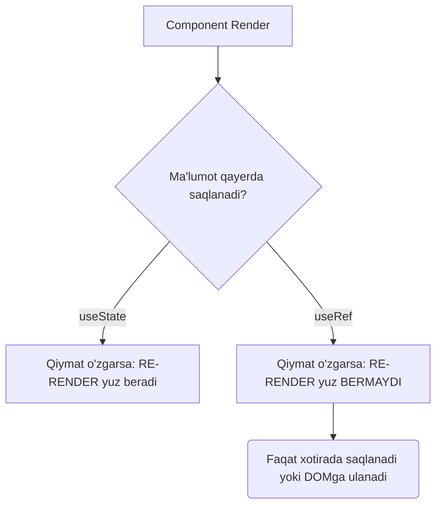
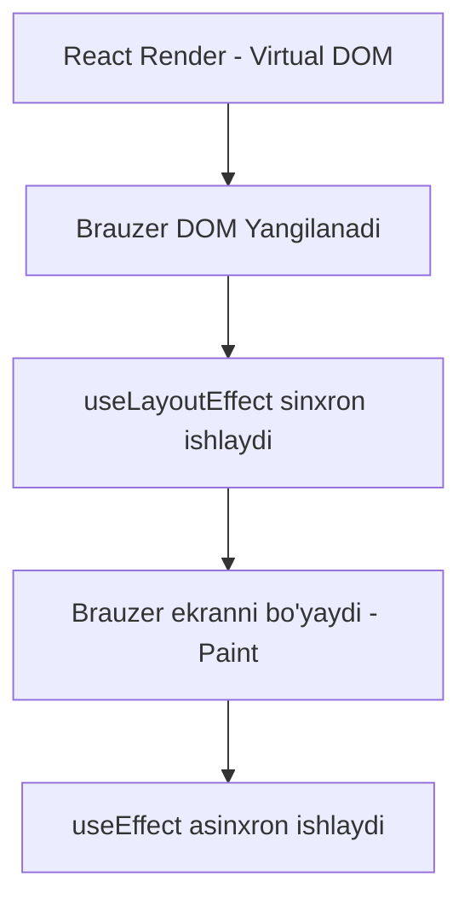

# React'da Ilg'or Hooklar va Optimizatsiya

React juda tez ishlaydi, lekin ilovamiz kattalashgan sari, biz ba'zi unumsiz jarayonlarni nazorat qilishimiz kerak. "Re-render" (qayta chizish) - bu React'ning asosi, lekin agar u keraksiz joyda va og'ir hisob-kitoblar bilan yuz bersa, dasturimiz sekinlashadi.

Ushbu bo'limda biz React'ni optimizatsiya qiluvchi ilg'or hooklar bilan tanishamiz: `useRef`, `useMemo`, `useCallback`, `React.memo` va `useLayoutEffect`.

---

## 1. useRef: Ekran orqasidagi "Maxfiy Quti"

Tasavvur qiling, sizda shaxsiy qutingiz bor. Uning ichiga nima solsangiz ham, tashqaridagi odamlar buni sezmaydi va xonani qayta bezatishga hojat qolmaydi. Aynan shu narsa `useRef` hisoblanadi.

`useState` qiymati o'zgarganda React butun komponentni boshqatdan o'qib chiqadi (re-render). `useRef` esa shunchaki xotirada saqlanadigan ob'ektdir. Uning qiymati o'zgarsa ham, komponent re-render **bo'lmaydi**.

### Ikkita asosiy ishlatilish joyi:
1. **DOM elementlariga bevosita kirish:** Oddiy JavaScript'da `document.getElementById` qilganingiz kabi.
2. **Re-renderlarsiz ma'lumot saqlash:** Timer (interval) ID lari, oldingi (previous) qiymatlar kabi vaqtinchalik xotira sifatida.



> **Qoida:** Agar ma'lumot UI (ekran) da ko'rinishi kerak bo'lsa, `useState` ishlating. Agar u faqat ichki hisob-kitob yoki qandaydir elementni ushlab turish uchun kerak bo'lsa, `useRef` ishlating.

---

## 2. useMemo: Qimmatli Kesh (Memoization)

Tasavvur qiling, qahvaxonaga kelib murakkab va tayyorlanishi qiyin qahva so'radingiz. Bunga 10 daqiqa ketdi. Agar siz har safar shu qahvani so'rasangiz va barista har gal noldan yasadimi, bu ko'p vaqt oladi. Yaxshisi, barista tayyor qahvani "keshlab" (eslab) qolib, siz yana so'raganda darhol tayyorini bergani ma'qul.

`useMemo` xuddi shunday ishlaydi: u og'ir (qimmatbaho) hisob-kitob natijasini xotirada eslab qoladi. Funksiya faqat unga berilgan "qaramliklar" (dependency array) o'zgargandagina boshqatdan hisoblaydi.

```javascript
// useMemo - qimmat hisob-kitob natijasini xotirada saqlaydi (keshlaydi).
// Bu funksiya ichidagi mantiq faqat qaramliklar array'i ([]) o'zgargandagina qayta ishlaydi.
const expensiveResult = useMemo(() => {
  // Og'ir yoki ko'p vaqt oladigan amal (masalan filtrlash yoki katta sikl)
  console.log("Juda uzoq hisoblanmoqda...");
  // Natija qaytariladi va `expensiveResult` ga o'zlashtiriladi
  return [1, 2, 3, 4, 5].filter(num => num > 2);
}, []); // Qaramliklar yo'q, faqat komponent birinchi marta chizilganda (mount) bir marta hisoblanadi
```

> **Ehtiyot bo'ling!** Hamma narsani ham `useMemo` bilan o'rayvermang. Xotira tekin emas! Keshga saqlashning o'zi ham qanchadir xarajat (vaqt va xotira). Uni faqat o'ta murakkab sikllar, og'ir filtrlash yoki massivlar bilan ishlaganda qo'llang.

---

## 3. useCallback: Funksiyalar uchun Kesh

JavaScript'da ob'ektlar va funksiyalar xotira manzili (referans) orqali solishtiriladi. Ikkita bir xil matnli funksiya yaratilganda, kompyuter ularni ikki xil turli narsa deb biladi.
React komponenti har safar qayta chizilganda, uning ichidagi barcha funksiyalar noldan, yangi xotira manzili bilan boshqatdan yaratiladi.

`useCallback` esa qimmatbaho funksiyaning **O'ZINI** keshlab qoladi (uni har renderda qayta yaratmaydi).

```javascript
// Har safar komponent re-render (qayta chizilgan) bo'lganda YANGI funksiya (yangi xotira manzili bilan) yaratiladi:
const handleClick = () => console.log('Salom');

// useCallback funksiyaning O'ZINI xotirada eslab qoladi (keshlaydi).
// Faqat qaramliklar o'zgarganda yangi funksiya yaratiladi, aks holda doim ESKISI (keshlangan) funksiya ishlatiladi:
const memoizedClick = useCallback(() => {
  // Bu yerda bajariladigan logika
  console.log('Salom');
}, []); // Bo'sh array - qaramliklar yo'q, demak funksiya faqat bir marta yaratiladi va aslo o'zgarmaydi.
```

> **Qachon kerak?** `useCallback` asosan funksiyani **bola komponentga** props qilib berayotganingizda va bola komponentni ortiqcha renderdan saqlamoqchi bo'lganingizda kerak. Oddiy holatlarda buning hojati yo'q.

---

## 4. React.memo: Bola Komponentni Himoya Qilish

Ota komponent o'zgarganda (masalan uning state-i yangilanganda), u barcha bola komponentlarini avtomatik qayta chizadi. Hattoki bolaning propslari mutlaqo o'zgarmagan bo'lsa ham!

`React.memo` - bu himoyachi (qorovul). U bola komponentni o'rab oladi va deydi: "Agar senga kelayotgan propslar aynan oldingi safargidek bo'lsa, sen qayta render bo'lmaysan, o'z joyingda qol!"

```javascript
// React.memo - High Order Component (HOC). U komponentni keraksiz re-renderlardan (qayta chizilishlardan) saqlaydi.
const ChildComponent = React.memo(function Child({ text }) {
  // Agar ota komponent re-render bo'lsa ham, lekin `text` props o'zgarmasa,
  // bu Child komponenti qayta chizilmaydi va bu console.log ishlamaydi.
  console.log("Men faqat text o'zgarganda render bo'laman!");
  // Komponentning UI (interfeys) qismi
  return <div>{text}</div>;
});
```

*Muhim qoida: Agar siz `ChildComponent` ga ota komponentdan funksiya uzatsangiz, uni albatta `useCallback` orqali keshlab yuboring. Aks holda ota komponent har renderda yangi funksiya yaratadi va `React.memo` buni o'zgarish deb baholab bolani baribir qayta render qiladi.*

---

## 5. useLayoutEffect: Rasmni Ekranga Chiqishidan Oldin Bo'yash

Odatda biz har doim `useEffect` ishlatamiz. U asinxron, ya'ni ekranda o'zgarishlar to'liq foydalanuvchiga ko'rsatilgandan (Paint) **SO'NG** fonda ishga tushadi. Bu ekranning qotib qolmasligi va tez yuklanishi uchun zarur.

Lekin ba'zida element foydalanuvchiga to'liq ko'rinmasdan turib uning o'lchamini (height/width) DOM dan o'qib, shunga qarab nimanidir o'zgartirishimiz kerak. Agar buni `useEffect` da qilsak, foydalanuvchi ekrandagi narsa avval bitta joyda chiqib, keyin darhol boshqa joyga "sakrab" (flicker) o'tganini ko'rib qoladi.

`useLayoutEffect` esa **sinxron**. U DOM hisoblanganidan keyin, lekin brauzer uni bo'yab ekranga chiqarishidan **OLDIN** ishga tushadi.



> **Maslahat:** Har doim standart sifatida `useEffect` dan foydalaning. Agar elementlar ekranda miltillab sakrayotgan (flicker) bo'lsa va ularning aniq o'lchami kerak bo'lsagina `useLayoutEffect` ga o'ting.

---

## 6. ❌ YOMON va ✅ YAXSHI Yondashuvlar

### Premature Optimization (O'rinsiz Optimallashtirish)

```jsx
// ❌ YOMON — Har bir funksiyani useCallback bilan, har bir obyektni useMemo bilan o'rash
// Bu xotirani to'ldiradi va aslini olganda ilovani sekinlashtirib yuborishi mumkin!
const handleClick = useCallback(() => { console.log('Salom') }, []);
const user = useMemo(() => ({ name: 'John' }), []);
```

```jsx
// ✅ YAXSHI — useMemo va useCallback ni faqat quyidagi hollardagina ishlating:
// 1. Hisob-kitob rostdan ham og'ir bo'lsa (masalan, 1000+ elementli ro'yxatni saralash)
// 2. Funksiya yoki obyekt React.memo bilan o'ralgan bola komponentga props orqali uzatilayotgan bo'lsa
// 3. Obyekt/funksiya qandaydir Effect ning qaramliklar ro'yxatida (dependency array) turgan bo'lsa
```

---

## 🎤 Intervyu Savollari

**1. useRef va useState farqi nimada?**
*Javob:* useState qiymati o'zgarganda komponent qayta render bo'ladi. useRef qiymati o'zgarganda qayta render bo'lmaydi. useRef DOM elementga murojaat qilish yoki render lar o'rtasida komponentning hayot tsikli davomida saqlanib turishi kerak bo'lgan, lekin ekranga to'g'ridan-to'g'ri bog'lanmagan o'zgaruvchilarni saqlash uchun ishlatiladi.

**2. useMemo va useCallback farqi?**
*Javob:* useMemo — qimmat va og'ir hisob-kitob natijasini xotirada saqlaydi (keshlaydi): `useMemo(() => heavyCalc(n), [n])`. useCallback — funksiyaning o'zini referansini xotirada saqlaydi, uni qayta-qayta yangidan yaratishni oldini oladi: `useCallback(() => handler(), [dep])`. Qisqasi: useMemo natijani, useCallback funksiyaning o'zini qaytaradi.

**3. React.memo nima va u qachon kerak?**
*Javob:* React.memo — Higher Order Component (HOC) bo'lib, u bola komponentni qamrab oladi va faqatgina uning props lari o'zgarsagina qayta render bo'lishga ruxsat beradi. U props larni oldingi holati bilan tekshiradi (shallow comparison). Faqat og'ir va ko'p qayta render bo'ladigan komponentlardagina foydalidir — uni barcha komponentlarga qo'llash mantiqsiz va unumdorlikni pasaytiradi.

**4. Premature optimization nima?**
*Javob:* Muammo yuzaga kelmasidan oldin `useMemo`, `useCallback`, yoki `React.memo` larni har joyda ishlatish — premature (barvaqt) optimallashtirish deyiladi. Bu kodni murakkablashtiradi, xotirada ortiqcha yuk yaratadi, va ko'pincha ilovani tezlashtirish o'rniga sekinlashtiradi. To'g'ri yondashuv: avval React DevTools Profiler yordamida muammoni aniqlang, keyin zarur joydagina optimallashtiring.
  