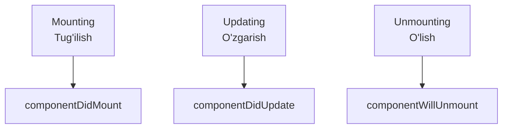
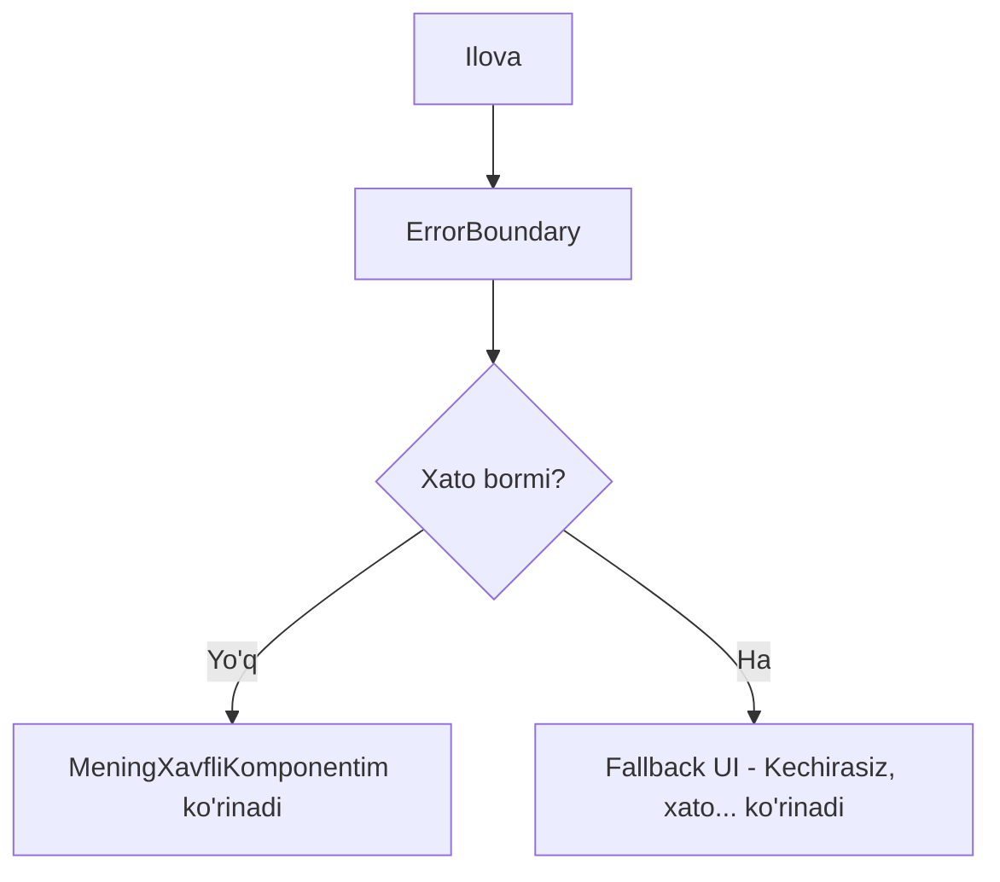

# 14. Klass Komponentlar (Class Components) va Xatolarni Boshqarish (Error Boundaries)

React olamida bugungi kunda Functional Components va Hooks (Hooklar) dominant bo'lsa-da, Klass Komponentlar (Class Components) uzoq yillar davomida React'ning asosi bo'lib kelgan. Shuningdek, ba'zi muhim xususiyatlar, masalan, **Error Boundaries** (Xatolar chegarasi) faqat klass komponentlar orqali amalga oshiriladi.

Ushbu darsda biz Klass komponentlar qanday ishlashini, ulardagi holat (state) va hayot tsikli (lifecycle) metodlarini, shuningdek, dastur ishdan chiqishining oldini oluvchi Error Boundaries haqida chuqur o'rganamiz.

---

## 1. Klass Komponentlar Asoslari va Konstruktor

### Klass Komponent nima?

Klass komponent - bu ES6 klassi bo'lib, u React'ning `Component` klassidan meros oladi va o'zida `render()` metodini saqlaydi.

**Analogi:** Agar Funksional Komponentlar bitta savolga javob beruvchi oddiy ishchilar bo'lsa, Klass Komponentlar - o'z ofisiga (state), kundalik rejasiga (lifecycle) va shaxsiy jurnaliga ega bo'lgan bo'lim boshliqlari kabi.

```jsx
import React, { Component } from 'react';

// React.Component dan meros oluvchi klass komponent yaratamiz
class Salomi extends Component {
  // render() metodi UI da nima chiqishini belgilaydi
  render() {
    // this.props orqali ota komponentdan kelgan ma'lumotlarga (masalan ism) kiramiz
    return <h1>Salom, {this.props.ism}!</h1>;
  }
}
```

### Konstruktor (Constructor)

Klass komponentlarda boshlang'ich sozlamalarni, ayniqsa *state* (holat) ni o'rnatish uchun `constructor` ishlatiladi.

```jsx
class MeningKomponentim extends Component {
  // constructor - komponent yaratilayotganda birinchi bo'lib ishga tushadigan qism
  constructor(props) {
    super(props); // Ota klassning (Component) konstruktorini chaqirish shart!
    
    // Boshlang'ich holatni (state) o'rnatish
    this.state = {
      sanoq: 0 // sanoq o'zgaruvchisiga dastlabki 0 qiymatini beramiz
    };
  }

  // Ekranda ko'rsatiladigan JSX kodini qaytaradi
  render() {
    // this.state orqali holat qiymatini (sanoq) o'qib, ekranga chiqaramiz
    return <div>Sanoq: {this.state.sanoq}</div>;
  }
}
```

> **Muhim Qoida:** Agar klassda konstruktor yozsangiz, doimo birinchi qatorda `super(props)` ni chaqirishingiz shart. Aks holda, `this.props` ishlamaydi!

---

## 2. State Boshqaruvi: `this.setState`

Klass komponentlarda holatni o'zgartirish faqat `this.setState()` orqali amalga oshiriladi. Hech qachon `this.state.sanoq = 1` deb to'g'ridan-to'g'ri o'zgartirmang!

```jsx
class Hisoblagich extends Component {
  constructor(props) {
    super(props);
    // Boshlang'ich state (holat) ni o'rnatamiz
    this.state = { sanoq: 0 };
    
    // Metodni this ga bog'lash (binding). Aks holda oshirish() ichida 'this' undefined bo'lib qoladi
    this.oshirish = this.oshirish.bind(this);
  }

  // Oddiy funksiya (metod), uni ishlatish uchun yuqorida bind qilish kerak bo'ldi
  oshirish() {
    // Holatni yangilash uchun har doim this.setState ishlatamiz
    this.setState({ sanoq: this.state.sanoq + 1 });
  }

  // ES6 Arrow function orqali binding'dan qutulish mumkin, this har doim klassni bildiradi
  kamaytirish = () => {
    // Avvalgi holatga (prevState) qarab yangilashning eng xavfsiz va to'g'ri usuli
    this.setState(prevState => ({ sanoq: prevState.sanoq - 1 }));
  }

  render() {
    return (
      <div>
        <h2>Sanoq: {this.state.sanoq}</h2>
        {/* Tugmalar bosilganda tegishli funksiyalar chaqiriladi */}
        <button onClick={this.oshirish}>+1</button>
        <button onClick={this.kamaytirish}>-1</button>
      </div>
    );
  }
}
```

### Do's and Don'ts (Qilish kerak va Mumkin emas)

✅ **QILING:** Oldingi holatga asoslanib o'zgartirmoqchi bo'lsangiz, `setState` ichiga funksiya bering: `this.setState((prevState) => ({ x: prevState.x + 1 }))`.
❌ **QILMANG:** `this.state.x = 2` kabi o'zgaruvchini to'g'ridan-to'g'ri mutatsiya qilmang. React komponentni qayta chizmaydi!

---

## 3. Hayot Tsikli Metodlari (Lifecycle Methods)

Komponentning tug'ilishidan (Mounting) tortib, to ekrandan o'chib ketishigacha (Unmounting) bo'lgan jarayon hayot tsikli deb ataladi.



### 1. `componentDidMount()`
Komponent ekranga birinchi marta chizilganidan so'ng darhol ishga tushadi. 
**Qachon ishlatiladi?** API dan ma'lumot yuklash, taymerlarni yoqish yoki DOM ni to'g'ridan-to'g'ri o'zgartirish kerak bo'lganda.

```jsx
// Komponent birinchi marta chizilganidan keyin darhol ishga tushadi
componentDidMount() {
  // Odatda API lardan ma'lumotlarni shu yerda yuklaymiz
  fetch('/api/data')
    .then(res => res.json()) // Kelgan ma'lumotni JSON formatiga aylantiramiz
    .then(data => this.setState({ data })); // Ma'lumotni holatga saqlaymiz
    
  // Har soniyada ishlaydigan taymer (interval) o'rnatamiz
  this.timerID = setInterval(() => this.tick(), 1000);
}
```

### 2. `componentDidUpdate(prevProps, prevState)`
Komponentning state yoki props'i o'zgargandan so'ng va u qayta chizilgandan keyin ishga tushadi.
**Qachon ishlatiladi?** Agar ma'lum bir state o'zgarganda yana qandaydir qo'shimcha ish qilish kerak bo'lsa.

```jsx
componentDidUpdate(prevProps, prevState) {
  if (this.state.sanoq !== prevState.sanoq) {
    document.title = `Siz ${this.state.sanoq} marta bosdingiz`;
  }
}
```

### 3. `componentWillUnmount()`
Komponent ekrandan o'chirilishidan darhol oldin ishga tushadi.
**Qachon ishlatiladi?** Taymerlarni to'xtatish, obunalarni (subscriptions) bekor qilish uchun (Memory leak oldini olish).

```jsx
// Komponent ekrandan olib tashlanishidan darhol oldin ishlaydi
componentWillUnmount() {
  // Xotiradan joy tejash uchun taymerni to'xtatamiz (memory leak ning oldini olish)
  clearInterval(this.timerID); // Taymerni o'chirish
}
```

---

## 4. Xatolarni Boshqarish: Error Boundaries

Tasavvur qiling, sizning ilovangizda kichik bir komponent ishdan chiqdi. Default holatda bu butun React ilovasining "qulashiga" olib keladi (Oq ekran ko'rinib qoladi).

**Error Boundaries (Xato chegaralari)** xuddi elektr tarmog'idagi saqlagichlar (probkalar) kabi ishlaydi. Ular xato yuz berganda uni tutib qoladi va butun uy yonib ketishining o'rniga, faqat bitta xonadagi chiroqni o'chirib, o'rniga "Zaxira lampochka" ni yoqadi.

> **Eslatma:** Error boundaries hozircha *faqat* Klass komponentlar orqali yaratilishi mumkin. Hooklarda uning muqobili yo'q.

### Error Boundary yaratish

Komponent xatolar chegarasiga aylanishi uchun u kamida bitta quyidagi metodni o'z ichiga olishi kerak:
1. `static getDerivedStateFromError(error)` - zaxira UI (fallback UI) ko'rsatish uchun state ni yangilash.
2. `componentDidCatch(error, errorInfo)` - xatoni log faylga (masalan Sentry'ga) yuborish uchun.

```jsx
// Xatolarni chegaralash (ErrorBoundary) vazifasini bajaruvchi maxsus komponent
class ErrorBoundary extends React.Component {
  constructor(props) {
    super(props);
    // Dastlab xato yo'q deb faraz qilamiz
    this.state = { hasError: false };
  }

  // Bu Reactning maxsus metodi bo'lib, uning yordamida state ni yangilaymiz
  static getDerivedStateFromError(error) {
    // Xato yuz berganda keyingi renderda Fallback (zaxira) UI ko'rsatish uchun state ni true qilamiz
    return { hasError: true };
  }

  // Bu metod xato bo'lganda qo'shimcha ishlar qilish imkonini beradi
  componentDidCatch(error, errorInfo) {
    // Xatoni serverga jo'natishingiz yoki konsolda ko'rishingiz mumkin
    console.error("Xato yuz berdi:", error, errorInfo);
  }

  render() {
    if (this.state.hasError) {
      // Zaxira UI: Agar dastur ishdan chiqsa, oq ekran qolib ketmasligi uchun shu chiqadi
      return <h2>Kechirasiz, nimadir xato ketdi! Dasturchilarimiz buni tuzatishmoqda.</h2>;
    }

    // Xato bo'lmasa, bolalar (children) komponentlarini odatdagidek chizamiz
    return this.props.children; 
  }
}
```

### Error Boundary'dan Foydalanish

Siz Error Boundary komponentingizni butun dastur atrofida yoki alohida muhim qismlar atrofida o'rashingiz mumkin.

```jsx
{/* Xato yuz berishi ehtimoli bo'lgan komponentimizni ErrorBoundary ichiga o'raymiz */}
<ErrorBoundary>
  <MeningXavfliKomponentim />
</ErrorBoundary>
```



---

## 5. Xulosa

1. **Klass Komponentlar** holatni va hayot tsiklini boshqarish uchun ES6 klasslaridan foydalanadi.
2. **State** o'zgartirish doim `this.setState()` orqali bo'lishi kerak.
3. Hayot tsikli metodlari (`componentDidMount`, `componentDidUpdate`, `componentWillUnmount`) komponent hayotining muayyan bosqichlarida aralashishga imkon beradi.
4. **Error Boundaries** yordamida kichik komponentdagi xatolik tufayli butun sayt oq ekran bo'lib qolishining oldi olinadi. Zaxira UI (Fallback UI) ko'rsatiladi.

Klass komponentlar eskiroq loyihalarda juda ko'p uchraydi, shuning uchun ularni qanday o'qish va tushunishni bilish har bir professional React dasturchisi uchun shartdir!

---

## 🎤 Intervyu Savollari

**1. Class component va Functional component asosiy farqlari?**
*Javob:* Class: extends React.Component, this.state, this.setState, lifecycle metodlar (componentDidMount va h.k.). Functional: hooks (useState, useEffect), sodda sintaksis, kichik kod hajmi. Zamonaviy React da funksional + hooks tavsiya etiladi.

**2. Error Boundary nima va qachon kerak?**
*Javob:* Error Boundary — farzand komponentlardagi JavaScript xatolarini ushlab, fallback UI ko'rsatadigan class komponent. getDerivedStateFromError (state yangilash) va componentDidCatch (xatoni log qilish) metodlarini amalga oshiradi. Funksional komponentda Error Boundary yaratib bo'lmaydi.

**3. componentDidMount va useEffect([]) farqi?**
*Javob:* componentDidMount — class komponentda komponent DOM ga qo'shilgandan keyin bitta ishlaydigan lifecycle metod. useEffect(() => {}, []) — funksional komponentdagi muqobil. Ikkalasi ham "mount" hodisasiga javob beradi, lekin useEffect StrictMode da ikki marta ishlaydi.

**4. this.setState asinxronmi?**
*Javob:* Ha, this.setState asinxron — React bir necha setState ni birlashtirishi mumkin (batching). Shuning uchun this.setState dan keyin darhol this.state ni o'qib bo'lmaydi. Callback ishlating: this.setState(prev => ({...}), callback).
  