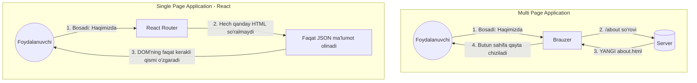
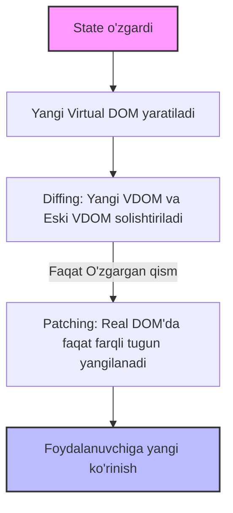

# 1-qadam: React'ga Kirish va Loyihani Sozlash (Setup)

## 1. React Tarixi va Arxitekturasi

React - bu foydalanuvchi interfeyslarini (UI) yaratish uchun mo'ljallangan ochiq kodli JavaScript kutubxonasi. U dastlab Facebook (hozirgi Meta) muhandisi Jordan Walke tomonidan 2011 yilda yaratilgan.

**Tarixiy fon:**
2010-yillarning boshlarida Facebook kundan-kunga kattalashib, murakkablashib borayotgan edi. "Chat" va "Yangiliklar tasmasi" (News Feed) kabi qismlar bir-biriga bog'liq bo'lsa-da, ularning ma'lumotlarini sinxronlash (masalan, kimdir xabar yozganda chat ikonkasida bildirishnoma sonini to'g'ri ko'rsatish) an'anaviy JavaScript usullari bilan juda qiyinlashib ketdi. Kod bazasi "spagetti" ga aylanib, xatolar (buglar) ko'payib ketaverdi. 

Shu muammoni hal qilish uchun Jordan Walke React'ni yaratdi. React 2013-yilda ochiq kodli (open-source) qilib e'lon qilindi va tez orada butun dunyo dasturchilari orasida mashhur bo'lib ketdi.

**Arxitekturasi:**
React asosan **Komponentlarga asoslangan (Component-based)** arxitekturaga ega. 
Buni qanday tushunamiz? Katta va murakkab veb-saytni bitta butun narsa sifatida emas, balki kichik, mustaqil va qayta ishlatsa bo'ladigan lego qismlariga (komponentlarga) bo'lib chiqamiz. Masalan: Navbar komponenti, Sidebar komponenti, Footer komponenti va hokazo.

*Analogi:* Tasavvur qiling, siz avtomobil yig'yapsiz. Avtomobilni bitta yaxlit temir bo'lagidan quymaysiz. Uning g'ildiraklari, dvigateli, eshiklari alohida tayyorlanadi va oxirida yig'iladi. Agar bitta g'ildirak teshib qolsa, faqat o'sha g'ildirakni almashtirasiz, butun mashinani emas. React komponentlari ham xuddi shunday ishlaydi!

> **Nega kerak? (Nima uchun aynan React?)**
> Oddiy HTML/CSS/JS bilan ham sayt qilsa bo'ladi-ku? Ha, bo'ladi. Lekin sayt kattalashgani sari UI'ni boshqarish qiyinlashadi. React bizga ma'lumotlar o'zgarganda faqat kerakli qismni o'zini yangilash, kodni qayta ishlatish (reusability) va murakkab interfeyslarni oson boshqarish imkonini beradi.

---

## 2. SPA (Single Page Application) vs MPA (Multi Page Application)

Web dasturlash olamida ikkita asosiy yondashuv bor: MPA va SPA. React aynan SPA yaratish uchun ishlatiladi.

### MPA (Multi Page Application) - Ko'p Sahifali Ilovalar
Bu an'anaviy usul. Foydalanuvchi biror havolani (linkni) bossa, brauzer serverga so'rov yuboradi, server esa butunlay yangi HTML sahifani (tepadan pastgacha) qaytaradi. Brauzer oq rangga kirib, qaytadan sahifani yuklaydi.
*Analogi:* Har safar kitobning yangi sahifasini o'qish uchun kutubxonachining oldiga borib, eski sahifani topshirib, yangisini olib kelishingizga to'g'ri keladi. Qanchalik vaqt talab qilishini tasavvur qilyapsizmi?

### SPA (Single Page Application) - Yagona Sahifali Ilovalar
Bu zamonaviy usul (React shunday ishlaydi). Foydalanuvchi saytga kirganda, faqat bitta HTML sahifa (`index.html`) yuklanadi. Keyin sahifa ichidagi ma'lumotlar foydalanuvchi harakatiga qarab JavaScript orqali orqa fonda (serverdan faqat kerakli ma'lumot, masalan JSON ko'rinishida olinib) almashtirib qo'yiladi. Sahifa umuman "perezagruzka" (reload) bo'lmaydi.
*Analogi:* Sizga bitta sehrli doska berishgan. Siz u yerdan qimirlamaysiz, shunchaki tugmani bossangiz, doskadagi yozuvlarning faqat kerakli qismi o'zgarib qoladi. Doska hamisha sizning oldingizda turadi.



---

## 3. Virtual DOM vs Real DOM (Nega React tez?)

Browser o'zida tushunadigan asosiy obyekt bu DOM (Document Object Model) - HTML hujjatining daraxt ko'rinishidagi tuzilishi.

**Real DOM muammosi:**
Deylik, sizning 5000 ta qatorli jadvalingiz bor. Agar 1 ta katakning rangi o'zgarsa, qadimgi usulda butun jadvalni qayta chizish yoki DOM bo'ylab uzoq qidirish kerak bo'lardi. DOM elementlarini har gal o'zgartirish brauzer uchun eng sekin va "qimmat" (ko'p resurs yeydigan) jarayon hisoblanadi.

**React qanday yechim topgan? (Virtual DOM):**
React "Virtual DOM" (VDOM) tushunchasini olib kirdi. Virtual DOM - bu Real DOM'ning shunchaki xotiradagi nusxasi (yengil vaznli JavaScript obyekti).

**Jarayon qanday kechadi (Reconciliation jarayoni)?**
1. Ma'lumot (State) o'zgardi.
2. React darhol yangi VDOM yaratadi (xotirada bu juda tez amalga oshadi).
3. Yangi VDOM ni eski VDOM bilan solishtiradi. Bu jarayon **Diffing** deb ataladi.
4. Faqat o'zgargan joylarni topadi.
5. So'ngra, topilgan qismlarnigina paketlab turib, Real DOM'ga jo'natadi va faqat o'sha o'zgargan nuqtani Real DOM'da yangilaydi (Bu jarayon Patching / **Reconciliation** deb ataladi).



*Analogi:* Siz uyning chizmasini (VDOM) tayyorladingiz. Keyin xotiningiz oshxonaga bitta deraza qo'shmoqchi bo'ldi. Siz eshikni, tomni, boshqa xonalarni buzmaysiz. Shunchaki chizmaga o'zgartirish kiritasiz va usta (React) kelib faqat o'sha devorni teshib deraza o'rnatadi. Butun uyni qaytadan qurish (Real DOM perezagruzkasi) shart emas!

---

## 4. O'rnatish Vositalari (Setup tools): Node, npm, CRA vs Vite

React loyihasini noldan barcha fayllarni ulab chiqib qilish juda mashaqqatli. Shuning uchun tayyor o'rnatish vositalari ishlatiladi. Lekin undan oldin kompyuterimizda muhit bo'lishi kerak.

**Node.js va npm:**
- **Node.js:** JavaScript'ni faqat brauzerda emas, balki kompyuterda (serverda) ham ishlashiga imkon beruvchi muhit (runtime). React loyihalarini kompyuterimizda run qilish uchun Node.js kerak.
- **npm (Node Package Manager):** Bu JavaScript kutubxonalari do'koni. Loyihamizga kimgadir tegishli bo'lgan tayyor kodni (paketni) olib kirish uchun ishlatamiz. Buni xuddi telefoningizdagi "App Store" yoki "Play Market" deb tushunishingiz mumkin.

**Create React App (CRA) vs Vite:**

Bir necha yil oldin barcha React loyihalari `npx create-react-app my-app` komandasi orqali yaratilardi. Bu Facebook tomonidan qilingan rasmiy "tayyor shablon" edi.

Ammo hozirgi kunda CRA eskirib qoldi. O'rniga **Vite** keng qo'llanilmoqda.

> **Nima uchun CRA'dan Vite'ga o'tilmoqda?**
> - **Sekinlik:** CRA loyihani ishga tushirish (dev serverni yoqish) va kodni o'zgartirganda ekranda ko'rinishi uchun barcha fayllarni bitta qilib yig'ardi (bundler - Webpack). Loyiha kattalashgani sari loyihani yoqishga 30 soniyadan bir necha daqiqagacha vaqt ketib qolardi.
> - **Vite (fransuzcha "tez" degani):** Vite bundler emas, u ES Module yordamida ishlaydi. Ya'ni u butun kodni emas, faqat siz o'zgartirgan faylnigina brauzerga uzatadi. Natijada loyiha kattaligidan qat'iy nazar server 1 soniyaga qolmasdan yonadi. O'zgartirishlar ham millisoniyalarda ekranda paydo bo'ladi (Hot Module Replacement - HMR).

**Do's and Don'ts:**

❌ *Don't (Qilmang):* Yangi loyiha boshlayotganda `create-react-app` dan foydalanmang. (Hatto React rasmiy hujjatlari ham buni endi tavsiya etmayapti).
```bash
npx create-react-app eski-loyiha
```

✅ *Do (Qiling):* Vite dan foydalaning.
```bash
# Vite orqali yangi React loyiha yaratish komandasi:
npm create vite@latest my-react-app -- --template react
```

---

## 5. Loyiha Papkalar Strukturasi (Deep Dive into Folder Structure)

Vite orqali loyiha yaratib, uni VS Code kabi muharrirda ochsangiz quyidagi papka va fayllarni ko'rasiz. Keling, har birining vazifasini chuqur tushunib olamiz:

```text
my-react-app/
├── node_modules/       # (Tegib bo'lmaydigan hudud!)
├── public/             # (Ommaviy statik fayllar)
│   └── vite.svg        
├── src/                # (Sizning ijod maydoningiz - asosan shu yerda ishlaysiz)
│   ├── assets/         # Rasm, fontlar uchun
│   ├── App.css         # App komponentining stillari
│   ├── App.jsx         # BOSH KOMPONENT!
│   ├── index.css       # Global stillar
│   └── main.jsx        # Dasturning kirish nuqtasi (Entry point)
├── .gitignore          # Git ga kirmasligi kerak bo'lgan fayllar ro'yxati
├── index.html          # O'sha yagona HTML sahifa (SPA ning asosi)
├── package-lock.json   # Paketlarning aniq versiyalarini qulflash
├── package.json        # Loyihamiz pasporti (qanday paketlar bor, qanday ishga tushadi)
└── vite.config.js      # Vite uchun sozlamalar
```

**Batafsil tushuntirish:**

1. `node_modules/`:
Bu yerda `npm` orqali yuklab olingan barcha kutubxonalar va ularning qaramliklari (dependencies) joylashadi.
*Qoida:* Bu papkaga hech qachon kirmang va undagi hech narsani o'zgartirmang. Agar xato qilib o'chirib yuborsangiz, terminalda `npm install` yozsangiz, o'zi qaytadan yaratib oladi. Github'ga ham bu papka yuklanmaydi.

2. `public/`:
Bu papkaga tashlangan fayllar Vite tomonidan hech qanday o'zgarishsiz, to'g'ridan-to'g'ri brauzerga uzatiladi. Masalan, saytning Favicon'i (tepada brauzer tab'ida turadigan mitti rasm) yoki SEO uchun kerakli `robots.txt` kabi fayllar shu yerda turadi.

3. `src/` (Source - Manba):
Sizning barcha kodingiz, komponentlaringiz, mantiqlar shu papka ichida yoziladi.
- `main.jsx`: Bu React dasturining **Kirish nuqtasi**. U `index.html` dagi `<div id="root"></div>` ni topib, bizning butun React kodimizni (VDOM ni) o'sha devorga yopishtiradi.
- `App.jsx`: Bu eng katta, ona (Root) komponent. Qolgan barcha kichik komponentlar shu fayl ichiga yig'iladi.

4. `index.html`:
Bizning sahifamizning "skeleti". E'tibor bersangiz ichida deyarli hech narsa yo'q, faqat bitta `<div id="root"></div>` bor. Bizning butun React dasturimiz sehrgarlik kabi shu bitta `div` ichiga chiziladi.

5. `package.json`:
Loyiha "pasporti". Loyiha nomi, versiyasi va eng muhimi - loyiha ishlashi uchun qanday tashqi paketlar kerakligi ro'yxati yozilgan fayl. 

> **Nega kerak?**
> Tasavvur qiling do'stingizga loyihangizni bermoqchisiz. Siz unga butun `node_modules` papkasini bermaysiz (u juda og'ir, ba'zan 500mb dan oshadi). Siz faqat o'z kodingiz va `package.json` ni berasiz. Do'stingiz loyihani ochib `npm install` ni bossa, npm u yerda yozilgan "retsept" (paketlar ro'yxati) asosida hamma narsani internetdan qayta yuklab oladi.

*Xulosa:* Endi biz React qanday paydo bo'lgani, u muammolarni qanday hal qilishi (VDOM va SPA orqali), hamda yangi loyihani o'rnatish va uni strukturasini chuqur o'zlashtirib oldik. Keyingi darsda shu komponentlarning ichiga kirib, JSX sintaksisini va komponentlar qanday tuzilishini o'rganamiz!
