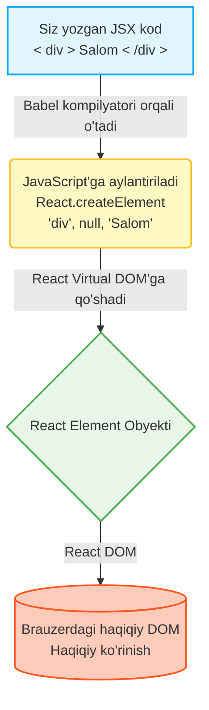

# 2-qadam: JSX - JavaScript va HTML ning mukammal nikohi

Xush kelibsiz! React olamiga kirib borarkanmiz, birinchi navbatda duch keladigan eng g'ayrioddiy, ammo eng kuchli tushunchalardan biri bu — **JSX**. Agar siz ilgari faqat oddiy HTML va JavaScript (Vanilla JS) bilan ishlagan bo'lsangiz, JSX boshida biroz g'alati tuyulishi mumkin. Ammo ishonavering, uning sehrini tushunib yetganingizdan so'ng, usiz kod yozishni tasavvur qila olmaysiz!

---

## 🧐 JSX o'zi nima?

**JSX (JavaScript XML)** — bu JavaScript tilining sintaksis kengaytmasi. U ko'rinishidan xuddi HTML ga o'xshaydi, lekin to'liq JavaScript quvvatiga ega. JSX orqali biz foydalanuvchi interfeysini (UI) to'g'ridan-to'g'ri JavaScript kodimiz ichida tasvirlashimiz mumkin.

### 💡 Hayotiy o'xshashlik (Analogy)
Tasavvur qiling, siz aqlli uy quryapsiz. An'anaviy veb-dasturlashda:
- **HTML** — bu uyning g'ishtlari, devorlari va xonalari (Struktura).
- **JavaScript** — bu uyning elektr tizimi, avtomatika va kalitlari (Mantiq va Harakat).

Odatda siz g'ishtlarni alohida terib chiqib, keyin ularga sim tortib, ularni birlashtirishingiz kerak bo'lardi (`document.getElementById` va hokazo). 
**JSX esa — bu o'zining ichiga oldindan mikrosxema va tugmalar o'rnatilgan "aqlli g'ishtlar"** dir! Siz strukturani qurayotgan vaqtingizning o'zida unga mantiqni ham qo'shib ketasiz. Siz UI qanday ko'rinishini va qanday ishlashini bitta yaxlit joyda ko'rasiz.

---

## ❓ Nega bizga JSX kerak? (Nega mantiq va ko'rinishni aralashtiramiz?)

O'nlab yillar davomida veb-dasturchilarga "Mantiq (JS) va Ko'rinish (HTML) ni alohida fayllarda saqlang" deb o'rgatib kelingan. Bunga "Vazifalarni ajratish" (Separation of Concerns) deyilardi.

Xo'sh, nega React bu qoidani buzadi?

React ijodkorlari anglab yetishdiki, zamonaviy veb-ilovalarda **UI va Mantiq bir-biri bilan uzviy bog'liq**. Tugma qanday ko'rinishi va uni bosganda nima sodir bo'lishi — bu bitta yaxlit narsa (komponent). Kodni fayl turlariga (HTML, JS, CSS) qarab emas, balki **vazifasiga qarab (Komponentlarga)** ajratish ancha mantiqli va samaraliroq.

**JSX ning afzalliklari:**
1. **O'qilishi oson:** Kodga qarashingiz bilan interfeys qanday tuzilganini darhol tushunasiz.
2. **Kamroq xato:** JavaScript ichida HTML yozish orqali, siz xatoliklarni kompilyatsiya vaqtidayoq (brauzerga yetib bormasdan) ko'ra olasiz.
3. **To'liq JS quvvati:** HTML ichida sikllar (`map`), shartlar (`if`/`ternary`) va o'zgaruvchilardan erkin foydalanish mumkin.

---

## ⚙️ Parda ortida: Babel qanday ishlaydi?

Brauzerlar (Chrome, Safari, Edge) JSX ni tushunmaydi! Ularning "tili" — faqat toza JavaScript, HTML va CSS.

Agar shunday bo'lsa, brauzer JSX ni qanday o'qiydi?
Bu yerda maydonga **Babel** tushadi. Babel — bu zamonaviy JS kodini (va JSX ni) eski, barcha brauzerlar tushunadigan oddiy JavaScript kodiga aylantirib beruvchi vosita (kompilyator/transpilyator).

Babel har bir JSX tegingizni olib, uni React'ning `React.createElement()` funksiyasi chaqiruviga aylantiradi.

### 🔄 JSX -> Babel -> React Element jarayoni:



*Ko'rib turganingizdek, JSX shunchaki `React.createElement` ni oson va chiroyli yozish uchun "sintaktik shakar" (syntactic sugar) xolos.*

---

## ⚠️ JSX ning qat'iy qoidalari

JSX HTML ga juda o'xshasa-da, uning o'ziga xos qat'iy qoidalari bor. U oddiy HTML ga qaraganda ancha talabchan. Bu qoidalarni bilish juda muhim.

### 1. Barcha elementlar Yagona Ota-ona (Single Parent) ichida bo'lishi shart
Komponent har doim bitta yaxlit element qaytarishi kerak. Agar bir nechta yonma-yon element qaytarmoqchi bo'lsangiz, ularni bitta "qopga" solishingiz kerak.

Nima uchun? Chunki har bir JSX aslini olganda funksiya (`React.createElement`) va funksiya faqat bitta qiymat (obyekt) qaytara oladi.

### 2. Barcha teglar albatta yopilishi shart (Self-closing tags)
HTML da `<input>` yoki `` kabi teglarni yopmasdan tashlab ketish mumkin. JSX da bunday qilib bo'lmaydi. Har bir teg albatta yopilishi shart: `<input />`, ``, `<br />`.

### 3. Atributlar nomlanishi TuyaKo'rinishida (camelCase) bo'lishi kerak
JSX da yozilgan narsa asosan JavaScript bo'lganligi sababli, atribut nomlari JS qoidalariga bo'ysunadi. 
- HTML dagi `class` atributi JSX da `className` ga aylanadi (chunki `class` bu JavaScript da zaxiralangan so'z - keyword).
- `for` o'rniga `htmlFor`.
- Voqealarni ushlash (Event listeners) ham camelCase da: `onclick` emas `onClick`, `onchange` emas `onChange`, `tabindex` emas `tabIndex`.

### 4. JavaScript ni HTML ichiga olib kirish uchun jingalak qavslar `{}` ishlatiladi
Agar siz JSX ichida biror JS o'zgaruvchisini ko'rsatmoqchi, funksiya ishlatmoqchi yoki hisob-kitob qilmoqchi bo'lsangiz, buni faqat jingalak qavslar `{}` ichida qilishingiz mumkin. Bu React ga "bu yerda JavaScript kodini hisobla" degan belgidir.

---

## ✅ Do's and Don'ts (Yaxshi va Yomon amaliyotlar)

Quyida keng tarqalgan xatolar va ularning to'g'ri yechimlari bilan tanishamiz.

### 1-qoida: Ota-ona elementi

🔴 **YOMON (Don't):** Xatolik yuz beradi, chunki ikkita h1 va p teglari yonma-yon turibdi, ularni o'rab turuvchi qop yo'q.
```jsx
// XATO! 
function UserProfile() {
  return (
    <h1>Farhod</h1>
    <p>React Dasturchi</p>
  );
}
```

🟢 **YAXSHI (Do):** Ularni `<div>` yoki React Fragment (`<> ... </>`) ichiga oling. Fragment ortiqcha HTML tugun (node) yaratmaydi, kodni toza saqlaydi.
```jsx
// TO'G'RI!
function UserProfile() {
  return (
    <>
      <h1>Farhod</h1>
      <p>React Dasturchi</p>
    </>
  );
}
```

### 2-qoida: Teglarni yopish

🔴 **YOMON (Don't):** Input va br teglari yopilmagan.
```jsx
function Form() {
  return (
    <form>
      Ism: <input type="text">
      <br>
      <button>Yuborish</button>
    </form>
  );
}
```

🟢 **YAXSHI (Do):** Oxiriga `/` qo'yib yopish shart.
```jsx
function Form() {
  return (
    <form>
      Ism: <input type="text" />
      <br />
      <button>Yuborish</button>
    </form>
  );
}
```

### 3-qoida: camelCase va CSS klasslar

🔴 **YOMON (Don't):** `class`, `onclick` kabi HTML xususiyatlari ishlatilmoqda. Inline stil (style) oddiy matn kabi yozilgan.
```jsx
function Button() {
  return (
    <button class="btn-primary" onclick={submitData} style="color: white; background-color: blue;">
      Tasdiqlash
    </button>
  );
}
```

🟢 **YAXSHI (Do):** `className`, `onClick` ishlatilmoqda. `style` esa ikkita jingalak qavs `{{}}` ichida JS obyekti sifatida berilmoqda (birinchi qavs JSX qoidasi, ikkinchisi obyekt ekanligini bildiradi). Xususiyatlar camelCase qilingan (background-color emas backgroundColor).
```jsx
function Button() {
  return (
    <button 
      className="btn-primary" 
      onClick={submitData} 
      style={{ color: 'white', backgroundColor: 'blue' }}
    >
      Tasdiqlash
    </button>
  );
}
```

### 4-qoida: JavaScript ifodalari (Expressions) vs Qoidalar (Statements)

JSX ichidagi `{}` ga siz faqat natija qaytaradigan "ifoda" (expression) larni yozishingiz mumkin (masalan: `2 + 2`, `user.name`, `array.map()`, uchlik (ternary) operator `isTrue ? 'Ha' : 'Yoq'`). 
Siz `if`, `for`, `while` kabi "qoidalar" (statements) ni to'g'ridan-to'g'ri JSX ichida ishlata olmaysiz.

🔴 **YOMON (Don't):** JSX ichida `if` yozish mumkin emas.
```jsx
function Greeting({ isLogin }) {
  return (
    <div>
      { 
        if (isLogin) { 
          return <h1>Xush kelibsiz!</h1> 
        } else {
          return <h1>Iltimos, kiring.</h1>
        }
      }
    </div>
  );
}
```

🟢 **YAXSHI (Do):** Buning o'rniga uchlik operator (ternary) yoki mantiqiy `&&` dan foydalaning, yoki `if` mantiqini asil `return` dan oldin tepada yozing.
```jsx
// 1-usul: Uchlik (Ternary) operator
function Greeting({ isLogin }) {
  return (
    <div>
      {isLogin ? <h1>Xush kelibsiz!</h1> : <h1>Iltimos, kiring.</h1>}
    </div>
  );
}

// 2-usul: Mantiqni JSX dan tashqarida tayyorlash
function Greeting2({ isLogin }) {
  let message;
  
  if (isLogin) {
    message = <h1>Xush kelibsiz!</h1>;
  } else {
    message = <h1>Iltimos, kiring.</h1>;
  }

  return (
    <div>
      {message}
    </div>
  );
}
```

---

## 🎯 Xulosa
JSX - bu React ning eng go'zal xususiyatlaridan biri. U sizga mantiq va vizual ko'rinishni bitta qulay va tushunarli formatda birlashtirish imkonini beradi. Boshida qat'iy qoidalar biroz noqulay tuyulishi mumkin, lekin vaqt o'tishi bilan siz bu qoidalar qanchalik ko'p xatolarning oldini olishini tushunib yetasiz.

**Asosiy qoidalar eslatmasi:**
1. Hamma narsani bitta teg (yoki fragment `<></>`) ichiga o'rang.
2. Barcha teglarni oxirigacha yoping (``).
3. Atributlarni `camelCase` formatida yozing (`className`, `onClick`).
4. JavaScript ishlatish uchun `{}` dan foydalaning.

Navbatdagi qadamlarda bu kodlarni turli fayllarga bo'lishni, komponentlar yaratish va ular orasida ma'lumot almashish (Props) tushunchalarini ko'rib chiqamiz!
