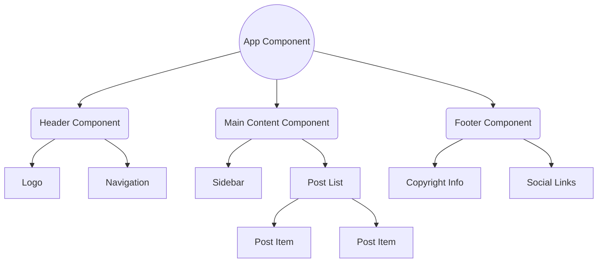

# 3-Qadam: React Komponentlari (Components) - UI'ni bo'laklarga ajratish

React'ning eng asosiy ustunlaridan biri bu **Komponentlar (Components)** hisoblanadi. Agar siz komponentlarni tushunmasangiz, React'ni tushunmaysiz. Ushbu darsda biz komponentlar nima ekanligi, ularning turlari va qanday qilib to'g'ri arxitektura qurish kerakligini chuqur o'rganamiz.

## 1. UI Modulligi Falsafasi (Lego bloklari analogiyasi)

Tasavvur qiling, sizga juda katta va murakkab kosmik kema qurish vazifasi berildi. Agar siz uni butunlay bitta qolipdan quyib yasamog'chi bo'lsangiz, bitta xato butun kemani yaroqsiz holga keltirishi mumkin. Lekin, agar siz uni kichik, alohida qismlardan (dvigatel, qanotlar, kabina) yig'sangiz, xato chiqqan qismni osongina almashtirishingiz mumkin.

**React komponentlari - bu dasturlash olamidagi Lego bloklaridir.**
Biz butun bir veb-saytni bitta ulkan kod qismi sifatida yozmaymiz. Buning o'rniga, har bir tugma (button), har bir forma (form), har bir rasm (image) uchun alohida kichik "Lego bloklarini" yaratamiz.

### Nega bu kerak? (Why do we need this?)
1. **Qayta foydalanish (Reusability):** Siz bitta chiroyli tugma (button) yaratasiz va uni saytning 10 xil joyida hech qanday kodni nusxalamasdan ishlata olasiz.
2. **Qulay xato izlash (Easier Debugging):** Agar "Savatga qo'shish" tugmasi ishlamasa, siz butun sayt kodini emas, faqat `AddToCartButton` komponentini tekshirasiz.
3. **Jamoada ishlash (Teamwork):** Bitta dasturchi `Header` (yuqori qism) ustida ishlasa, boshqasi `Footer` (pastki qism) ustida bemalol, bir-biriga xalaqit bermasdan ishlashi mumkin.

---

## 2. Mermaid Komponentlar Daraxti Diagrammasi

React ilovasi doimo bitta asosiy (Root) komponentdan boshlanadi, odatda bu `App` deb ataladi. Uning ichida boshqa komponentlar shoxlanib ketadi.



*Bu daraxt tuzilmasiga e'tibor bering: Ma'lumotlar doimo yuqoridan pastga (App'dan pastdagi komponentlarga) oqadi.*

---

## 3. Class va Functional Komponentlar (Tarix va Nega Functional'ga o'tdik?)

React tarixida komponentlarni yaratishning ikki xil usuli mavjud bo'lgan: **Class Components** va **Functional Components**.

### Class Components (Eski maktab)
Dastlabki yillarda (React 16.8 gacha) komponentda qandaydir holat (state) saqlash yoki "hayot tsikli" (lifecycle) usullaridan foydalanish uchun albatta JS Class'laridan foydalanish kerak edi.

👎 **Yomon (Eskirgan) amaliyot - Class Component:**
```jsx
import React, { Component } from 'react';

class OltinSoat extends Component {
  constructor(props) {
    super(props);
    this.state = { vaqt: new Date() };
  }

  componentDidMount() {
    this.timerID = setInterval(() => this.tick(), 1000);
  }

  componentWillUnmount() {
    clearInterval(this.timerID);
  }

  tick() {
    this.setState({ vaqt: new Date() });
  }

  render() {
    return <h1>Hozirgi vaqt: {this.state.vaqt.toLocaleTimeString()}</h1>;
  }
}
```
*Muammo nima edi?* 
Class komponentlar juda ko'p "boilerplate" (keraksiz, qayta-qayta yoziladigan) kod talab qilardi. `this` kalit so'zi atrofida chalkashliklar ko'p edi. Kodni o'qish va tushunish murakkab edi.

### Functional Components + Hooks (Yangi standart)
React 16.8 da **Hooks** (Ilmoqlar) kiritilgach, biz oddiy JavaScript funktsiyalari yordamida ham Class komponentlar qila oladigan barcha ishlarni (state, lifecycle) qila oladigan bo'ldik.

👍 **Zo'r (Zamonaviy) amaliyot - Functional Component:**
```jsx
import React, { useState, useEffect } from 'react';

const OltinSoat = () => {
  const [vaqt, setVaqt] = useState(new Date());

  useEffect(() => {
    const timerID = setInterval(() => setVaqt(new Date()), 1000);
    return () => clearInterval(timerID); // Tozalash
  }, []);

  return <h1>Hozirgi vaqt: {vaqt.toLocaleTimeString()}</h1>;
};

export default OltinSoat;
```
### Nega biz Functional Komponentlarga o'tdik?
1. **Soddalik:** Kod sezilarli darajada qisqardi va o'qish osonlashdi. `this` bilan bog'liq muammolar yo'qoldi.
2. **Kodni qayta ishlatish (Custom Hooks):** Mantiqni (logic) boshqa komponentlar bilan bo'lishish Hooks yordamida juda osonlashdi.
3. **Ishlash tezligi (Performance):** Funktsiyalar sinflarga (classes) qaraganda biroz yengilroq ishlaydi va React kelajakda ularni optimallashtirishi osonroq.

---

## 4. Dumb (Aqlsiz) vs Smart (Aqlli) Komponentlar Arxitekturasi

React'da katta ilovalar qurishda kodingizni toza saqlash uchun "Presentational vs Container" (yoki Dumb vs Smart) komponentlar arxitekturasidan foydalaniladi.

### Smart (Container / Aqlli) Komponentlar
Bu komponentlar ilovaning "miyasi" hisoblanadi. Ular qanday ishlashini bilishadi.
- Ma'lumotlarni serverdan olib keladi (API calls).
- Holatni (state) boshqaradi.
- Mantiqni va funksiyalarni o'zida saqlaydi.
- Tashqi ko'rinishga (CSS) unchalik ahamiyat bermaydi.

### Dumb (Presentational / Aqlsiz) Komponentlar
Bu komponentlar ilovaning "yuzi" hisoblanadi. Ular faqatgina o'ziga berilgan ma'lumotni ekranga chiroyli qilib chiqarishni biladi.
- Hech qanday murakkab mantiq (state, API fetch) bo'lmaydi.
- Ma'lumotlarni faqat **props** orqali oladi.
- Qayta foydalanish uchun juda mos keladi.

#### Do's and Don'ts (Yaxshi va yomon yondashuvlar)

👎 **Yomon: Hamma narsani bitta joyga tiqish (Spaghetti code)**
```jsx
// Bitta komponent ham API chaqiradi, ham dizaynni chizadi
const UserProfile = () => {
  const [user, setUser] = useState(null);

  useEffect(() => {
    fetch('/api/user/1').then(res => res.json()).then(setUser);
  }, []);

  if (!user) return <p>Yuklanmoqda...</p>;

  // Dizayn ham shu yerda! Qayta ishlata olmaymiz.
  return (
    <div className="card shadow-lg p-4 rounded-xl">
      
      <h2 className="text-xl font-bold">{user.name}</h2>
      <button className="bg-blue-500 text-white px-4 py-2">Follow</button>
    </div>
  );
};
```

👍 **Yaxshi: Smart va Dumb ga ajratish**

**1. Dumb Component (Aqlsiz, faqat ko'rinish):**
```jsx
// UserCard.jsx - Faqat Props oladi va chizadi. Boshqa joyda ham ishlatsak bo'ladi!
export const UserCard = ({ name, avatar, onFollow }) => {
  return (
    <div className="card shadow-lg p-4 rounded-xl">
      
      <h2 className="text-xl font-bold">{name}</h2>
      <button onClick={onFollow} className="bg-blue-500 text-white px-4 py-2">
        Follow
      </button>
    </div>
  );
};
```

**2. Smart Component (Aqlli, mantiq):**
```jsx
// UserProfileContainer.jsx - Mantiqni hal qiladi, ma'lumot olib keladi.
import { UserCard } from './UserCard';

const UserProfileContainer = () => {
  const [user, setUser] = useState(null);

  useEffect(() => {
    fetch('/api/user/1').then(res => res.json()).then(setUser);
  }, []);

  const handleFollow = () => {
    console.log("Foydalanuvchiga obuna bo'lindi: ", user.name);
    // API ga jo'natish mantiqi...
  };

  if (!user) return <p>Yuklanmoqda...</p>;

  return <UserCard name={user.name} avatar={user.avatar} onFollow={handleFollow} />;
};
```

---

## 5. Export va Import Qoidalari (Modullarni ulash)

Komponentlarni alohida fayllarga ajratganimizdan so'ng, ularni bir-biriga ulashimiz kerak. JavaScript'da (va React'da) buni **ES6 Modules** (`import` va `export`) yordamida qilamiz. Asosan ikki xil export usuli bor: **Default** va **Named**.

### Default Export (Asosiy eksport)
Har bir faylda faqat **bitta** default eksport bo'lishi mumkin. Odatda bitta faylda bitta katta komponent yozilsa, shundan foydalaniladi.

```jsx
// tugma.jsx fayli
const Button = () => {
  return <button>Meni bos</button>;
};

export default Button; 
```

**Qanday import qilinadi?**
Nomini xohlagancha o'zgartirib chaqirib olishingiz mumkin (chunki u faylning yagona asosiy eksporti).
```jsx
import MeningTugmam from './tugma'; // Hech qanday jingalak qavslarsiz!
```

### Named Export (Nomlangan eksport)
Bitta fayldan bir nechta o'zgaruvchi, funksiya yoki komponentlarni eksport qilish uchun ishlatiladi.

```jsx
// utils.jsx fayli
export const qoShish = (a, b) => a + b;
export const ayirish = (a, b) => a - b;
export const PI = 3.14;
```

**Qanday import qilinadi?**
Aynan o'sha nom bilan, **jingalak qavslar `{}`** ichida import qilinishi **shart**.
```jsx
import { qoShish, PI } from './utils';
```

### Qaysi birini qachon ishlatamiz?
- **Komponentlar uchun:** Ko'pchilik dasturchilar har bir komponentni alohida faylda yaratib, **Default Export** qilishni ma'qul ko'rishadi (masalan: `Header.jsx` dan default export `Header`). Lekin so'nggi paytlarda katta jamoalarda nomlar chalkashib ketmasligi uchun **Named Export** (faqat jingalak qavs bilan olinadigan) usuli ham juda mashhur bo'lib bormoqda.
- **Yordamchi funksiyalar (utils, constants):** Har doim **Named Export** ishlating.

> **💡 Oltin Maslahat:** Ilovangizda standart yarating! Yoki hamma komponentlar uchun "Default export" ishlating, yoki hammaga "Named export". Ikkalasini aralashtirib yuborish jamoa a'zolarini chalg'itishi mumkin.

---
## Xulosa
React'ning qudrati uning komponentli yondashuvidadir. Katta muammolarni (katta veb-saytlarni) mayda, boshqarish oson bo'lgan bo'laklarga (komponentlarga) ajratish orqali biz toza, qayta ishlatiladigan va xatosiz kod yozishga erishamiz. Keyingi darsda ushbu Lego bloklarini bir-biriga qanday qilib "Props" orqali bog'lashni o'rganamiz!
