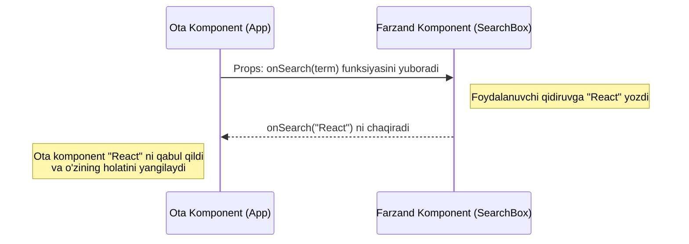

# 4-Qadam: React Props - Komponentlar o'rtasidagi aloqa vositasi

## Props o'zi nima?

Tasavvur qiling, siz inson tanasini yaratmoqchisiz. Har bir insonning o'ziga xos xususiyatlari bor: ko'zining rangi, bo'yi, sochining shakli. Bu xususiyatlar insonga qayerdan keladi? Albatta, ota-onasidan gen (DNK) orqali o'tadi. React-da ham xuddi shunday!

**Props** (inglizcha *properties* - xususiyatlar so'zining qisqartmasi) - bu ota komponentdan farzand komponentga ma'lumot uzatish usuli. Ular xuddi ota-onadan farzandga o'tadigan DNKga o'xshaydi: farzand uni qabul qiladi va shunga mos shakllanadi, lekin farzand o'z DNK-sini o'zi o'zgartira olmaydi.

### Nega bizga Props kerak?
Agar bizda props bo'lmaganida, har bir komponent faqat bitta xil narsani ko'rsata olar edi (statik bo'lardi). Props yordamida biz **bitta komponentni yaratib, unga turlicha ma'lumotlar berib, ko'p marotaba ishlata olamiz** (Reusability).

```jsx
// ❌ YOMON AMALIYOT (Don'ts): Har bir foydalanuvchi uchun alohida komponent yaratish
function UserAli() {
  return <h1>Salom, Ali! Sen 20 yoshdasan.</h1>;
}

function UserVali() {
  return <h1>Salom, Vali! Sen 25 yoshdasan.</h1>;
}

// ✅ YAXSHI AMALIYOT (Do's): Bitta komponent yaratib, unga Props berish
function UserProfile(props) {
  return <h1>Salom, {props.name}! Sen {props.age} yoshdasan.</h1>;
}

// Ota komponentda ishlatilishi:
function App() {
  return (
    <div>
      <UserProfile name="Ali" age={20} />
      <UserProfile name="Vali" age={25} />
    </div>
  );
}
```

> [!WARNING]
> **Props o'zgarmasdir (Read-only / Immutable)!**
> Farzand komponent hech qachon o'ziga kelgan props'ni o'zgartirmasligi kerak. Ular faqat o'qish uchun mo'ljallangan.

## Bir yo'nalishli ma'lumotlar oqimi (Unidirectional Data Flow)

React-da ma'lumotlar har doim **tepadan pastga** (ota komponentdan farzand komponentga) qarab harakatlanadi. Bunga "Unidirectional Data Flow" yoki bir yo'nalishli oqim deyiladi. Ma'lumot hech qachon o'z-o'zidan pastdan tepaga qarab oqmaydi.

### Nega bu muhim?
Ilovaning holati (state) va ma'lumotlari qayerdan kelayotganini kuzatish juda oson bo'ladi. Agar qandaydir ma'lumot xato chiqayotgan bo'lsa, siz uni faqat tepadagi ota komponentlardan izlaysiz, bu esa xatolarni (bug) topishni va arxitekturani tushunishni juda osonlashtiradi.

```mermaid
graph TD
    A[Ota Komponent <br> App] -->|props: {users}| B(Farzand Komponent <br> UserList)
    A -->|props: {theme}| C(Farzand Komponent <br> Header)
    B -->|props: {name, age}| D(Nabira Komponent <br> UserCard 1)
    B -->|props: {name, age}| E(Nabira Komponent <br> UserCard 2)
    
    style A fill:#4CAF50,stroke:#388E3C,stroke-width:2px,color:white
    style B fill:#2196F3,stroke:#1976D2,stroke-width:2px,color:white
    style C fill:#2196F3,stroke:#1976D2,stroke-width:2px,color:white
    style D fill:#FF9800,stroke:#F57C00,stroke-width:2px,color:white
    style E fill:#FF9800,stroke:#F57C00,stroke-width:2px,color:white
```

## Props'dan Ilg'or Foydalanish (Advanced Prop Usage)

### 1. Destructuring (Qismlarga ajratish)
Odatda biz `props` obyekti ichidan qiymatlarni olish uchun `props.name`, `props.age` deb yozamiz. Lekin bu kodni biroz uzun qilib yuboradi. ES6 ning "Destructuring" xususiyati yordamida biz props'ni bevosita parametrlar qismidayoq ajratib olishimiz mumkin.

**Nega kerak?** Kodni toza, qisqa va o'qishga qulay qilish uchun. Bir qarashda komponent qanday xususiyatlarni qabul qilishini ko'rish mumkin.

```jsx
// ❌ YOMON AMALIYOT (Eski usul)
function ProductCard(props) {
  return (
    <div>
      <h2>{props.title}</h2>
      <p>Narxi: {props.price}$</p>
      <button disabled={!props.inStock}>Sotib olish</button>
    </div>
  );
}

// ✅ YAXSHI AMALIYOT (Destructuring bilan)
function ProductCard({ title, price, inStock }) {
  return (
    <div>
      <h2>{title}</h2>
      <p>Narxi: {price}$</p>
      <button disabled={!inStock}>Sotib olish</button>
    </div>
  );
}
```

### 2. Default Props (Standart xususiyatlar)
Ba'zan ota komponent ma'lum bir prop'ni berishni unutilishi mumkin yoki o'sha ma'lumot vaqtincha mavjud bo'lmasligi mumkin. Shunday paytlarda komponent "sinib qolmasligi" uchun biz standart qiymatlarni (Default Props) belgilashimiz mumkin.

**Nega kerak?** Ilova ishonchliligini oshirish va "undefined" yoki xatoliklarning oldini olish uchun.

```jsx
// Destructuring vaqtida standart qiymat berish (Eng zamonaviy va tavsiya etilgan usul)
function Avatar({ imageUrl = "https://default-image.com/user.png", size = "medium" }) {
  const imageSize = size === "large" ? "100px" : "50px";
  
  return ;
}

// Agar ota komponent hech narsa bermasa ham, xato chiqmaydi:
// <Avatar />  => imageUrl va size o'zining standart qiymatini oladi.
```

### 3. PropTypes (Tiplarni tekshirish)
Katta loyihalarda komponentga noto'g'ri ma'lumot tipi (masalan, string o'rniga number) yuborilishi xavfi mavjud. Buning oldini olish uchun React-da `prop-types` kutubxonasidan foydalaniladi. Garchi bugungi kunda TypeScript bu vazifani a'lo darajada bajarsa ham, oddiy JavaScript loyihalarida PropTypes bilish juda muhim.

**Nega kerak?** Dasturchi xatolarini erta aniqlash va qat'iy ma'lumotlar tipini ta'minlash uchun.

```jsx
import PropTypes from 'prop-types';

function Button({ text, color, onClick }) {
  return <button style={{ backgroundColor: color }} onClick={onClick}>{text}</button>;
}

// Qanday turdagi props kelishi kerakligini qat'iy belgilaymiz
Button.propTypes = {
  text: PropTypes.string.isRequired,    // isRequired - albatta berilishi shart
  color: PropTypes.string,              // ixtiyoriy
  onClick: PropTypes.func               // funksiya bo'lishi kerak
};
```

## Funksiyalarni Props orqali uzatish (Callback Props)

Yuqorida aytganimizdek, ma'lumot faqat tepadan pastga qarab oqadi. Xo'sh, farzand komponent ota komponentdagi qandaydir ma'lumotni o'zgartirishi yoki unga xabar berishi kerak bo'lsa-chi?

Buning yechimi oddiy: Ota komponent farzandga ma'lumot emas, balki **bajarilishi kerak bo'lgan funksiya (callback)** yuboradi. Farzand kerakli vaqtda (masalan, tugma bosilganda) o'sha funksiyani chaqiradi va unga kerakli ma'lumotni argument sifatida berib yuboradi. Shu tariqa biz pastdan tepaga ma'lumot yuborgandek bo'lamiz!

**Nega kerak?** Farzand komponentlarda yuz bergan hodisalarga (bosish, yozish) ota komponent javob qaytara olishi uchun.



### Kod namunasi:

```jsx
// Ota komponent
function Dashboard() {
  // Callback funksiya
  const handleDelete = (itemId) => {
    console.log(`O'chirilayotgan element ID: ${itemId}`);
    // Bu yerda API ga so'rov yuborib elementni o'chirish mumkin
  };

  return (
    <div>
      <h1>Boshqaruv paneli</h1>
      {/* Funksiyani prop orqali uzatish */}
      <ItemCard id={1} title="Maqola 1" onDelete={handleDelete} />
    </div>
  );
}

// Farzand komponent
function ItemCard({ id, title, onDelete }) {
  return (
    <div className="card">
      <h3>{title}</h3>
      {/* Tugma bosilganda otadan kelgan funksiya ishga tushadi */}
      <button onClick={() => onDelete(id)}>
        O'chirish
      </button>
    </div>
  );
}
```

> [!TIP]
> E'tibor bering, `ItemCard` o'zini o'zi o'chirmaydi. U shunchaki otasiga "Meni o'chirish knopkamni bosishdi, bu mening ID raqamim" deb xabar beradi. Asosiy ishni Ota komponent hal qiladi.

## Props bilan ishlashda eng ko'p yo'l qo'yiladigan xatolar (Common Mistakes)

### 1. Props-ni to'g'ridan-to'g'ri o'zgartirishga urinish (Mutating Props)
Props bu o'qish uchun mo'ljallangan (read-only). Hech qachon farzand komponent ichida prop-ga qiymat biriktirmang!

```jsx
// ❌ QILMANG: React bu yerda qattiq xato tashlaydi!
function UserPanel(props) {
  props.name = "Yangi ism"; // XATO! Props o'zgarmasdir!
  return <div>{props.name}</div>;
}
```
Agar props asosida qandaydir o'zgarish qilmoqchi bo'lsangiz, uni state (holat) yoki yangi o'zgaruvchiga oling.

### 2. Oddiy HTML atributlari va Props'ni chalkashtirish
Ba'zi HTML atributlari React'da boshqacha nomlanadi, buni eslab qolish muhim:
- `class` o'rniga `className`
- `for` o'rniga `htmlFor`
- Hodisalar camelCase usulida yoziladi: `onclick` o'rniga `onClick`, `onchange` o'rniga `onChange`.

```jsx
// ❌ QILMANG
function Box(props) {
  return <div class="box-style" onclick={props.clickEvent}>{props.text}</div>
}

// ✅ QILING
function Box({ customClass, onClickEvent, text }) {
  return <div className={`box-style ${customClass}`} onClick={onClickEvent}>{text}</div>
}
```

### 3. Ortiqcha props yuborish (Prop Drilling)
Tasavvur qiling, ota komponentda ma'lumot bor. Lekin u ma'lumot eng chuqurdagi 5-darajali farzand komponentga kerak. O'rtadagi 4 ta komponent bu ma'lumotdan foydalanmasa ham, uni pastga uzatish uchun o'zidan o'tkazishi kerak. Bu **Prop Drilling** deyiladi.

Bu noto'g'ri amaliyot hisoblanadi, chunki o'rtadagi komponentlar o'ziga kerak bo'lmagan ma'lumotni tashib yuradi. Buning yechimi sifatida kelajakda **Context API** yoki **Redux/Zustand** kabi state menejerlarini o'rganamiz. Hozircha esa komponentlarni iloji boricha ixcham saqlashga harakat qiling.

---
**Xulosa:** Props - bu React komponentlari o'rtasida ma'lumot tashuvchi ko'prik. U tepadan pastga (Unidirectional) harakatlanadi, doim o'zgarmas (immutable) bo'ladi va ilovangizni bo'laklarga (reusable components) bo'lib ishlashga imkon beradi. Ularni to'g'ri tushunish, React-dagi ilk katta g'alabangizdir!
