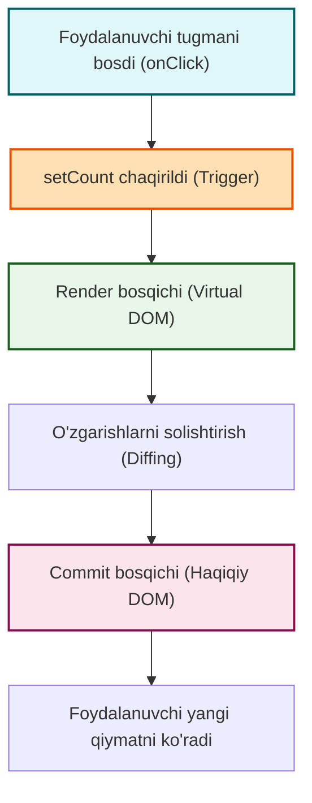

# 5-Qadam: React State (Holat) – Komponentning Xotirasi

React'ning eng kuchli xususiyatlaridan biri bu uning interaktivligidir. Ekranda tugma bosilganda sonning oshishi, qidiruv maydoniga matn kiritganda natijalarning filtrlanishi yoki "Dark Mode" yoqilishi — bularning barchasi **State** (Holat) orqali boshqariladi.

## 1. State o'zi nima?

**Analogiyni tasavvur qiling:** Komponentni bir inson deb hisoblasak, **State** uning *xotirasi* yoki *kayfiyati* hisoblanadi. 
Sizning qorningiz ochsa (ichki holatingiz o'zgarsa), sizning yuz ifodangiz va xulq-atvoringiz ham shunga mos ravishda o'zgaradi. React komponenti ham xuddi shunday ishlaydi: uning ichki `state`i (holati) o'zgarsa, u foydalanuvchiga ko'rinadigan qismini (UI) avtomatik ravishda yangilaydi.

Props – bu ota-onadan o'tadigan o'zgarmas genlar bo'lsa, State – bu komponentning o'z hayoti davomida o'zgarib turadigan ichki holatidir.

**Nega kerak?** Komponentlar foydalanuvchi bilan o'zaro aloqada bo'lganda nimalar bo'layotganini eslab qolishi kerak. Masalan, savatdagi (cart) mahsulotlar soni, kiritilgan parol yoki hozirgi vaqtni eslab qolish uchun bizga State kerak bo'ladi.

## 2. Nega oddiy o'zgaruvchilardan foydalana olmaymiz?

Ajam (boshlang'ich) dasturchilar ko'pincha "Nega oddiy JavaScript o'zgaruvchisi o'rniga `useState` degan murakkab narsani ishlatishim kerak?" deb o'ylashadi. 

Keling, oddiy o'zgaruvchi yordamida hisoblagich (counter) yasashga urinib ko'ramiz:

```jsx
// ❌ YOMON AMALIYOT (DON'T)
function BadCounter() {
  let count = 0; // Oddiy o'zgaruvchi

  function handleClick() {
    count = count + 1;
    console.log(count); // Konsolda son oshadi, lekin ekranda EMAS!
  }

  return (
    <div>
      <h1>Sanoq: {count}</h1>
      <button onClick={handleClick}>Qo'shish</button>
    </div>
  );
}
```

Nega bu ishlamaydi? Ikkita asosiy sabab bor:
1. **Oddiy o'zgaruvchilar o'zgarganda React buni sezmaydi.** React ekranni qayta chizishi (re-render) uchun unga maxsus signal kerak.
2. **Qayta render bo'lganda oddiy o'zgaruvchilar yo'qoladi.** Agar React qandaydir sabab bilan komponentni qayta chizsa, `let count = 0` qatori yana ishga tushadi va hamma narsa noldan boshlanadi.

Endi buni React'ning `useState` yordamida to'g'rilaymiz:

```jsx
// ✅ TO'G'RI AMALIYOT (DO)
import { useState } from 'react';

function GoodCounter() {
  // count - joriy holat, setCount - uni o'zgartiruvchi funksiya
  const [count, setCount] = useState(0); 

  function handleClick() {
    setCount(count + 1); // React'ga "state o'zgardi, ekranni yangila!" deymiz
  }

  return (
    <div>
      <h1>Sanoq: {count}</h1>
      <button onClick={handleClick}>Qo'shish</button>
    </div>
  );
}
```

`useState` React'ga ikkita narsani ta'minlaydi:
1. Renderlar oralig'ida ma'lumotni **saqlab qoladi** (xotira).
2. Qiymat o'zgarganda ekranni yangilash uchun React'ni **uyg'otadi** (trigger).

---

## 3. State yangilanish sikli (Trigger -> Render -> Commit)

State o'zgarganda React qanday ishlaydi? Bu jarayon uch bosqichdan iborat:

1. **Triggering (Uyg'otish):** Siz `setCount` ni chaqirganingizda, React'ga komponentni qayta chizish kerakligini aytasiz.
2. **Rendering (Chizish):** React komponent funksiyasini *yangi* state qiymati bilan qaytadan ishga tushiradi va ekranda nima o'zgarishi kerakligini hisoblaydi.
3. **Committing (Joriy qilish):** React o'zgarishlarni olib, haqiqiy DOM'ga (brauzer ekraniga) kiritadi.

Quyidagi vizual diagramma orqali buni tushunish osonroq:



---

## 4. `setState`'ning asinxron tabiati (Asynchronous updates)

React'da state'ni o'zgartirganingizda, o'zgarish **darhol** sodir bo'lmaydi. React o'zgarishlarni yig'ib (batching), barchasini birdaniga bajaradi.

**Nega bunday?** Tasavvur qiling, restoranda ofitsiantga buyurtma beryapsiz. Ofitsiant har bir so'zingizdan keyin oshxonaga chopmaydi, balki to'liq buyurtmangizni yozib olib, keyin bitta borishda oshxonaga uzatadi. React ham xuddi shunday ishlaydi — bu **performanceni (ishlash tezligini)** oshiradi.

```jsx
// ❌ YOMON TUSHUNCHA
function AsynchronousProblem() {
  const [count, setCount] = useState(0);

  function handleClick() {
    setCount(count + 1);
    console.log(count); // Bu yerda count HALI HAM 0 bo'ladi!
  }
}
```

Bu kodda `console.log(count)` eski qiymatni chiqaradi, chunki `setCount` React'dan shunchaki kelajakda (keyingi renderda) o'zgartirishni so'raydi xolos.

---

## 5. Funksional State yangilash (Functional State Updates)

Siz bir vaqtning o'zida bir nechta state yangilanishini qilmoqchi bo'lsangiz nima bo'ladi?

```jsx
// ❌ KUTILMAGAN NATIJA
function WrongMultipleUpdates() {
  const [count, setCount] = useState(0);

  function handleClick() {
    setCount(count + 1); // React: "Tushundim, count ni 0 + 1 = 1 qilaman"
    setCount(count + 1); // React: "Tushundim, count ni 0 + 1 = 1 qilaman"
    setCount(count + 1); // React: "Tushundim, count ni 0 + 1 = 1 qilaman"
  }
  // Natijada tugma bir marta bosilganda count 3 ga emas, faqat 1 ga oshadi!
}
```

Yuqoridagi misolda `count` ning qiymati o'sha paytdagi render uchun *qotib qolgan* (`0`). Shu sababli uchala `setCount` ham faqat `0 + 1` buyrug'ini beryapti.

**Yechim:** State'ni avvalgi qiymatiga asoslanib yangilash uchun har doim **callback funksiya** (updater function) ishlatishingiz kerak:

```jsx
// ✅ TO'G'RI YONDASHUV
function CorrectMultipleUpdates() {
  const [count, setCount] = useState(0);

  function handleClick() {
    setCount(prevCount => prevCount + 1); // prevCount: 0 => 1
    setCount(prevCount => prevCount + 1); // prevCount: 1 => 2
    setCount(prevCount => prevCount + 1); // prevCount: 2 => 3
  }
  // Endi tugma bosilganda count 3 ga oshadi!
}
```

Qoida: Agar yangi state qiymati **oldingi state qiymatiga qaram bo'lsa**, doimo `setCount(prev => prev + yangiQiymat)` sintaksisidan foydalaning.

---

## 6. Obyektlar va Massivlarni State'da yangilash

JavaScript'da string, number yoki boolean (primitivlar) o'zgarmas (immutable). Lekin Object va Array'lar o'zgaruvchan (mutable). React'da **HECH QACHON** state obyektlarini to'g'ridan-to'g'ri mutatsiya qilmang!

```jsx
// ❌ YOMON AMALIYOT (Mutatsiya)
const [user, setUser] = useState({ name: 'Ali', age: 20 });

function badUpdate() {
  user.age = 21; // XATO! State'ni to'g'ridan-to'g'ri o'zgartirish!
  setUser(user); // React o'zgarishni sezmaydi, chunki obyekt reference'i o'zgarmadi
}
```

Buning o'rniga doimo **Spread Operator (`...`)** yordamida yangi obyekt yoki massiv yarating:

```jsx
// ✅ TO'G'RI AMALIYOT (Immutability)
function goodUpdate() {
  setUser({
    ...user, // eski obyekt xossalarini nusxalaymiz
    age: 21  // o'zgarishi kerak bo'lgan qismini ustidan yozamiz
  });
}
```

Xuddi shunday massivlar uchun:
- Qo'shish: `[...items, newItem]`
- O'chirish: `items.filter(item => item.id !== id)`
- Yangilash: `items.map(item => item.id === id ? updatedItem : item)`

---

## 7. Eng yaxshi amaliyotlar va xatolar (Best practices and common pitfalls)

> [!TIP]
> **Keraksiz state'lardan qoching (Derived State).** 
> Agar biror ma'lumotni boshqa state yoki prop'dan hisoblab topish mumkin bo'lsa, uni alohida state qilib saqlamang.
> Masalan: `firstName` va `lastName` state'lari bo'lsa, `fullName` uchun uchinchi state yaratmang. Shunchaki `const fullName = firstName + ' ' + lastName;` deb hisoblang.

> [!WARNING]
> **State'ni render qismida yangilamang!**
> Agar komponent ichida to'g'ridan-to'g'ri `setCount(count + 1)` chaqirsangiz, u cheksiz siklga (infinite loop) tushib qoladi. (React render qiladi -> state yangilanadi -> yana render qiladi -> ...). State doim Event Handlerlar (masalan onClick) yoki Effectlar (`useEffect`) ichida yangilanishi kerak.

> [!IMPORTANT]
> **State qayerda turishi kerak?**
> Agar ikkita komponent bitta ma'lumotga ehtiyoj sezsa, state'ni ularning ota (parent) komponentiga olib chiqing (Lifting state up). Bu haqda keyingi darslarda batafsil gaplashamiz.
