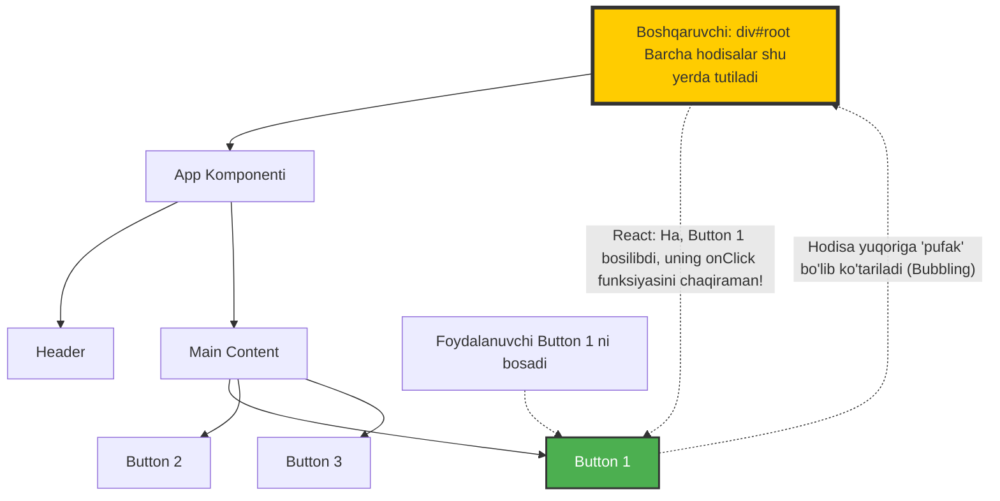

# 6-Dars: React-da Hodisalar (Events) bilan Ishlash (Event Handling)

Assalomu alaykum! React olamiga sayohatimizning navbatdagi muhim bekatiga yetib keldik. Bugun biz foydalanuvchilar bilan interaktivlikni ta'minlovchi asosiy mexanizm – **Hodisalar (Events)** haqida chuqur gaplashamiz.

Tasavvur qiling, siz restorandasiz. Ofitsiantga qo'lingizni ko'tarib ishora qilsangiz (bu hodisa - event), u sizning oldingizga keladi va xizmatingizni bajaradi (bu hodisani boshqaruvchi - event handler). Xuddi shunday, web-sahifada foydalanuvchi tugmani bosganda, formani to'ldirganda yoki sichqonchani harakatlantirganda bizning dasturimiz bunga reaksiya bildirishi kerak.

---

## 1. React vs Vanilla JS: Hodisalarni Boshqarishdagi Farqlar

React-da hodisalarni boshqarish odatiy (Vanilla) JavaScript-ga juda o'xshaydi, lekin ba'zi muhim sintaktik va arxitektura farqlari mavjud.

### Asosiy farqlar:
1. **Nomlanishi:** Vanilla JS'da hodisalar kichik harflar bilan yoziladi (masalan, `onclick`), React'da esa **camelCase** formatida yoziladi (masalan, `onClick`).
2. **Funksiya uzatish:** Vanilla JS'da hodisaga funksiya nomini qator (string) ko'rinishida berasiz. React'da esa haqiqiy funksiyaning o'zini (yoki referensini) uzatasiz.

#### ❌ Yomon amaliyot (Vanilla JS uslubi - React'da ishlamaydi):
```html
<!-- Vanilla HTML/JS -->
<button onclick="handleClick()">Bosing</button>
```

#### ✅ Yaxshi amaliyot (React uslubi):
```jsx
// React
<button onClick={handleClick}>Bosing</button>
```

> **Diqqat!** `handleClick()` qavslar bilan yozilmayapti! Agar qavslar bilan yozsangiz, komponent chizilayotganda (render) funksiya avtomatik ishlab ketadi. Biz esa u faqat bosilganda ishlashini xohlaymiz.

---

## 2. Sintetik Hodisalar (Synthetic Events) nima?

React-da `onClick` yoki `onChange` ishlaganingizda, sizga beriladigan `event` (yoki `e`) obyekti oddiy brauzer hodisasi emas. Bu **SyntheticEvent** deb ataluvchi maxsus React obyektidir.

### Nega kerak? (Why do we need this?)
Turli brauzerlar (Chrome, Safari, Firefox, Eski IE) hodisalarni turlicha ishlashi mumkin. React hamma brauzerlarda bir xil ishlaydigan yagona "ko'ylak" (wrapper) yaratgan. 
* **Brauzerlararo moslik (Cross-browser compatibility):** Sizning kodingiz barcha brauzerlarda bir xil ishlaydi. React ichki farqlarni o'zi hal qiladi. Siz "Firefox-da boshqacha yozishim kerakmikin" deb o'ylamaysiz.
* **Ishlash tezligi (Performance):** React hodisa obyektlarini qayta ishlatadi (pooling), bu esa xotirani tejashga yordam beradi. Yangi va yangi obyektlar yuzaga kelib xotirani to'ldirib tashlamaydi.

Siz `e.preventDefault()` yoki `e.stopPropagation()` kabi odatiy metodlarni bemalol ishlataverasiz, React buni to'g'ri tushunadi.

---

## 3. Hodisalar Delegatsiyasi (Event Delegation) qanday ishlaydi?

React DOM-dagi har bir tugma yoki input uchun alohida `addEventListener` yaratmaydi. Bu xotira va ishlash tezligi uchun juda yomon bo'lar edi. O'rniga, React **Event Delegation (Hodisalar Delegatsiyasi)** usulidan foydalanadi.

Tasavvur qiling: Katta korxonada 1000 ta ishchi bor. Har bir ishchining oldiga bittadan qorovul qo'yish o'rniga, korxona darvozasiga bitta bosh qorovul qo'yiladi. Kim kirib-chiqayotganini shu bitta qorovul nazorat qiladi va kerakli ishchiga xabar beradi.

React 17-versiyadan boshlab barcha hodisalarni sizning ilovangiz joylashgan eng yuqori asosiy (root) elementga (masalan, `<div id="root">`) biriktiradi.

### Hodisalar Delegatsiyasi Qanday Ishlaydi?



Bu yondashuv minglab elementlari bor murakkab ilovalarning ham juda tez ishlashini va kompyuter xotirasini isrof qilmasligini ta'minlaydi.

---

## 4. Hodisa funksiyalariga argument (parametr) o'tkazish

Ko'pincha biz qaysi element bosilganini bilish uchun funksiyaga qandaydir ma'lumot (ID yoki ism) yuborishimiz kerak bo'ladi. Masalan, mahsulotlar ro'yxatidan qaysi mahsulot o'chirilishi kerakligini qanday bilamiz?

Bu yerda yangi o'rganuvchilar juda ko'p xato qilishadi.

#### ❌ Yomon amaliyot (Don'ts):
```jsx
function App() {
  const deleteItem = (id) => {
    console.log(id + " o'chirildi!");
  }

  return (
    // XATO: Funksiya to'g'ridan-to'g'ri chaqirilib ketdi! Sahifa yuklanishi bilan ishlaydi.
    <button onClick={deleteItem(1)}>O'chirish</button>
  );
}
```

#### ✅ Yaxshi amaliyot (Do's) - Anonim funksiya (Arrow function) orqali:
Biz tugma bosilgandagina ishga tushadigan "vositachi" (wrapper) funksiya yaratishimiz kerak.

```jsx
function App() {
  const deleteItem = (id) => {
    console.log(id + " o'chirildi!");
  }

  return (
    // TO'G'RI: Tugma bosilganda oldin anonim funksiya ishlaydi, keyin u deleteItem'ni chaqiradi.
    <button onClick={() => deleteItem(1)}>O'chirish</button>
  );
}
```

#### ✅ Yaxshi amaliyot (Do's) - Hodisa obyekti (`e`) bilan birga argument o'tkazish:
Agar sizga ham React hodisa obyekti (`e`), ham o'zingizning argumentingiz kerak bo'lsa:

```jsx
function App() {
  const deleteItem = (e, id) => {
    console.log("Hodisa turi:", e.type); // "click"
    console.log(id + " o'chirildi!");
  }

  return (
    // 'e' ni qabul qilib olamiz va funksiyamizga uzatamiz
    <button onClick={(e) => deleteItem(e, 42)}>O'chirish</button>
  );
}
```

---

## 5. Hodisalarni To'xtatish (e.stopPropagation va e.preventDefault)

### e.stopPropagation() - "Pufaklashishni" to'xtatish

Web-sahifada hodisalar suv ostidagi pufakchaga o'xshaydi. Agar siz bitta tugmani bossangiz, u tugma ichida joylashgan div, undan keyin uni o'rab turgan section, va hokazo – eng yuqoriga qarab "Men bosildim!" deb xabar berib boradi. Bunga **Event Bubbling (Hodisa Pufaklanishi)** deyiladi.

**Analgiya:** Siz xonangizda baqirdingiz. Ovozingiz oldin xonangizga, keyin uyingizga, keyin ko'chaga eshitiladi. Agar siz ovozingiz faqat xonangizda qolishini (boshqalar eshitmasligini) xohlasangiz, derazalarni yopishingiz kerak bo'ladi. Bu darsimizdagi `e.stopPropagation()` ga to'g'ri keladi.

```jsx
function Card() {
  const handleCardClick = () => {
    console.log("Karta bosildi!"); // Div bosilganda ishlaydi
  };

  const handleButtonClick = (e) => {
    e.stopPropagation(); // Hodisa yuqoriga ko'tarilishini shu yerda to'xtatadi!
    console.log("Tugma bosildi!");
  };

  return (
    <div onClick={handleCardClick} style={{ padding: 20, background: 'lightgray' }}>
      <h3>Mahsulot nomi</h3>
      {/* Agar stopPropagation bo'lmasa, bu tugmani bosganda Card ham bosildi deb hisoblanadi */}
      <button onClick={handleButtonClick}>Sotib olish</button>
    </div>
  );
}
```

### e.preventDefault() - Standart xulq-atvorni to'xtatish

Ba'zi HTML elementlari o'zining "tug'ma" odatlariga ega. 
Masalan:
* `<a>` (havola) bosilganda yangi sahifaga o'tib ketadi.
* `<form>` submit qilinganda (yuborilganda) butun sahifa yangilanadi (refresh bo'ladi).

React - bu Single Page Application (SPA). Biz sahifaning qayta yuklanishini xohlamaymiz! Biz bu elementlarning o'zining "standart" xulq-atvorini to'xtatishimiz kerak.

```jsx
function MyForm() {
  const handleSubmit = (e) => {
    // 🛑 MUHIM: Sahifa qayta yuklanishini oldini oladi!
    e.preventDefault(); 
    console.log("Forma yuborildi, lekin sahifa yangilanmadi!");
  };

  return (
    <form onSubmit={handleSubmit}>
      <input type="text" placeholder="Ismingiz" />
      <button type="submit">Yuborish</button>
    </form>
  );
}
```

### Nega kerak? (Why do we need this?)
Agar siz `e.preventDefault()` dan foydalanmasangiz, React-dagi state'laringiz (holatingiz) formani yuborganda sahifa yangilangani sababli butunlay o'chib ketadi (reset bo'ladi). Dasturiy mantiqni o'zingiz boshqarishingiz va holatni saqlab qolishingiz uchun brauzerning avtomatik qiliqlarini o'chirib qo'yishingiz shart.

---

## Xulosa

1. React hodisalari Vanilla JS ga o'xshaydi, lekin `camelCase` ishlatiladi va to'g'ridan-to'g'ri funksiyaning o'zi beriladi (String emas).
2. React barcha hodisalarni yagona **SyntheticEvent** bilan o'rab, barcha brauzerlarda bir xil va tez ishlashini ta'minlaydi.
3. **Event Delegation** tufayli minglab hodisalar root element darajasida tutib olinib boshqariladi, bu esa optimallikni beradi.
4. Funksiyaga parametr berish uchun u albatta anonim funksiya `() => myFunction(arg)` bilan o'ralgan bo'lishi shart, aks holda render jarayonidayoq ishlab ketadi.
5. `e.stopPropagation()` ota elementlarga hodisa o'tishini, `e.preventDefault()` esa brauzerning avtomatik sahifani yangilash kabi harakatlarini bloklaydi.

Ushbu qoidalarni tushunib olish sizga React-da har qanday murakkab interfeyslarni bexato va samarali yaratishga mustahkam zamin yaratadi!
