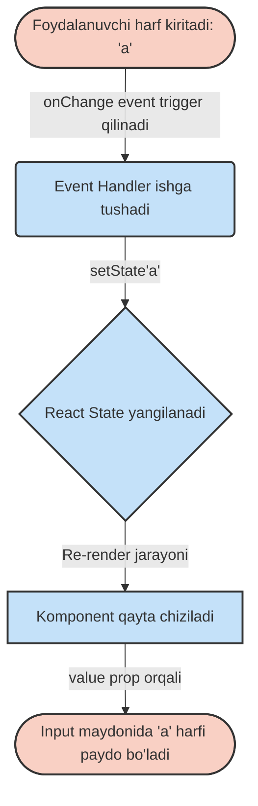

# React'da Formalar (Forms): Boshqariladigan va Boshqarilmaydigan Komponentlar

## 1. Kirish: React'da Formalar vs Oddiy (Native) Formalar

HTML'dagi oddiy formalar (`<form>`, `<input>`, `<select>`) o'zining ichki holatini (state) o'zi saqlaydi. Masalan, foydalanuvchi `<input>` ga nimadir yozsa, brauzer o'sha qiymatni o'z xotirasida saqlab turadi va forma yuborilmaguncha biz unga aralashmasligimiz mumkin.

Lekin React'da biz barcha ma'lumotlar oqimini o'z nazoratimizda ushlab turishni yaxshi ko'ramiz. React "One-way data flow" (Bir yo'nalishli ma'lumotlar oqimi) qoidasiga asoslanadi. Shu sababli, HTML formalarining o'zicha, shaxsiy holatiga ega bo'lib mustaqil ishlashi React falsafasiga unchalik to'g'ri kelmaydi.

**Hayotiy o'xshatish:**
Tasavvur qiling, oddiy HTML formasi bu – mustaqil ishlaydigan xodim. Siz unga blankalarni berasiz, u o'zi to'ldiradi va oxirida sizga tayyor hujjatni olib keladi (submit). Jarayon davomida u nima yozayotganini va qanday xatolar qilayotganini ko'rmaysiz. 
React formasi (Controlled Component) esa – xuddi sizning ko'z o'ngingizda yozayotgan yordamchi kabi. Har bir harfni yozganda, siz u harfni o'qiysiz, tekshirasiz, tasdiqlaysiz va ro'yxatga kiritasiz. Siz hamma narsani 100% nazorat qilasiz.

---

## 2. Controlled (Boshqariladigan) va Uncontrolled (Boshqarilmaydigan) Komponentlar

React'da formalarni boshqarishning ikkita asosiy yondashuvi bor:

### Uncontrolled Components (Boshqarilmaydigan Komponentlar)
Bu usulda biz formaning holatini React'ning `state`ida saqlamaymiz. Buning o'rniga biz DOM'ga to'g'ridan-to'g'ri ulanamiz (`useRef` hooki yordamida) va faqat kerak paytda (masalan, yuborish tugmasi bosilganda) qiymatni DOMdan tortib olamiz. Bu xuddi Vanilla JavaScript yoki HTML'dagi klassik formalar bilan bir xil ishlaydi.

**Nega kerak? / Qachon ishlatiladi?**
- Agar siz React'ni eski loyihaga (masalan jQuery bilan yozilgan) qo'shayotgan bo'lsangiz va ma'lumotlar oqimini tezda ulash kerak bo'lsa.
- Juda oddiy formalar uchun (faqat bitta input va submit tugmasi bo'lsa) va har bir o'zgarishni bilish shart bo'lmasa.
- Fayl yuklash (`<input type="file">`) uchun – chunki uning qiymatini React bilan boshqarib bo'lmaydi (xavfsizlik sababli u har doim boshqarilmaydigan hisoblanadi).

### Controlled Components (Boshqariladigan Komponentlar)
Bu React'ning rasmiy va tavsiya etilgan usuli. Bunda `<input>` ning `value` si to'g'ridan-to'g'ri React `state`iga bog'lanadi. Foydalanuvchi nimanidir yozganda, u brauzer xotirasiga emas, birinchi bo'lib React `state`iga boradi va u yerdan qaytib inputga yoziladi. React `state` "Yagona haqiqat manbai" (Single Source of Truth) ga aylanadi.

**Nega kerak? / Qachon ishlatiladi?**
- Kiritilayotgan ma'lumotni o'sha zahoti tekshirish (Real-time validation) uchun (masalan, parolni juda qisqa ekanligini foydalanuvchi yozayotgan paytdanoq ko'rsatish).
- Ma'lumotni ma'lum bir formatga solish (Masking/Formatting) uchun (masalan, barcha harflarni darhol kattalashtirish yoki telefon raqamini +998 (xx) xxx-xx-xx formatiga o'tkazish).
- Bitta inputning qiymatiga qarab sahifadagi boshqa joylarni o'zgartirish uchun (masalan, "Men rozi emasman" belgilansa, "Yuborish" tugmasini aktivlikdan chiqarish).

---

## 3. Boshqariladigan Komponentning ishlash mexanizmi (One-way data binding)

Keling, Controlled Component qanday ishlashini quyidagi Mermaid sxemasi orqali ko'ramiz:



Bu jarayon shunchalik tez yuz beradiki, foydalanuvchi o'zini to'g'ridan-to'g'ri inputga yozayotgandek his qiladi. Aslida esa har bir bosilgan klaviatura tugmasi React'ning uzluksiz filtrlash va tasdiqlash jarayonidan o'tadi!

---

## 4. Controlled Componentga Misol: Do's and Don'ts

Keling, ism kiritish uchun oddiy formani ko'ramiz.

### 🔴 Yomon amaliyot (Don't)
Agar siz inputga `value` bersangiz-u, lekin `onChange` yozmasangiz, React xato beradi va input qotib qoladi (Read-only bo'lib qoladi). Sababi, siz "Input qiymati har doim state'dagi qiymat bilan bir xil bo'lsin" dedingiz, lekin u qiymatni o'zgartirish yo'lini (onChange) ko'rsatmadingiz.

```jsx
// ❌ YOMON USUL: Input bloklanib qoladi
import { useState } from 'react';

function BadForm() {
  const [name, setName] = useState('Ali');

  return (
    <form>
      {/* Diqqat: Bu yerda onChange yo'q, shuning uchun foydalanuvchi yozuvni o'zgartira olmaydi! */}
      <input type="text" value={name} />
    </form>
  );
}
```

### 🟢 Yaxshi amaliyot (Do)
To'g'ri ulangan Boshqariladigan Komponent:

```jsx
// ✅ YAXSHI USUL: To'liq nazorat
import { useState } from 'react';

function GoodForm() {
  const [name, setName] = useState('');

  const handleChange = (e) => {
    // Biz bu yerda aralashishimiz mumkin!
    // Masalan: Kiritilayotgan qiymatni faqat katta harflarga o'tkazamiz
    setName(e.target.value.toUpperCase());
  };

  return (
    <form>
      <label>
        Ismingiz:
        <input 
          type="text" 
          value={name} 
          onChange={handleChange} 
          placeholder="Ismingizni kiriting..."
        />
      </label>
      <p>Siz kiritdingiz: {name}</p>
    </form>
  );
}
```

---

## 5. Ko'p inputlarni bitta state bilan boshqarish

Tasavvur qiling, formada 1 ta emas, balki 10 ta input bor (Ism, familiya, yosh, manzil, telefon va h.k.). Har biri uchun alohida `useState` yozish (`const [firstName, setFirstName] = useState('')` , `const [lastName, setLastName] = useState('')` ...) kodni juda uzaytirib yuboradi. Buning o'rniga barcha maydonlarni bitta obyekt (object) ko'rinishida guruhlab saqlashimiz mumkin!

**Hayotiy o'xshatish:**
Har bir xodim haqidagi ma'lumot (ismi, yoshi, kasbi) uchun alohida qog'oz ishlatgandan ko'ra, hamma ma'lumotni bitta maxsus anketaga (obyekt) yozgan ming marta qulayroq.

Buning siri – inputlarga `name` atributini to'g'ri berish va `onChange` funksiyasida shu `name`dan kalit (key) sifatida foydalanish.

```jsx
import { useState } from 'react';

function UserProfileForm() {
  // Barcha ma'lumotlar uchun bitta state obyekti
  const [formData, setFormData] = useState({
    firstName: '',
    lastName: '',
    email: '',
    age: ''
  });

  // Umumiy o'zgartiruvchi universal funksiya
  const handleInputChange = (event) => {
    // event.target dan 'name' atributini va kiritilgan 'value' ni ajratib olamiz
    const { name, value } = event.target;

    setFormData((prevData) => ({
      ...prevData, // Oldingi qolgan ma'lumotlarni o'chib ketmasligi uchun nusxalaymiz
      [name]: value // Qaysi input o'zgargan bo'lsa (name orqali topamiz), faqat shuni yangilaymiz
    }));
  };

  return (
    <form>
      <input 
        type="text" 
        name="firstName" // State dagi kalit nomiga aynan mos kelishi kerak
        value={formData.firstName} 
        onChange={handleInputChange} 
        placeholder="Ism"
      />
      <input 
        type="text" 
        name="lastName" 
        value={formData.lastName} 
        onChange={handleInputChange} 
        placeholder="Familiya"
      />
      <input 
        type="email" 
        name="email" 
        value={formData.email} 
        onChange={handleInputChange} 
        placeholder="Pochta"
      />
      <input 
        type="number" 
        name="age" 
        value={formData.age} 
        onChange={handleInputChange} 
        placeholder="Yosh"
      />
      
      <div style={{ marginTop: '20px', padding: '10px', background: '#f4f4f4' }}>
        <strong>Sizning profilingiz:</strong>
        <p>Ism-familiya: {formData.firstName} {formData.lastName}</p>
        <p>Email: {formData.email}</p>
        <p>Yosh: {formData.age}</p>
      </div>
    </form>
  );
}
```

> **Muhim eslatma!** `[name]: value` sintaksisi JavaScript'dagi "Computed Property Names" (Hisoblangan xususiyat nomlari) deyiladi. Bu orqali biz obyektning qaysi kalitiga qiymat yozishni dinamik ravishda, o'zgaruvchining joriy qiymati orqali belgilaymiz. Spread operatori (`...prevData`) esa obyektning o'zgarmayotgan qismlarini saqlab qolish uchun juda muhim, aks holda ular yo'qolib ketadi.

---

## 6. Formani Yuborish (Submission) va Validatsiya (Validation) tushunchalari

### Formani Yuborish (`onSubmit`)
Oddiy HTML formalarini yuborganda (masalan "Submit" tugmasini bosganda), brauzer odatiga ko'ra sahifani qayta yuklaydi (refresh). React'da biz bunday bo'lishini hech qachon xohlamaymiz, chunki sahifa yangilansa barcha JavaScript xotirasi (va albatta barcha `state`lar) butunlay yo'qoladi. Bu "Single Page Application" (SPA) ruhiga va tezkorlikka mutlaqo ziddir.

Buning oldini olish uchun formaning yuborilish hodisasini ushlab qolib, `event.preventDefault()` funksiyasidan foydalanamiz.

### Validatsiya (Ma'lumotlarning to'g'riligini tekshirish)
Kiritilayotgan ma'lumotlar to'g'ri, xavfsiz va biz kutgan formatda ekanligini tekshirishimiz kerak. React'da validatsiya asosan:
1. Forma yuborilayotgan paytda (`onSubmit`da) 
2. Yoki foydalanuvchi ma'lumot kiritayotgan jarayonning o'zida (`onChange`da) amalga oshiriladi.

Quyida amaliy validatsiyaga misol:

```jsx
import { useState } from 'react';

function RegistrationForm() {
  const [email, setEmail] = useState('');
  const [password, setPassword] = useState('');
  const [error, setError] = useState(''); // Xatoliklarni foydalanuvchiga ko'rsatish uchun state

  const handleSubmit = (event) => {
    // 1. Brauzer sahifani yangilashini qat'iyan to'xtatamiz!
    event.preventDefault();

    // 2. Validatsiya (Tekshiruv bosqichi)
    if (!email.includes('@')) {
      setError("Iltimos, to'g'ri email manzilini kiriting.");
      return; // Xato topildimi? Jarayonni shu yerda to'xtatamiz!
    }
    
    if (password.length < 6) {
      setError("Xavfsizlik talabi: Parol kamida 6 ta belgidan iborat bo'lishi kerak.");
      return;
    }

    // 3. Agar tekshiruvlardan muvaffaqiyatli o'tsa, oldingi xatoliklarni tozalaymiz
    setError('');

    // 4. Serverga yuborish mantiqi (API call)
    // Bu yerda hozircha faqat konsolga chiqaramiz
    console.log("Ma'lumotlar tekshirildi va yuborishga tayyor!", { email, password });
    
    // 5. Yuborilgandan so'ng formani tozalab qo'yishimiz mumkin (ixtiyoriy)
    setEmail('');
    setPassword('');
    alert("Muvaffaqiyatli ro'yxatdan o'tdingiz!");
  };

  return (
    <form onSubmit={handleSubmit} style={{ display: 'flex', flexDirection: 'column', width: '300px' }}>
      <h2>Tizimga kirish</h2>
      
      {/* Agar xato mavjud bo'lsa, uni qizil rangda ko'rsatamiz */}
      {error && <p style={{ color: 'red', fontWeight: 'bold' }}>⚠️ {error}</p>}
      
      <input 
        type="text" 
        value={email} 
        onChange={(e) => setEmail(e.target.value)} 
        placeholder="Email manzil"
        style={{ marginBottom: '10px', padding: '8px' }}
      />
      
      <input 
        type="password" 
        value={password} 
        onChange={(e) => setPassword(e.target.value)} 
        placeholder="Yashirin parol"
        style={{ marginBottom: '10px', padding: '8px' }}
      />
      
      <button type="submit" style={{ padding: '10px', cursor: 'pointer' }}>
        Ro'yxatdan O'tish
      </button>
    </form>
  );
}
```

### Xulosa
React'da formalar bilan ishlash boshlanishiga biroz qiyinroq va oddiy HTML'ga nisbatan ko'proq kod yozishni talab qiladigandek tuyulishi mumkin. Ammo bu yondashuv (Controlled Components) bizga forma ustidan **100% to'liq nazoratni** beradi. Kelajakda bu sizga murakkab validatsiyalar qilish, dinamik qadamli (step-by-step) formalar yaratish va UI interfeysni foydalanuvchi kiritgan ma'lumotlarga qarab zumda reaksiyaga kiritish imkonini beradi.

---

> **💡 Bonus Maslahat:** Agar loyihangizda formalar juda ko'p, katta va murakkab bo'lsa (masalan, 20-30 ta input maydonlari, qiyin va chuqur validatsiyalar), bu ishlarni qo'lda qilish o'rniga **Formik** yoki **React Hook Form** kabi tayyor va mashhur kutubxonalardan foydalanish tavsiya etiladi. Ular sizni ortiqcha qozon-kod (boilerplate) yozishdan qutqaradi, ishlash tezligini (performance) oshiradi va qulay validatsiya vositalarini taqdim etadi. Ammo ularni ishlatishga o'tishdan oldin, hozirgina o'rgangan "Controlled Components" mexanizmini to'liq o'zlashtirib, tushunib olishingiz shart!
